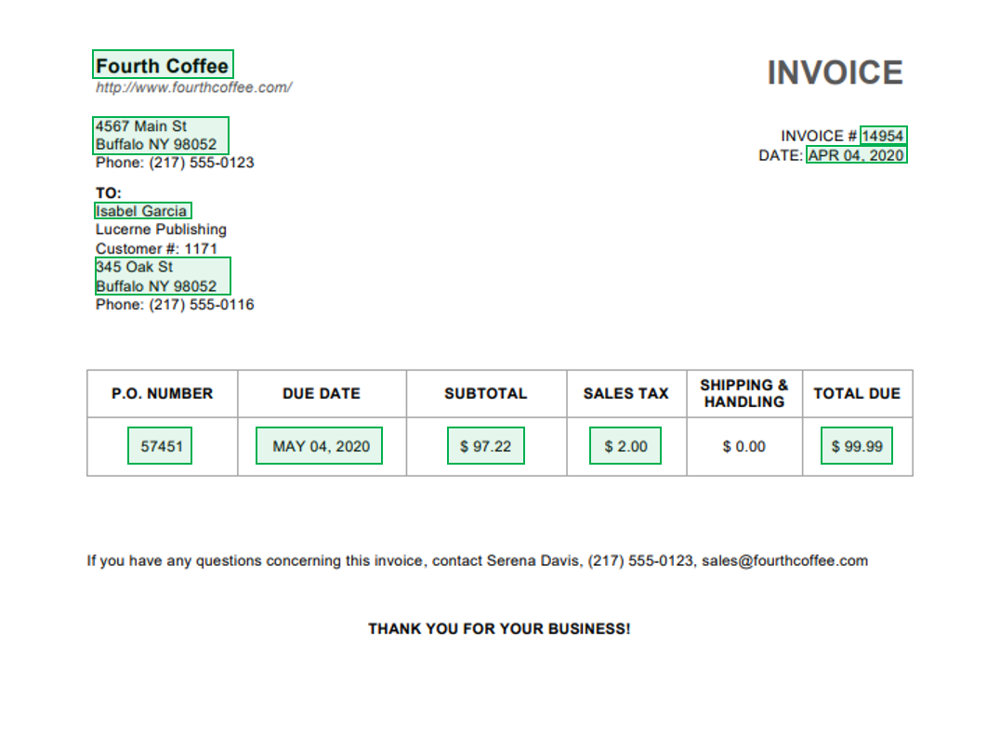

Before you begin this course, we recommend that you first complete the [Get started with AI Builder](/learn/modules/get-started-with-ai-builder/?azure-portal=true) module.

The invoice processing prebuilt AI model extracts key invoice data to help automate the processing of invoices. The Invoice processing model is optimized to recognize common invoice elements like invoice ID, invoice date, amount due and more.

> [!div class="mx-imgBorder"]
> 

The AI model also provides all recognized text on the invoice, which is useful if you're looking for fields that might be customized to a subset of your invoices.

No training or prior configuration is required to use invoice processing; you only need to provide an image or a PDF file, and the model returns the results instantly.

Only English invoices from the United States are currently supported. For best results, limit your photos to only one invoice for each image and take the photo in adequate lighting conditions.
