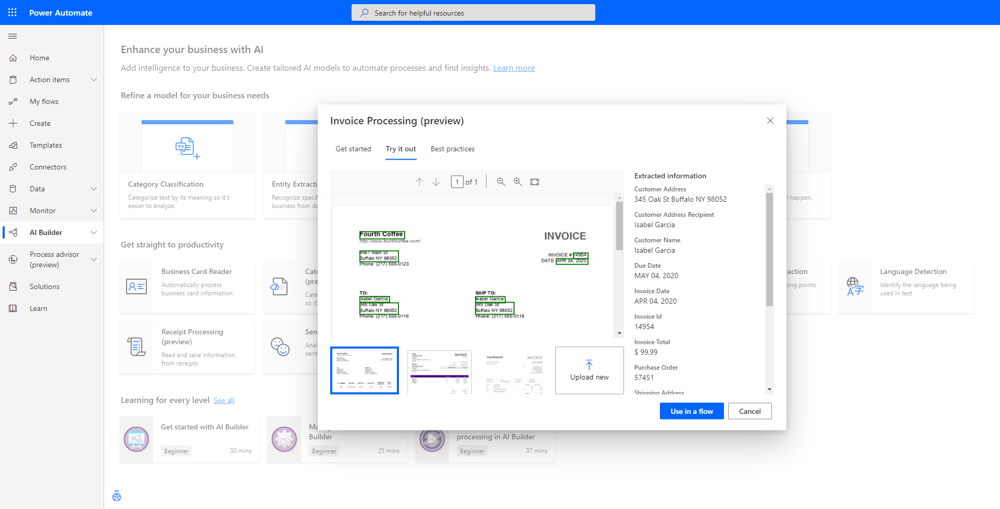
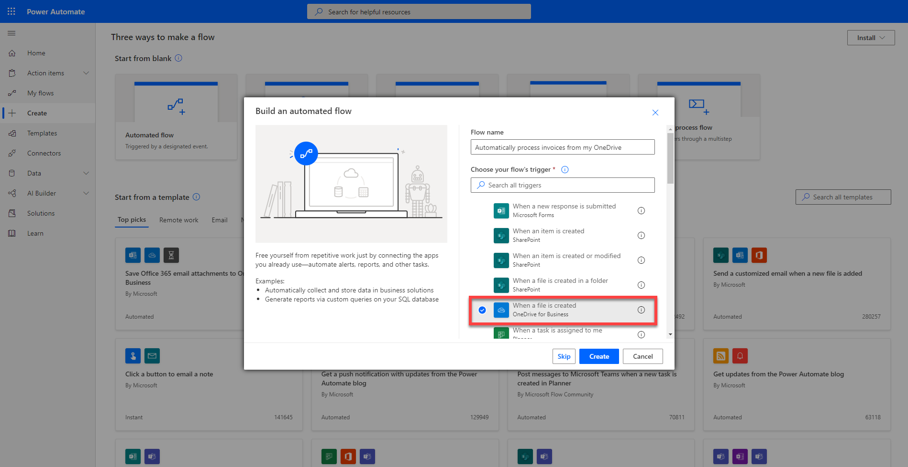
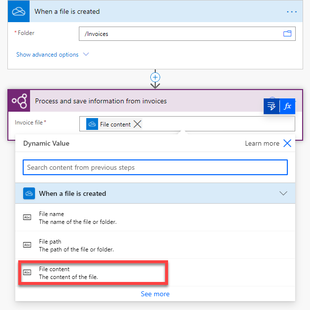
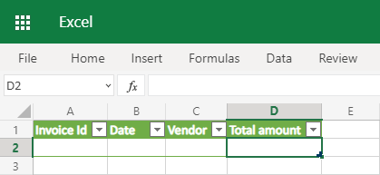
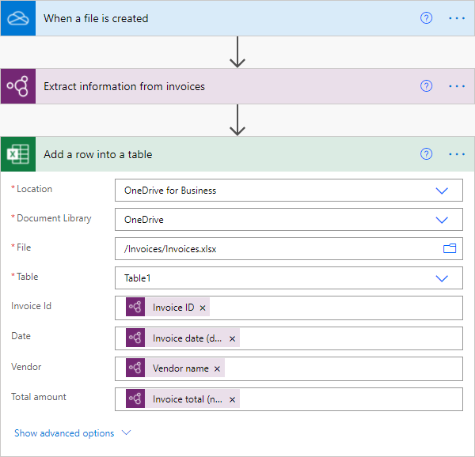
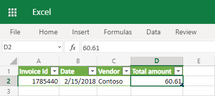

## Discover invoice processing on AI Builder's home page

When you log into either Power Automate or Power Apps, you can navigate to **AI Builder** on the left menu and then select **Build**.

On the AI Builder home page, you'll see all the AI capabilities that are at your disposal. In the Get straight to productivity section, you'll see an entry for **Invoice Processing**. By selecting it, you'll learn more about this AI capability plus a **Try it out** section where you can see some sample invoices and try your own invoices right away. Give it a try!

> [!div class="mx-imgBorder"]
> 

## Create an automated workflow using invoice processing

When you have multiple invoices to process an automated workflow can save you considerable time by scanning each invoice for you automatically in the background.

### Create a new flow

In this exercise, you'll create a flow that automatically runs whenever a new invoice file is added to a OneDrive for Business folder. This flow will scan the image for key invoice information and will then write it into a Microsoft Excel spreadsheet.

1. Sign into Microsoft Power Automate

1. Create a new flow by going to the **Create** menu on the left and select **Automated flow**. Give your flow a name and select as trigger **When a file is created** for OneDrive for Business.

> [!div class="mx-imgBorder"]
> 

### Configure the trigger

Once the flow has been created, you'll see that the **When a file is created** OneDrive trigger has been automatically added. Now you have to specify the folder in your OneDrive for business that you want to use to put your invoices in the **Folder** field.

### Scan the invoice file

Next, you'll scan the contents of the image file for the key invoice information.

1. Select **+ New step**.

1. Search for the **AI Builder** connector or select it from the list of connectors.

1. Select the **Extract information from invoices** action.

1. In the **Invoice file** field, select the **File content** dynamic content from the OneDrive trigger.

> [!div class="mx-imgBorder"]
> 

### Create an Excel table

1. Create a new Excel spreadsheet in a OneDrive or SharePoint folder.

1. In the first row, enter the following values in their own cells, which will serve as the column headers for your table: **Invoice ID**, **Date**, **Vendor**, and **Total amount**.

1. Select the cells that you entered and then format them as a table, marking the first row as the header.

> [!div class="mx-imgBorder"]
> 

### Write the data to Excel

Now that your table is set up, you can add the extracted invoice information to the Excel spreadsheet.

1. Select **+ New step**.

1. Search for the **Excel Online (Business)** connector or select it from the list of connectors.

1. Select the **Add a row into a table** action.

1. In the **Location**, **Document Library**, and **File** fields, specify the location in SharePoint where your file is stored.

1. In the **Table** field, select the table that you created.

1. In the **Invoice ID** field, select the **Invoice ID** dynamic content from the AI Builder action.

1. In the **Date** field, select the **Invoice date (date)** dynamic content from the AI Builder action.

1. In the **Vendor** field, select the **Vendor name** content from the AI Builder action.

1. In the **Total amount** field, select the **Invoice total (number)** content from the AI Builder action.

> [!div class="mx-imgBorder"]
> 

### Test the flow

We're done building the flow. Now let's test it. Select the **Save** button on the top right and then on the **Test** button next to it. Select the option to trigger the action.

Next, take an invoice and put it in the folder you defined on the OneDrive trigger in your flow. Once the invoice is uploaded to your OneDrive, the flow will get executed after some seconds: AI Builder will extract the data from the uploaded invoices and a new entry will be added to Excel with the extracted information.

> [!div class="mx-imgBorder"]
> 

Congratulations! You've created an automated workflow by using invoice processing. Now, whenever you add a new invoice file to that OneDrive folder, a new entry will be added to the Excel file.
