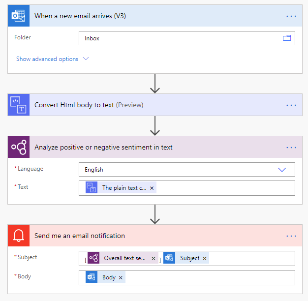

Microsoft Power Automate is a great way to automate AI Builder usage and exploit AI model results at scale.

## AI Builder usage in Power Automate

Power Automate offers AI Builder actions that enable usage of all model types in flows. Adding AI Builder actions in your flow allows you to:

-   Perform model inference by using outputs of upstream actions (email attachments received, SharePoint files dropped, created records in a Common Data Service entity, and so on).

-   Process model inference results in downstream actions (send by email, store in Common Data Service records, message in Teams, and so on).

The following illustration shows a simple flow with three main stages:

1. Receive an email in Microsoft Outlook. 
2. Detect sentiment of the email body by using the AI Builder sentiment analysis model.
3. Send an email notification with the sentiment detected in the email by using the **Overall text sentiment** output from the AI Builder model

