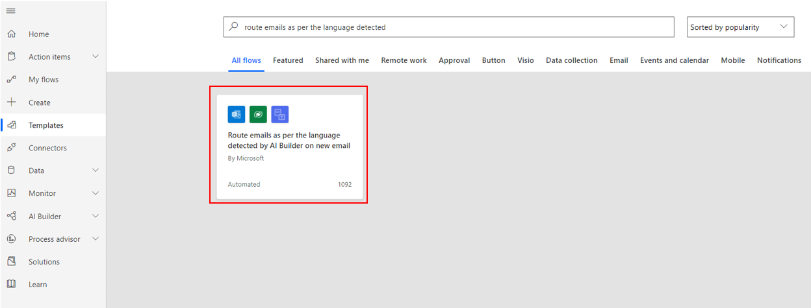
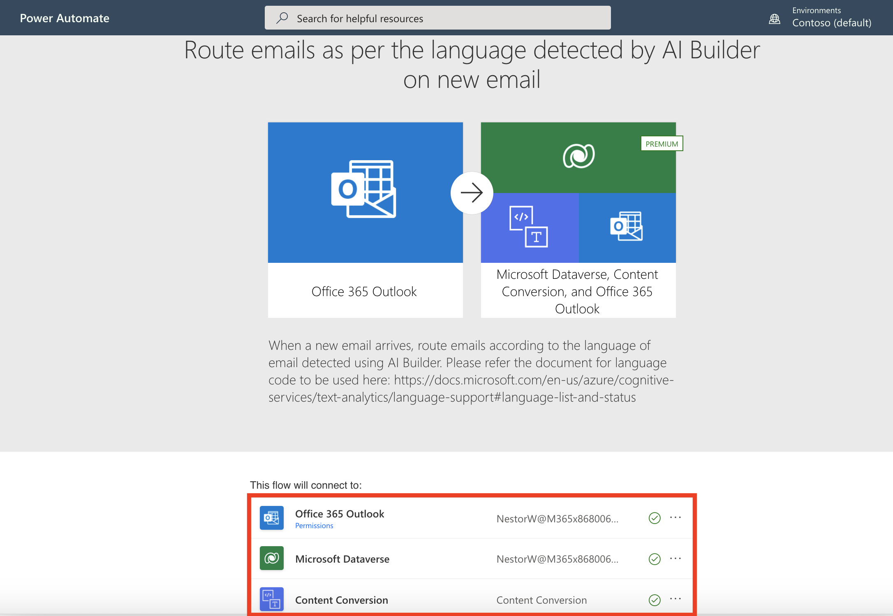
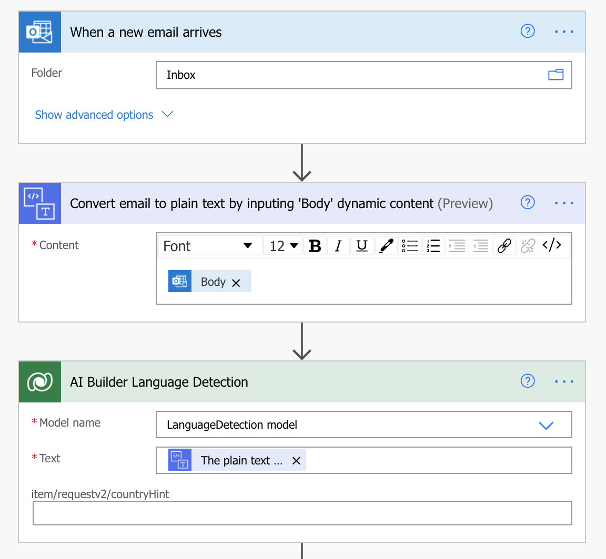
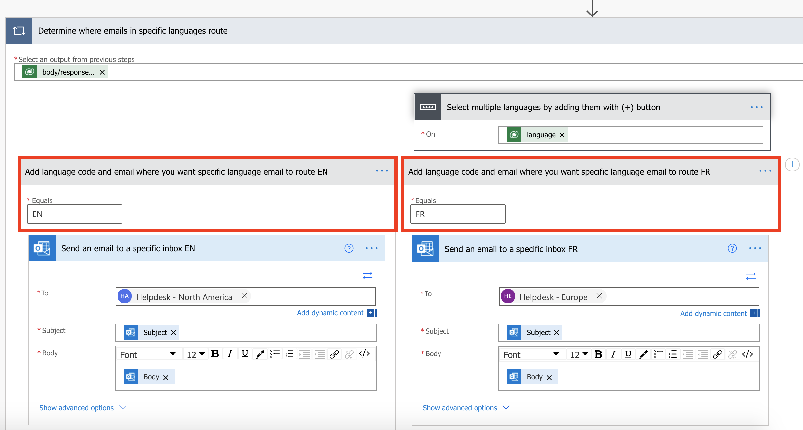

This section describes various use cases that can be fulfilled by using AI Builder and Power Automate.

## Prerequisites

- Access to [Power Automate](https://flow.microsoft.com/?azure-portal=true).
- A license or trial of the [AI Builder](/ai-builder/administer-licensing).
- An [environment](/power-platform/admin/environments-overview) with a [Microsoft Dataverse database](/power-platform/admin/create-database). (Applicable only for work or school accounts).
- A basic understanding of Power Automate as well as experience with creating a flow is recommended.

## Invoice processing

Companies often receive invoices in large quantities and from a variety of sources, such as mail, fax, email, or in person. Processing these documents and manually entering them into your database can take considerable time. This process can be greatly improved by:

- Using the **AI Builder form processing** model to extract the columns and tables from your documents.

- Creating a Power Automate flow to automatically move information into your database.

## Analyze email sentiment

Employees might want to process emails according to their overall sentiment, for example:

- If my boss is angry, I'd like to know the reason right now.

- If my customer is not satisfied, I need to answer immediately to avoid generating more frustration.

- After sharing a document, I want to track the positive and negative feedback.

AI Builder allows you to analyze overall sentiment of a text and even the sentiment of each sentence. By using a Power Automate flow, you can apply the **AI Builder sentiment analysis** model on receipt of an email and be notified of the sentiment of important emails to you.

You can also combine the sentiment analysis with key phrase detection by using the **AI Builder key phrase extraction** model.

## Dematerialize documents

Companies can have multiple sites in which some key information is still entered on paper form. Afterward, an agent will manually enter the form content into a centralized tool.

This process can be improved by using Power Automate and AI Builder in the following ways:

- The agent takes a picture of each audit record and saves it in a folder.

- A Power Automate flow processes all new pictures in the folder, sends them to your **AI Builder text recognition** model to extract the forms' information, and then saves them in the centralized tool.

Similar processes could be used to record business cards at scale by using the **AI Builder business card reader** model.

## Filter support requests by language

Typically, support teams receive numerous requests from customers worldwide. The team in charge of a request can vary, depending on the language. Therefore, it's important to detect language as quickly as possible to redirect requests to the relevant teams.

To solve this use case, you can build a Power Automate flow that:

- Checks for the language of a received email by using the **AI Builder language detection** model.

- Routes the email into the mailbox of the team in charge, depending on the language that is detected.

## Exercise - Create a flow to route Helpdesk requests to different mailboxes based on language

In this exercise, we will be using a flow template that connects to a pre-configured Language Detection model. This pre-configured Language Detection model is available in environments where *sample apps and data* are enabled.

1. Sign in to [Power Automate](https://ms.flow.microsoft.com/?azure-portal=true) using your organizational account.

1. In the **Search for a template by app, task, or industry** field, enter *route emails as per the language detected* and click the **Search Icon**.

1. Select the **Route emails as per the language detected by AI Builder on new email** flow template.

    

1. At the bottom of the screen, under *This flow will connect to:*, ensure all of your connections have been entered correctly and click **Continue**. If any of the connections are missing or incorrect, you will not be able to proceed.

    

1. In the first 3 steps of this flow, it's checking a mailbox for new emails, then using the AI **Convert email to plain text by inputting 'Body' dynamic content** action and then using the **AI Builder Language Detection** to determine language.

    

In this example, we are just using our logged in user account, but in a real-world scenario this would most likely be a shared Helpdesk mailbox.

1. This template has predefined a couple of languages, **EN** and **FR**. You could add additional cases for other languages as well by clicking the **+** icon, .

    

1. In the **Send an email to a specific inbox EN** step, click the **To** field and enter an email address. In this example, I will use our **Helpdesk - North America** mailbox.

    

1. Repeat the previous step, but enter a different email address. In this example, I will use our **Helpdesk - Europe** mailbox.

1. At the bottom of the screen, click **Save**.

Any new emails will now be routed to the correct Helpdesk mailbox based on the language detected.

This example is meant to demonstrate the possibilities and potential of using Power Automate and AI in your own organizations.  

## Categorize feedback

A public-facing company might need to categorize feedback that they receive for more relevant processing. For example, a hotel might need to know if feedback targets check-in, rooms, staff, or restaurant.

A company as such can fulfill this scenario by creating a flow that would perform these two actions:

- Get new feedback:

  - Power Automate gets data directly from external sources, for example, new messages on Twitter. A flow could be triggered on tweets that mention the company name.

  - Power Automate gets data from an aggregated data source, for example, a table in Microsoft Dataverse. A flow could be triggered on new record creation.

- Categorize the feedback by using the **AI Builder category classification model**.

That's it for this unit! Now that you know more about how Power Automate and AI can assist with streamlining various business processes you're ready to build a custom flow using AI connectors. Head to the next unit, **Exercise - Use AI Builder actions in Power Automate** to continue on your learning path.
