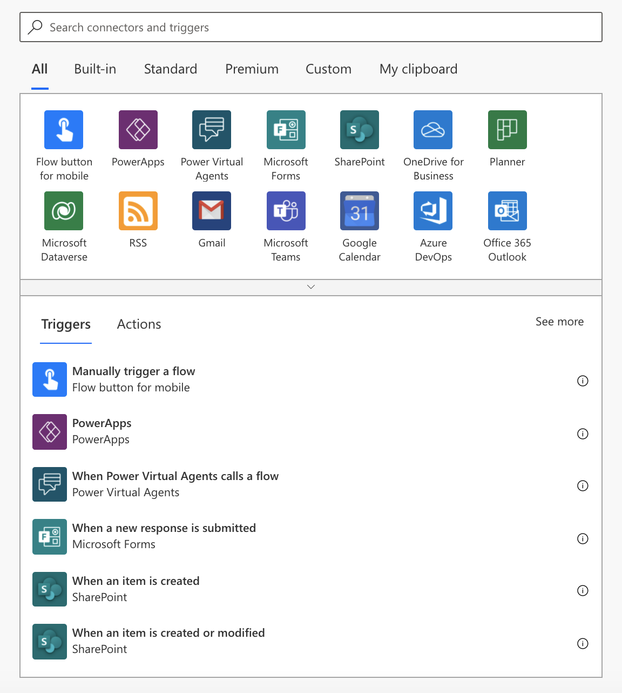
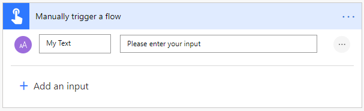
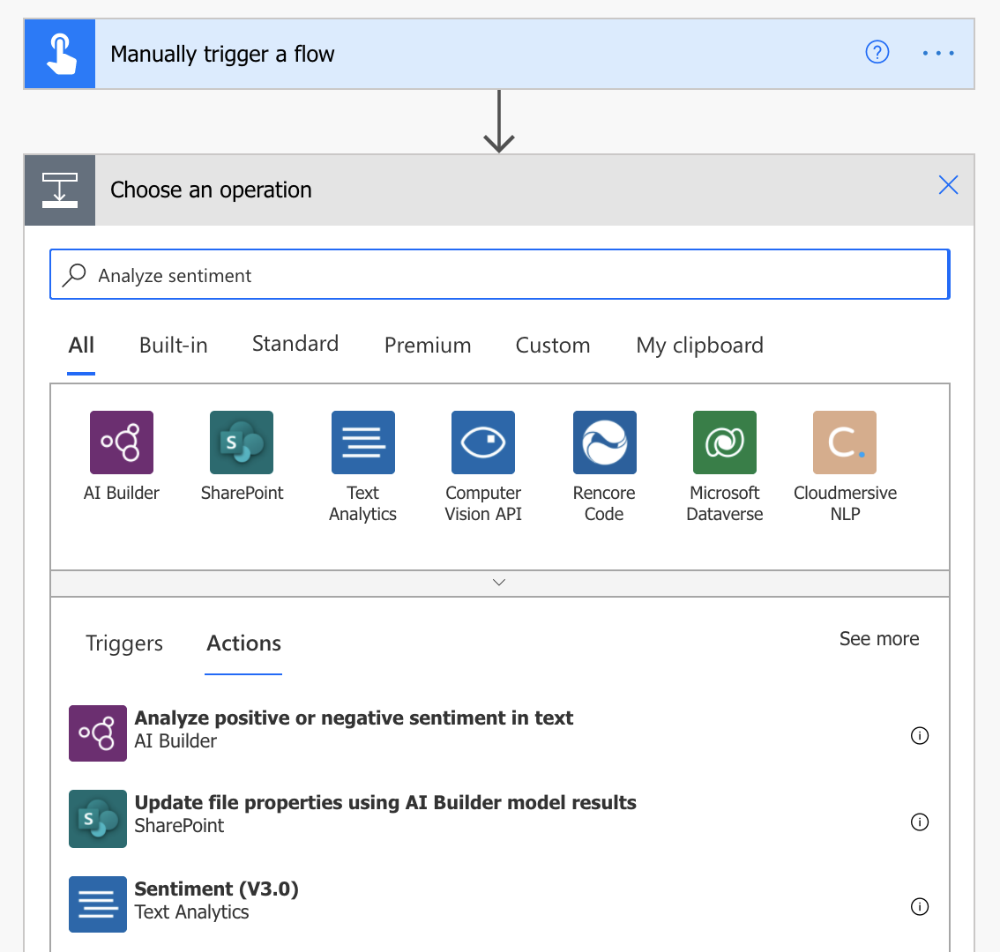
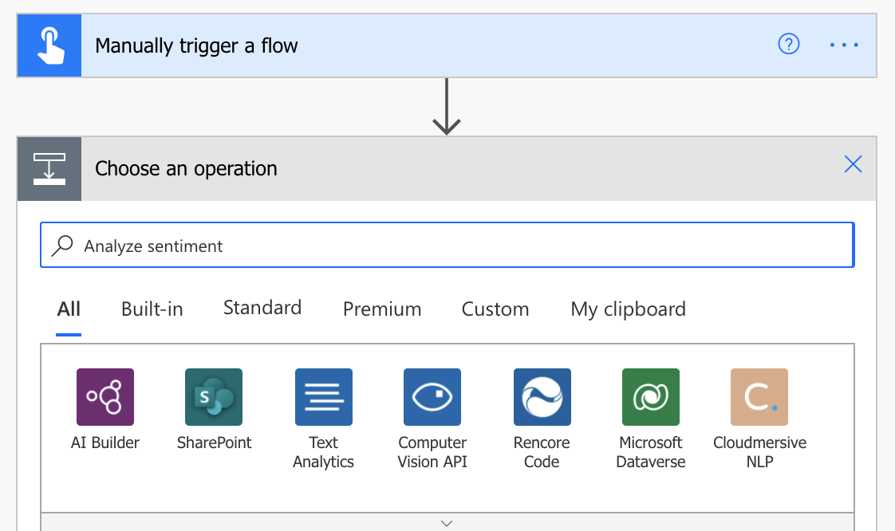
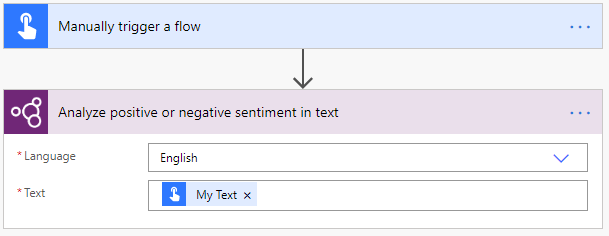
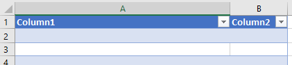
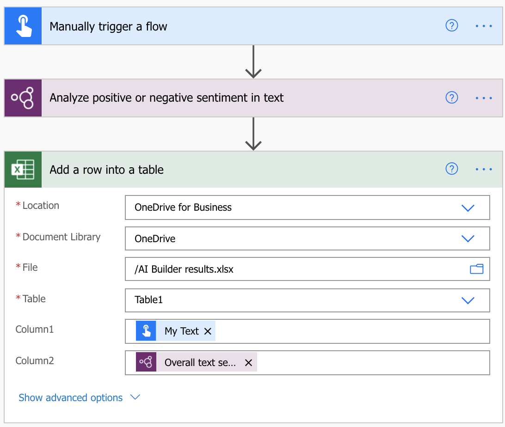
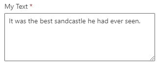
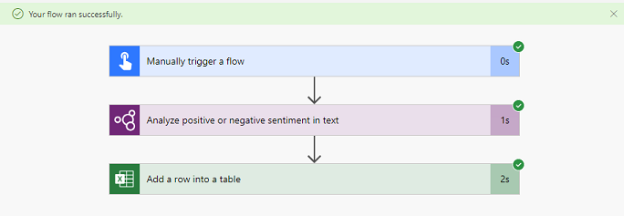
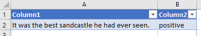

In this section, you will learn how to discover and use AI Builder actions in Power Automate through the creation of a simple flow.

Start by [signing-in](https://flow.microsoft.com/?azure-portal=true) to Power Automate and follow all the instructions in this section.

## Create a flow from a solution

To be able to add AI Builder actions in a flow, you need to create the flow from a common data service **solution**.

1.  Go to **Solutions** from the navigation bar on the left

2.  Create a new solution called **My AI Builder solution** and open it

3.  Select **+New \> Flow** in the action bar on the top of the screen. The flow designer screen appears and asks you to choose the trigger action:

    

4.  Pick-up **Manually trigger a flow**, Select **+ Add an input**, and select **Text**. Name your Input **My Text**:

    

5.  Select **+ New step**. We'll now add an AI Builder action.

### Search and add an AI Builder action

In our example, we want to add the AI Builder action that allows *sentiment analysis*. For that, you have couple of options:

-   Search for the intent. For example, "Analyze sentiment":

    

Or

-   Open the AI Builder action group

    

    This lists all the available AI Builder actions. You can pick the action from there:

    

Or

-   Use the generic **Predict** action that allows you to use any type of model

Select the action **Analyze positive or negative sentiment in text**.

### Configure the AI Builder action

Each AI Builder action has different parameters depending on the underlying model requirements.

For AI Builder sentiment analysis model, **Language** and **Text** are the two mandatory fields to fill.

1.  In **Language**, select **English** as language

2.  In **Text**, select **My Text** defined in the trigger action:

    

    The **My Text** value will be provided during flow testing, don't focus on it right now.

3.  Select **Save.** Your flow is now saved with an autogenerated name. You can change it by clicking on the generated name on the top left of the flow designer screen. Name your flow **My AI Builder flow**.

### Use the model's inference

We will use an Excel file in OneDrive to store the text sentiment detected by the AI Model.

1.  Create an Excel file named **AI Builder results.xlsx** in your OneDrive

2.  In this file, insert a table with two columns and save the file (make sure you use the "Insert \> Table" function of Excel):

    

3.  In **My AI Builder flow**, Select **+ New step** and add the action **Add a row into a table** from Excel Online (Business)

4.  Complete the **Location**, **Document** **Library**, **File** fields to point at the Excel file in your machine

5.  In the **Table** field, select the name of the table created in your Excel file

6.  In the first column field, add **My Text** and in the **second column** field add **Overall text sentiment**:

    

7.  Select **Save**

### Test the flow

Before productizing a flow, it's always a good idea to test it during design phase.

1.  Select **Test** on the top right of flow designer screen

2.  Select **I'll perform the trigger action** and Select **Save & Test**

3.  At that stage, you will need to provide the value of the **My Text** field from the trigger action. This is the text for which you want to analyze the sentiment:

    

4.  Select **Run flow.** If everything went well, you would see all your steps with a green thick:

    

5.  You can expand the actions to view the running inputs and outputs of each action. It's a good way to debug your flow

6.  You can check that the line has been correctly added in the Excel file:

    

Congratulations! You successfully created your first AI Builder flow.

### Documentation

Find details on each AI Builder action in our documentation pages: [Use AI Builder in Power Automate](https://docs.microsoft.com/ai-builder/use-in-flow-overview/?azure-portal=true).
