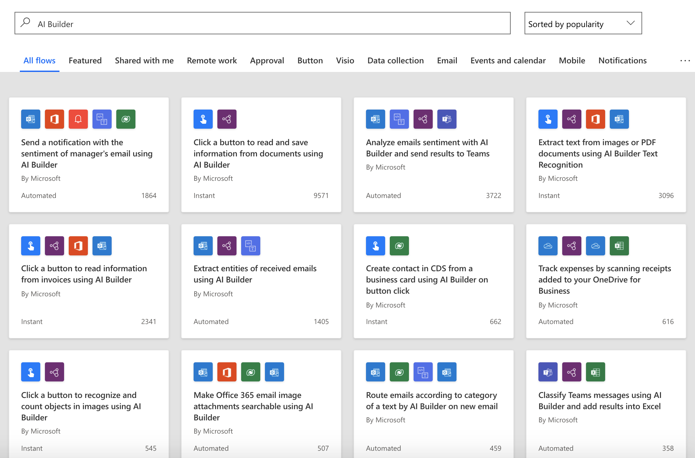
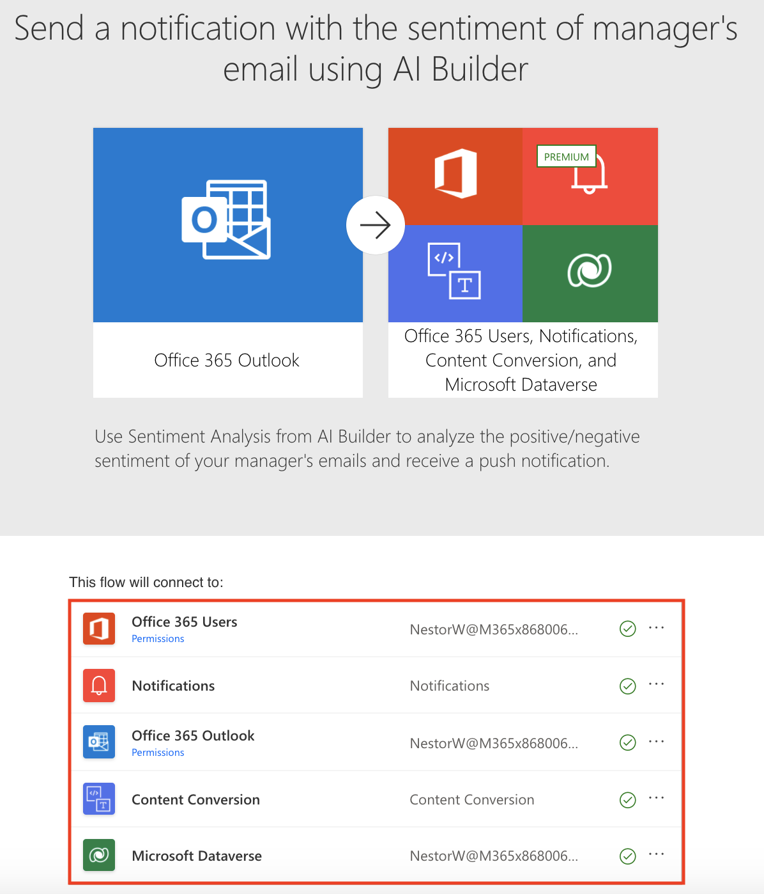
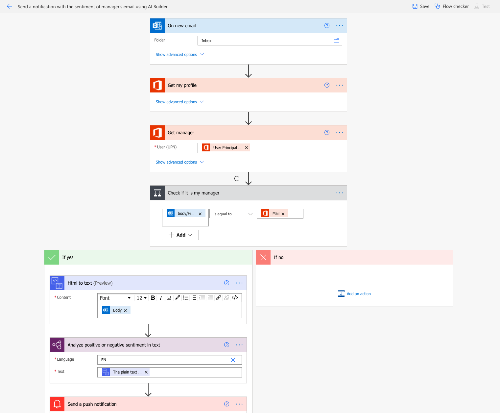
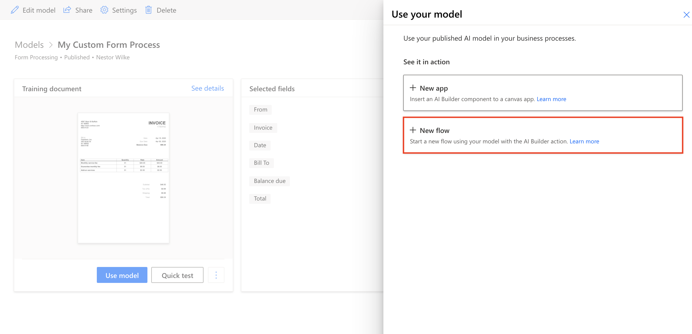
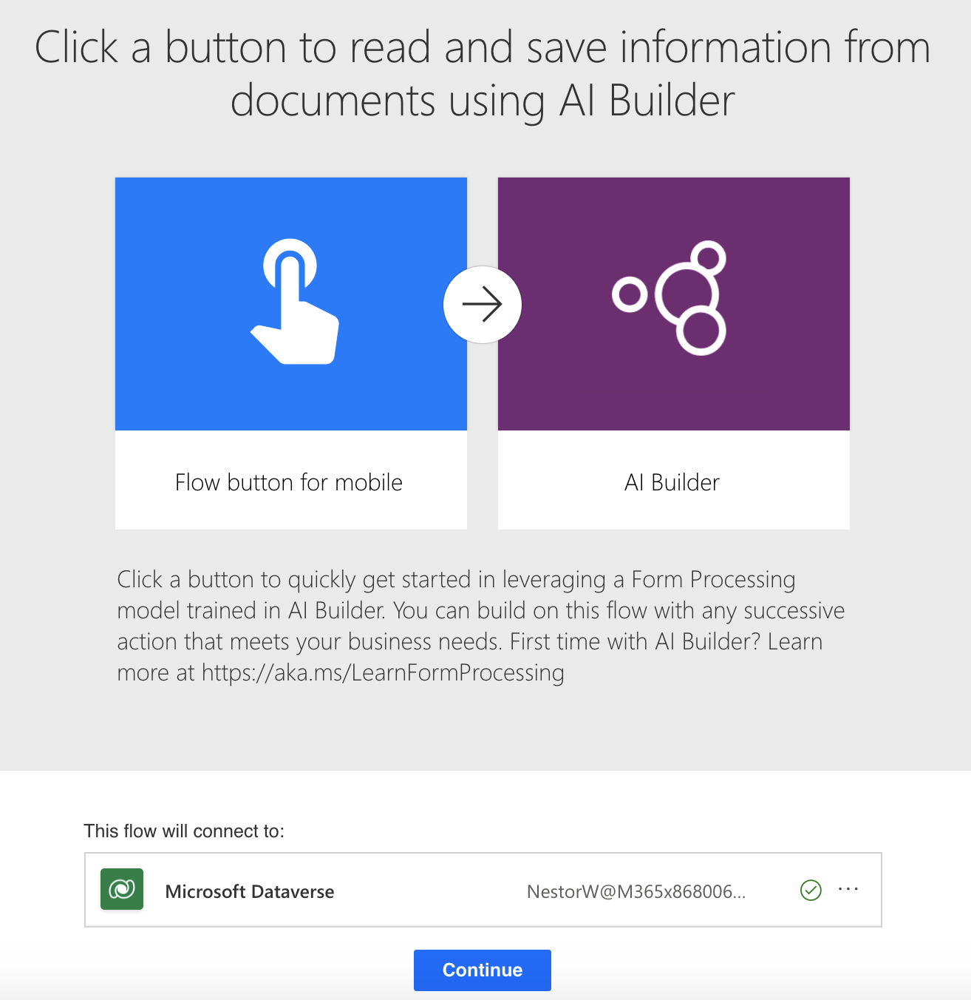
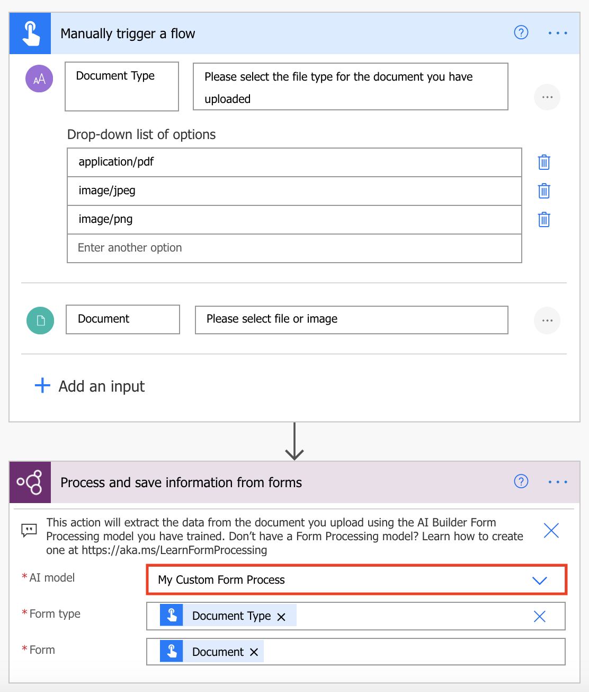

In this section, you will discover how to install your AI Builder flows to fulfill your business scenarios.

## AI Builder flow templates

[Power Automate templates](https://us.flow.microsoft.com/templates/?azure-portal=true) contain preconfigured logic that eases creation of flows for specific business purposes.

To create a flow from an AI Builder template, follow these steps:

1. Select the **My templates** tab in the left menu. The list of available templates will appear.

2. Enter **AI Builder** in the search bar and then press the **Enter** key. All AI Builder templates will be displayed, as shown in the following figure.

    

3. Select the **Send a notification with the sentiment of manager's email using AI Builder** template. You will see a summary of the template with a list of the connections that will be used.

    

    Select **Continue**.

4. A preconfigured flow appears (at this stage, the flow is not yet saved).

    

    You can save the flow as-is or update it at your convenience:

    - Modify existing actions: input parameters, action name, or advanced parameters
    - Add new actions
    - Remove existing actions (this step will likely break the actions downstream)

5. Save the flow and then test it.

## Create a flow from AI Builder studio

From AI Builder studio, you can launch the creation of a flow by using your favorite model.

The following example shows a custom form processing model. The detail page of the model contains a **Use model** button (the model must be published). Selecting this button will open a right panel that offers multiple options, as shown in the following figure.

Selecting **+ New flow** opens the screen where you can create a flow from a template.

Selecting **Continue** opens a preconfigured flow with the custom model selected in the AI Builder action.

