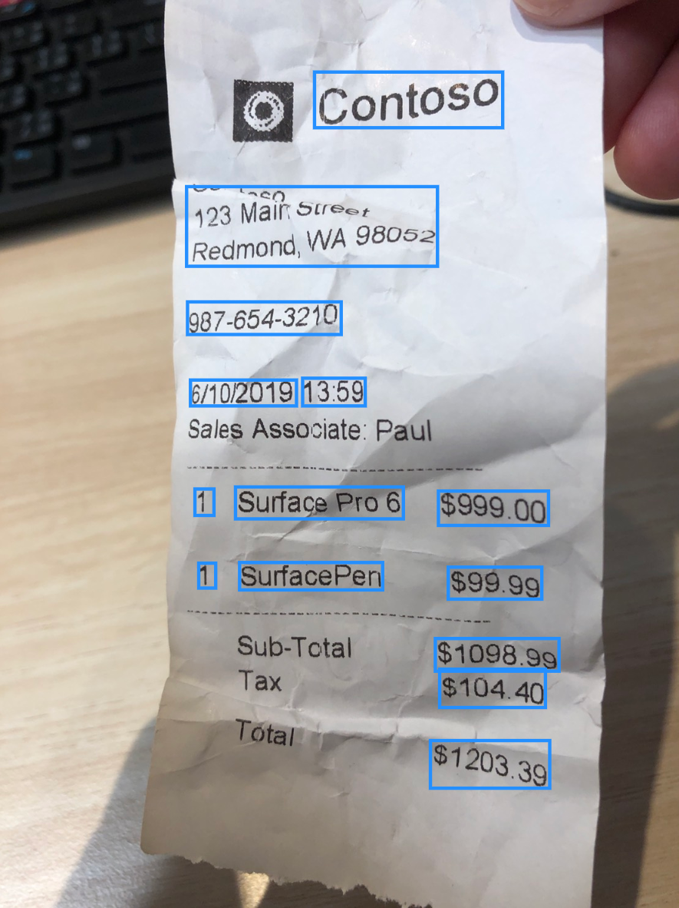

Before you begin this course, we recommend first completing the [Get started with AI Builder](https://docs.microsoft.com/learn/modules/get-started-with-ai-builder/?azure-portal=true) module.

Receipt processing lets you read and save key information from common sales receipts, like those used in restaurants, gas stations, retail, and more.

The prebuilt AI model uses state-of-the-art optical character recognition (OCR) to extract both printed and handwritten text from receipts. You can retrieve valuable information such as the merchant details, transaction date and time, list of purchased items, tax, and totals.

> [!div class="mx-imgBorder"]
> 

The AI model also provides all recognized text on the receipt, particularly useful if you are looking for fields that may be custom to a subset of your receipts.

No training or prior configuration is required to use Receipt processing. You simply need to provide an image or a PDF file, and the model will instantly return the results.

Only receipts in English are currently supported. Full page receipts, such as hotel receipts or invoices, are not supported. To see the best results, limit your photos to just one receipt per image, keeping the crumpling to a minimum and taking the photo in adequate lighting conditions.

### Next steps

Now that you have learned about the basics behind Receipt processing, lets dive into some of the different business problems you can solve.
