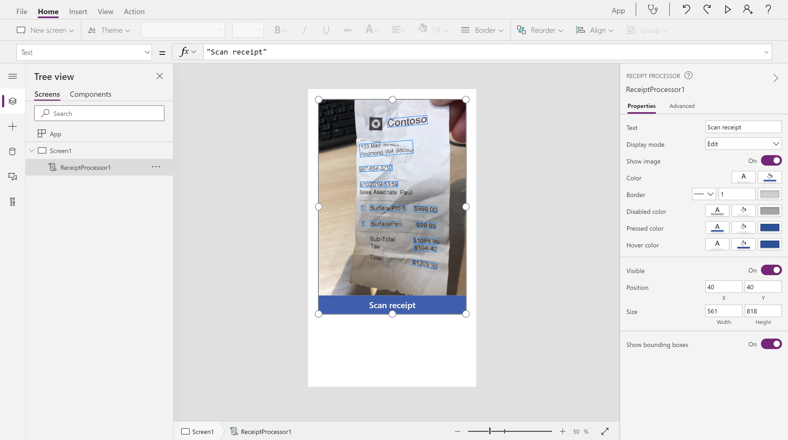
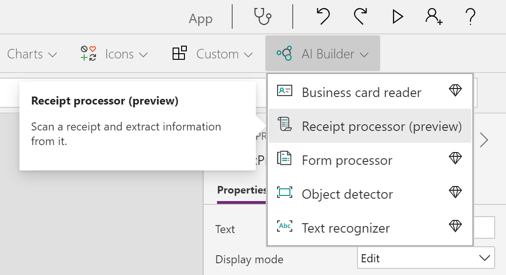
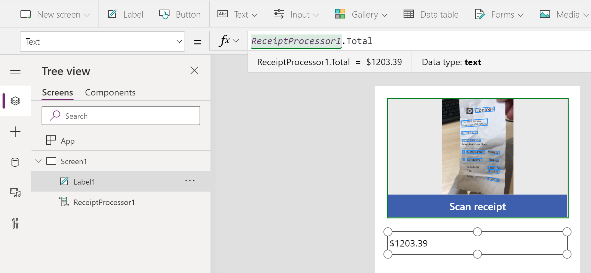
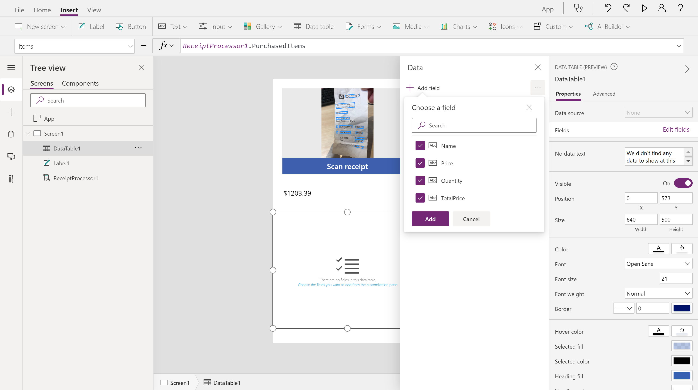
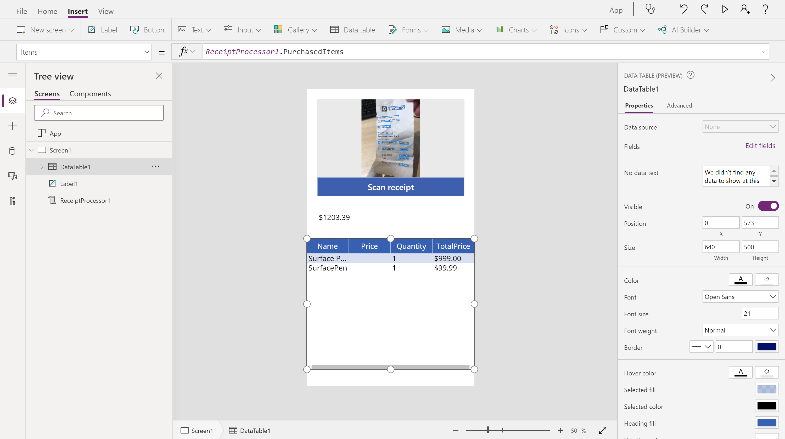
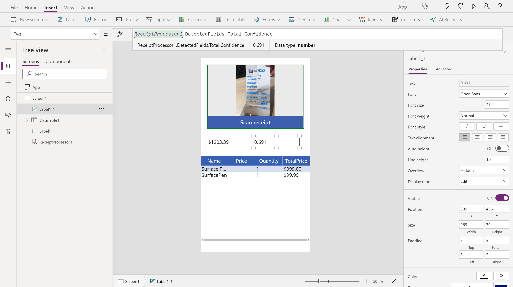

Receipt processing uses a prebuilt AI model, which means that no prior training or configuration is required. You can use this model immediately in your canvas app by using the **Receipt processor** component.

> [!div class="mx-imgBorder"]
> 

In this exercise, you will create an app that scans a receipt and then displays the extracted information.

### Add the Receipt processor component

To add the **Receipt processor** component to your app, follow these steps:

1. Sign in to Microsoft Power Apps Studio and open a new or existing canvas app.

2. Select **Insert > AI Builder** from the top menu.

3. Select **Receipt processor (preview)**.

    > [!div class="mx-imgBorder"]
    > 

Select the **Play** button in the upper-right corner of the screen to preview your app. You can then select the **Scan receipt** button on the component to upload a test image, which will scan and outline the key detected information from the receipt.

### Use scanned information

The AI model will look for the most commonly used fields in receipts. The values of these fields can be retrieved directly as properties from the component.

> [!div class="mx-imgBorder"]
> 

1. Select **Insert > Label**.

1. After you have selected the newly created label component, set its **Text** property by using the formula bar to the **Total** property of the **Receipt processor** component.

    > [!div class="mx-imgBorder"]
    > 

1. Select **Insert > Data table**.

1. After you have selected the newly created data label component, set its **Items** property by using the formula bar to the **PurchasedItems** property of the **Receipt processor** component.

1. In the Properties pane of the data label component, select **Edit fields**.

1. Select the **Add field** button.

1. Select all field options and then select **Add**.

    > [!div class="mx-imgBorder"]
    > 

    You can retrieve additional information about your receipts by using the **DetectedFields** and **DetectedText** properties.

    **DetectedText** contains a raw list of all recognized lines of text on the receipt.

    **DetectedFields** contains advanced information about the key fields, such as the confidence score, bounding box, and page number.

    > [!div class="mx-imgBorder"]
    > 

    For instance, to show the confidence score for the **Total** field that you displayed earlier, follow the next two steps.

1. Select **Insert > Label**.

1. After you have selected the newly created label component, set its **Text** property by using the formula bar to the **DetectedFields.Total.Confidence** property of the **Receipt processor** component.

After you have all values that you want to retrieve, save this information locally to your device as a collection or to the cloud, such as in Microsoft Dataverse or a list.

Congratulations, you have created an app by using receipt processing.

### Next steps

Now that you have learned how to use receipt processing in your apps, you can learn how to use it in your automated flows.
