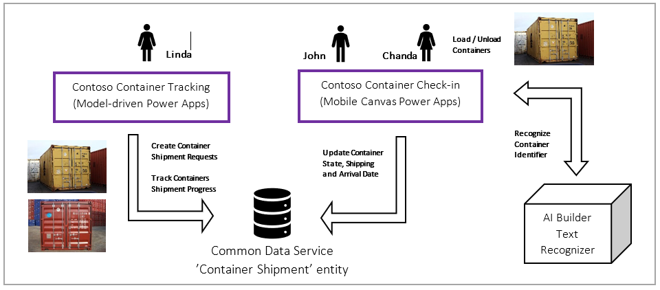

Before following this course, we recommend reading "Get Started with AI Builder" and the documentation [What is AI Builder?](https://docs.microsoft.com/ai-builder/overview).

This module explains how [AI Builder Text recognition model](https://docs.microsoft.com/ai-builder/prebuilt-text-recognition) can help to automate your business. AI Builder Text recognition is a built-in model, which means you can use it without having to customize and train. It leverages [Azure Computer Vision OCR service](https://docs.microsoft.com/azure/search/cognitive-search-skill-ocr), which can process an image to extract printed or handwritten text.

## Example scenario | Contoso Shipment

To illustrate how you can apply this technology to your business, we'll take the example of good delivery and an example scenario with Contoso Shipment, which is a marine container transport company.

Linda, the administrative representant, also a citizen developer, is receiving container transport requests from customers. She enters the basic information about the container in the CRM such as customer name, container identifier, weight, price, wherever it's fragile or not, origin and destination.

She's also responsible for tracking containers shipment status (waiting to be loaded on the ship, in transit and delivered to destination) and report progresses to customers.

She'll use a Power Apps to create a new container transport request and monitor status of ongoing shipments.

John and Chanda are dockers working for Contoso Shipment. Their task is to ensure containers are loaded and unloaded updating the CRM at each stage. They'll use an AI Builder text recognition control to automatically detect a container identifier and update the shipment date and status, streamlining these repetitive tasks and minimizing human errors.

>[!div class="mx-imgBorder"]
