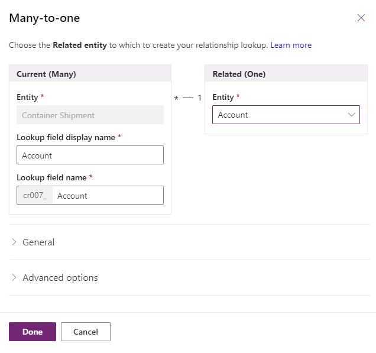
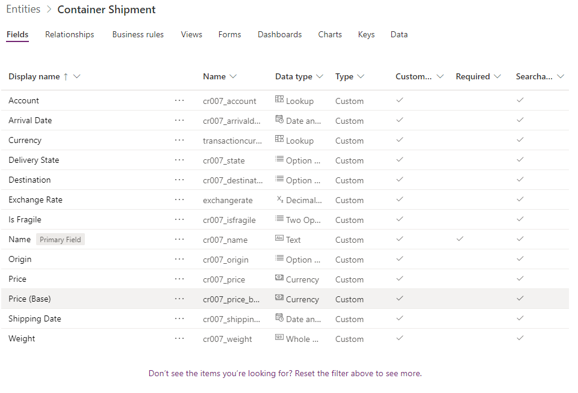

## Create an entity

As Linda, the first step is to create an entity that will store the data about the containers. (See [Create a custom entity](/powerapps/maker/common-data-service/data-platform-create-entity/?azure-portal=true))

Go to <https://make.powerapps.com> and open the "Data" menu and "Entities" submenu. Now click the "+New Entity" button which will open a side panel to enter the information about the entity. We will use Container Shipment as display name and click on "Create".

## Add fields

The second step is to add fields that will store the data about each container. As said in the introduction unit, we need to store several information about the container. We will create the following fields in this entity:

The container's identifier is a textual data, we will use the built-in Name field. (See [Types of fields](/powerapps/maker/common-data-service/types-of-fields/?azure-portal=true))

- The Weight is a numerical data, modeled as Whole Number type in Microsoft Dataverse.

- The Price is a currency data, modeled as Currency type in Dataverse.

- The Origin and Destination are location data, to make it simple we will use an Option Set with following values New York, Shanghai, San Francisco, Cape Town, Delhi, each corresponding to a port where the company is operating. An advanced design would be to create a separate Dock entity to enter more information data like country, zip code... and create a relationship with Container Shipment. (See [Create an Option set](/powerapps/maker/common-data-service/custom-picklists/?azure-portal=true))

- Shipping Date and Arrival Date will store the date and hour of shipping from origin and arrival to destination, we will use Dataverse's Date and Time.

- Is Fragile will indicate if the container is fragile or not, we use a Two Option for this.

- Delivery State will track the container progresses using an Option Set with following values Waiting, In Transit, Delivered with default value Waiting.

- Eventually for "Customer", Microsoft Power Platform provide some built-in entities like Account or Contact. We will use Account here and will create a Many-to-one relationship using the "Relationship" tab and "+Add relationship" button. (see [Create a relationship between entities](/powerapps/maker/common-data-service/data-platform-entity-lookup/?azure-portal=true))

We end with following entity structure. (Some fields are automatically added by Dataverse to manage currencies)

You can add some customers in the Account table using the "Edit from Excel" button. (See [Open entity data in Excel](/powerapps/maker/common-data-service/data-platform-excel-addin/?azure-portal=true) or [Import or export data from Dataverse](/powerapps/maker/common-data-service/data-platform-import-export/?azure-portal=true))

## Summary

We have successfully created an entity that will store the information about the container. We are now ready to create the container tracking application.
