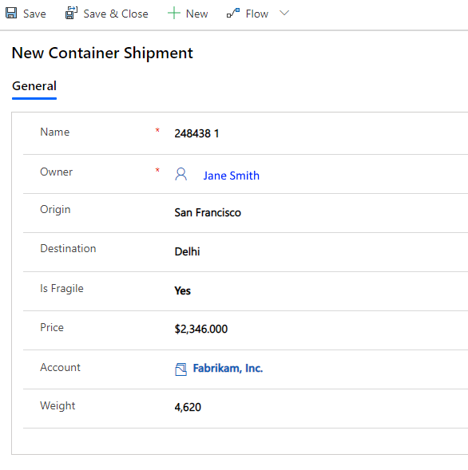
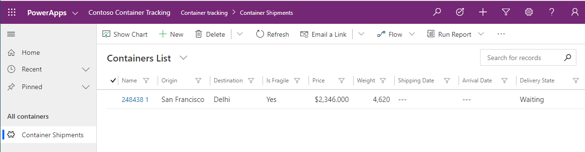
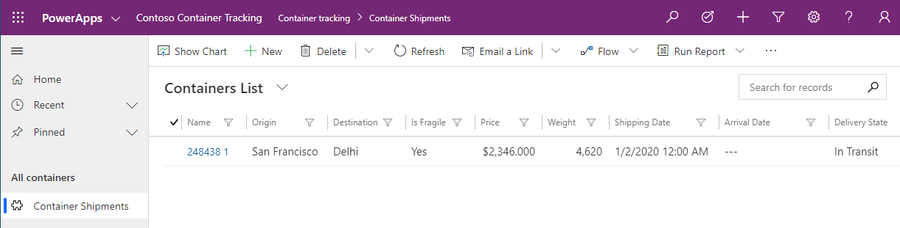
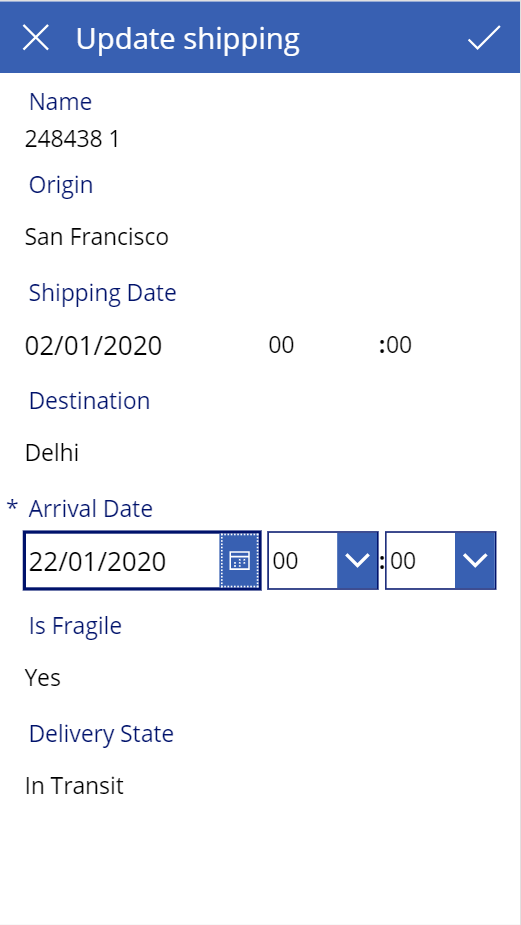
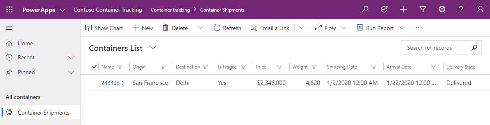

## Check work

To check that what you have created so far is working and can be released, we must fake a real world scenario and ensure that the entire flow can be achieved.

Linda receives a transport request from Fabrikam, Inc for container to be shipped from San Francisco to Delhi. She opens the "Contoso Container Tracking" application and uses the "New button".

She enters all the information using the data entry form and saves.

She can now see this new container, which is waiting to be shipped.

John, the docker worker from San Francisco, has managed to carry the container on a boat and uses the "Contoso Container Check-in" application to update the status. He takes a picture of the container, selects the text with the container identifier, and updates the shipment date.

>[!NOTE] 
>AI Builder text recognizer also supports uploading a picture from local device.

Linda can now see that the container is on his way to Delhi in "Contoso Container Tracking" application.

After 20 days of travel, Chanda, the docker worker from Delhi, receives and unloads the container from the boat. She uses the "Contoso Container Check-in" application to update the status. She takes a picture of the container, selects the text with the container identifier, and updates the arrival date.

Linda can now see that the container has been delivered to Delhi and can inform her customer.

## Summary

You've now successfully tested that your business scenario is working end to end. You're now ready to release these applications to your users improving the way your company will run his business thanks to the magic of AI and the Power Platform!