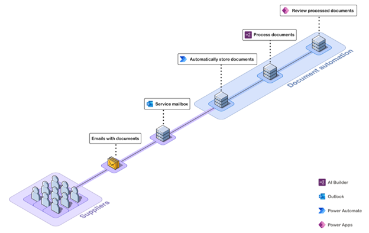

In this unit, you will

- Understand which scenarios document automation addresses.

- Learn what you can accomplish with document automation.

Before you begin this course, we recommend that you get familiar with these products:

- [Introduction to Power Automate](/learn/modules/introduction-power-automate/?azure-portal=true) learn module.

- [Introduction to Power Apps](/learn/modules/introduction-power-apps/?azure-portal=true) learn module.

- [Get started with Dataverse](/learn/modules/get-started-with-powerapps-common-data-service/?azure-portal=true) learn module.

- [Get started with Form processing in AI Builder](/learn/modules/get-started-with-form-processing/?azure-portal=true) learn module.

- [Overview of AI Builder form processing model](/ai-builder/form-processing-model-overview/?azure-portal=true) documentation.

## What document automation is

Thanks to automation solutions and AI, organizations can accelerate and optimize the processing of documents to free humans from repetitive, low value, and error prone tasks. This applies to any kind of printed or digital form that must be reviewed, have data extracted from it, and be processed.

Automating the processing of documents requires a complete solution. The Microsoft Power Platform enables you to build a rich and robust document automation solution using Power Automate to orchestrate the overall process, AI Builder to bring the Intelligence required to efficiently extract information from documents, Power Apps to allow users to manually review and approve documents, and Dataverse to manage the document queue and store all the data, files, and configuration required.

Starting from a blank page can be challenging when designing such a complex system. This document automation solution is a reference implementation that provides a functional end-to-end solution that is ready to install and supports a common processing pattern: 

- Receiving documents from a service mailbox.

- Automatically extracting data from these documents.

- Exporting the results to a target system like accounting, HR or CRM.

Because of things like compliance rules or the need to evaluate the accuracy of AI, there's a need to include a "human in the loop" manual review in this process.

Document automation provides this standard end-to-end solution. It includes the following components:

- Manage documents received in emails.

- Use the AI Builder form processing solution to extract data from those documents.

- Process the data extracted and allow users to review and approve data through a central manual validation application.

> [!div class="mx-imgBorder"]
> 

The document automation tool is a solution that you install in one of your Environments (learn more about environments in [Environments Overview](/power-platform/admin/environments-overview/?azure-portal=true)). This solution includes several Power Automate flows, a Power App, and several Dataverse data tables. It's called the **Document automation base kit**.

## What document automation includes

The received documents go through the following steps:

### Document Automation Email Importer flow

This imports documents to process.

This flow is configured to work with documents sent via email. If you receive documents in a different manner, you can customize the import flow to retrieve documents from a SharePoint folder or cloud storage for example. You can find more information about customization of the import mechanism in the next learning modules.

The **Document Automation Email Importer** does the following:

  - It triggers when mail is received at a specific Outlook email address with an attachment. You can filter on senders or a specific word in the title. In the following module, you will learn how to configure this trigger to best fit how you receive documents.

  - It adds the document to the document queue managed in Dataverse.

  - It stores the document file in Dataverse.

  - The document's state is set to **Extracting data**. This is an indication that the document was received and is ready to be processed with AI to extract the relevant information.

### Document Processor flow

This extracts data from the document using an AI Builder model.

The **Document Processor** does the following:

  - It is triggered when a document is received and stored in the document queue, and is in the **Extracting data** state.

  - It retrieves each document and runs an AI Builder form processing model on it to retrieve the relevant data. You can build your own AI Builder model for your unique document layout. More about this configuration is in the following learn modules.

  - It stores the extracted data in a Dataverse table so that further data checks and processing can be performed before it's exported or used in another system.

  - It sets the document's state to **Validating data** to indicate that the data has been extracted and is ready to be processed with the business logic and rules that you need to apply.

### Document Automation Validator flow

This helps apply business rules and determine if the document requires manual validation.

This flow is a placeholder where you can add the business logic that you'd like to apply to the data. For example, you could ask for manual validation if one of the data fields hasn't been extracted or if the confidence level is below 80%; or you could auto approve the data when the \$ amount is below a certain value, while sending the others for manual approval.

This flow is not configured with any rules by default and sends all documents for manual review.

The **Document Automation Validator** does the following:

  - It is triggered after a document has been processed and extracted data stored in Dataverse, when it is in the "validating data" state.

  - It sets the document's state to **Manual review** to indicate that the data extracted is ready to be reviewed and approved by the someone.

### Document Automation Application

This helps with manually reviewing and approving documents.

This application is the central place where users can visualize all the documents that are in the pipeline, view their states, and review and approve the data extracted when required. This application also includes a section for the owner of the solution to configure the process. This application is built in Power Apps, which allows for easy customization.

The **Document Automation Application** allows users to do the following:

For manual reviewer:

  - List all documents that are ready for review.

  - Open a document to view the document and the extracted data side by side.

  - Edit or complete the data extracted with missing data fields or errors.

  - Approve the document and set the state to **Validated**.

For process owners

  - Configure the AI Builder model used to process documents.

  - List all documents that have been processed.

  - Filter based on document states:

    - **Invalid document** when not a PDF, PNG or JPEG.

    - **Downloading document** when email attachment is being retrieved and store in Dataverse.

    - **Extracting data** when the AI model is extracting data from the document.

    - **Validating** when validation logic is being performed.

    - **Manual review** when the document is ready to be reviewed by a reviewer.

    - **Validated** when the document has been successfully reviewed.

It is possible to configure who is a reviewer and/or an owner in your team.

The documents and extracted data that are in the **Validated** state are ready to be exported to external systems like accounting, HR, or CRM.

## How to use document automation

Document automation is a reference managed solution. Users are free to use and update the components of this solution to adapt it to their business and system specifics.

To use this solution, you need the following licenses:

- One [Power Automate license](/power-platform/admin/pricing-billing-skus/?azure-portal=true) to run all the flows that orchestrate the process.

- A [Power Apps license](/power-platform/admin/pricing-billing-skus/?azure-portal=true) for any user who must manually review and approve documents.

- A Power Apps license for the process owner to configure the process.

- AI Builder capacity based on the volume of document processed per month. The [AI Builder calculator](https://flow.microsoft.com/ai-builder-calculator/) helps you to estimate the capacity that is right for you.

Now you have an understanding of which scenarios the **Document automation base kit** can help you with in automating the processing of your documents.
