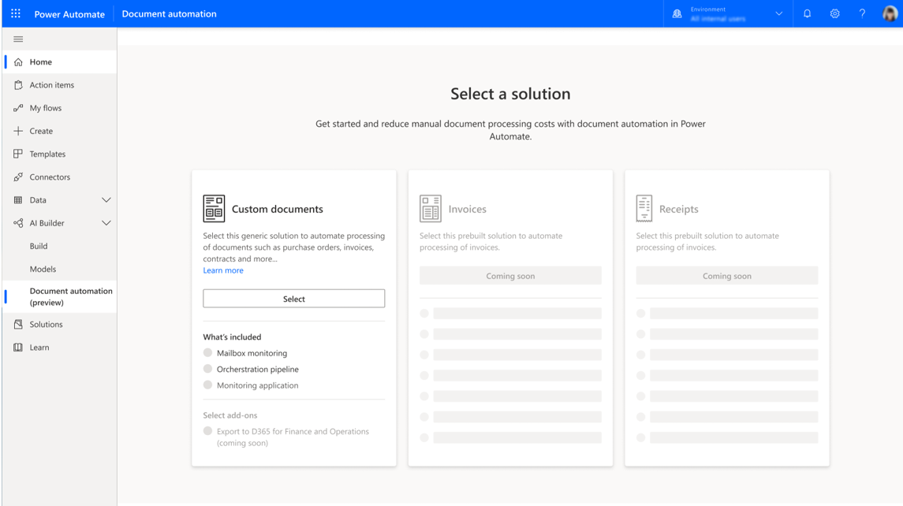
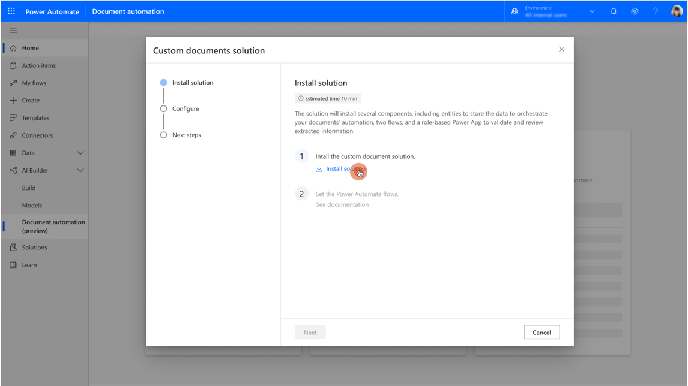
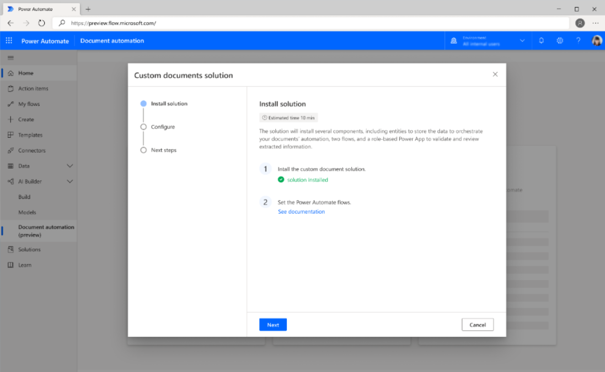
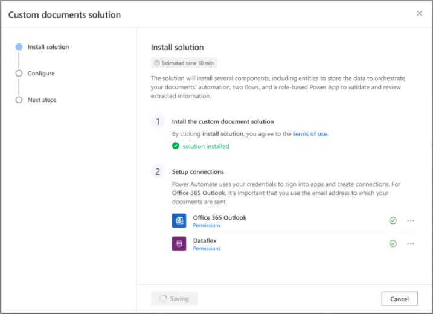

In this unit, you will

- Understand how to install the document automation base kit.

- Learn what key components are installed.

- Learn how to configure the connection to Outlook and Dataverse.

The person installing the document automation solution should:

- Have good knowledge of Microsoft Power Platform concepts (at least Power Automate connections and Dataverse).

- Have Microsoft Power Platform privileges to configure Power Automate connections and add environment variables.

- Own the connection to the Outlook service mailbox that will be used to receive the documents.

Makers or Administrators are usually a good fit for this task.

The following items will be installed with this package:

> [!div class="mx-imgBorder"]
> 

- A Power Apps **Document Automation Application** allowing makers to configure the AI model to use for document extraction, and users to track processing of documents and review them.

- Three Power Automate flows

  - **Document Automation Email Importer** that listens to new emails arriving in the service mailbox, extracts any attachments, and creates a new processing request.

  - **Document Automation Processor** that calls the AI Builder model to extract values and store them in Microsoft Dataverse.

  - **Document Automation Validator** that acts as a placeholder for your business rules and sends documents to the validation application.

- Four Microsoft Dataverse tables

  - **Document Automation Processing** stores document automation requests, files to be processed, and the status of the processing.

  - **Document Automation Data** stores values extracted from the document.

  - **Document Automation Configuration** stores information about the model to use.

  - **Document Automation Taxonomy** maps where each model's labels are stored in the **Document Automation Data** table fields.

- Two Microsoft Dataverse choices

  - **Document Automation Processing Status** with steps of the workflow.

  - **Document Automation Configuration Status** to indicate that the AI model has been configured.

To install your document automation solution in one of your environments, you need to go through the following steps:

- Install the **Document automation base kit** solution package.

- Activate the flows and data connections with your account.

The flows run with the user credentials and data connections of the user who installs and configures the solution.

## Install the solution

To install and configure the document automation solution, you must follow these steps:

1. Go to Power Automate and navigate to the AI Builder > [Document automation page](https://flow.microsoft.com/manage/aibuilder/documentautomation).

1. Select the **Select** button.

    > [!div class="mx-imgBorder"]
    > 

1. Once in the wizard, select the **Install solution** link.

    > [!div class="mx-imgBorder"]
    > 

1. Wait five to ten minutes for the installation to complete.

    > [!div class="mx-imgBorder"]
    > 
    
1. Choose from already created connections or create a new one using the ellipsis (...) button.

    > [!div class="mx-imgBorder"]
    > 

1. Select **Next** and wait for the flows to activate, then select **Finish**.

You have successfully installed the "Document automation base kit" and are ready to configure it.
