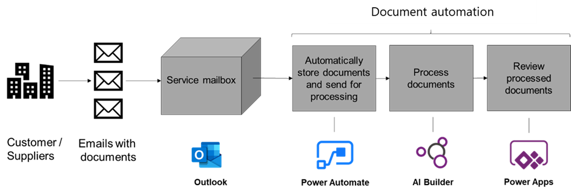

In this unit, you will

- Understand which scenarios Document automation addresses.

- Learn what you can accomplish with Document automation.

Before you begin this course, we recommend that you get familiar with these products:

- [Introduction to Power Automate](https://docs.microsoft.com/learn/modules/introduction-power-automate/) learn module.

- [Introduction to Power Apps](https://docs.microsoft.com/learn/modules/introduction-power-apps/) learn module.

- [Get started with Dataverse](https://docs.microsoft.com/learn/modules/get-started-with-powerapps-common-data-service/) learn module.

- [Get started with Form processing in AI Builder](https://docs.microsoft.com/learn/modules/get-started-with-form-processing/) learn module.

- [Overview of form processing model](https://docs.microsoft.com/ai-builder/form-processing-model-overview) documentation.

## What Document automation is

Thanks to automation solutions and AI, organizations can accelerate and optimize the processing of documents to save humans from repetitive, low value, and error prone tasks. This applies to any kind of printed or digital form that must be reviewed, have data extracted from it, and be processed.

Automating the processing of documents requires a complete solution. The Power Platform enables you to build a rich and robust document automation solution using Power Automate to orchestrate the overall process, AI Builder to bring the Intelligence required to efficiently extract information from documents, Power Apps to allow users to manually review and approve documents, and Dataverse to manage the document queue and store all the data, files, and configuration required.

Starting from a blank page can be challenging when designing such a complex system. This Document automation solution is a reference implementation that provides a functional end-to-end solution that is ready to install and supports a common processing pattern: 

- Receiving documents from a service mailbox.

- Automatically extracting data from these documents.

- Exporting the results to a target system like accounting, HR or CRM. 

Because of compliance rules or because AI doesn't always have 100% accuracy, there's a need to include a "human in the loop" review in this processing.

Document automation provides this standard end-to-end solution and includes the following components: 

1. Manage documents received in emails.

1. Use the AI Builder form processing solution to extract data from those documents.

1. Process the data extracted and allow users to review and approve data through a central manual validation application.

> [!div class="mx-imgBorder"]
> 

This Document automation functionality is a solution that you install in one of your Environments (learn more about environments in [Environments Overview](https://docs.microsoft.com/en-us/power-platform/admin/environments-overview)). This solution includes several Power Automate flows, a Power App, and several Dataverse data tables. It's called the "Document automation base kit."

## What Document automation includes

The received documents go through the following steps:

1. Importing documents to process.

    This solution is configured to work with documents sent via email. If you receive documents in a different manner, you can customize the import flow to retrieve documents from a SharePoint folder or cloud storage for example. You can find more information about customization of the import mechanism in the next learning modules.

    The Document Automation Email importer does the following:

    - It triggers when mail is received at a specific Outlook email address with an attachment. You can filter on senders or a specific word in the title. In the following module, you will learn how to configure this trigger to best fit how you receive documents.

    - It adds the document to the document queue managed in Dataverse.

    - It stores the document file in Dataverse.

    - The document's state is set to "extracting data." This is an indication that the document was received and is ready to be processed with AI to extract the relevant information.

1. Extracting data from the document using AI.

    The Document processor flow extracts data from the document using an AI Builder model.

    This flow does the following:

    - It gets triggered after a document has been received and stored in the document queue (when it is in the "extracting data" state).

    - It retrieves the documents to process and runs an AI Builder form processing model on it to retrieve the relevant data. You can build your own AI Builder model to work with your unique document layout and retrieve the data that you need. More about this configuration is in the following learn modules.

    - It stores the data extracted into a Dataverse table so that further data checks and processing can be performed on the data before it's exported or used in another system.

    - It sets the document's state to "validating data" to indicate that the data has been extracted and is ready to be processed with the business logic and rules you need to apply.

1. Apply business rules and determine if the document requires manual validation.

    The Document Automation Validator is a placeholder for you to add the business logic that you'd like to apply to the data. For example, asking for manual validation if one of the data fields hasn't been extracted or if the confidence level is below 80%, or auto approving the data if the \$ amount is below a certain amount and sending the others for manual approval.

    This flow is not configured with any rules by default and sends all documents for manual review.

    This flow does the following:

    - It gets triggered after a document has been processed and extracted data stored in Dataverse (when it is in the "validating data" state).

    - It sets the document's state to "manual review" to indicate that the data extracted is ready to be reviewed and approved by the someone.

1. Manually reviewing and approving the document.

    The Document Automation Application is the central place where users can visualize all the documents that are in the pipeline, their states, and review and approve the data extracted when required. This application also includes a section for the owner of the solution to configure the process. This application is built with Power Apps, which allows for easy customization.

    The Document Automation Application allows users to do the following:

    For manual reviewer:

    - List all documents that are ready for review.

    - Open one of the documents to visualize side by side the document and the data extracted.

    - Edit and/or complete the data extracted to check for missing data fields or errors.

    - Approve the document and set the state to "Validated."

    For process owners

    - Configure the AI Builder model used to process documents.

    - List all documents that have been processed.

    - Filter based on document states:

      - Invalid Document when not a PDF, PNG or JPEG.

      - Downloading document when email attachment is being retrieved and store in Dataverse.

      - Extracting Data when AI is extracting data from the document.

      - Validating when validation logic is being performed.

      - Manual review when the document is ready to be reviewed by a reviewer.

      - Validated when the document has been successfully reviewed.

    It is possible to configure who is a reviewer and/or an owner in your team.

The documents and extracted data that are in the "validated" state are ready to be exported to external systems like accounting, HR, or CRM.

## How to use Document automation

Document automation is a reference unmanaged solution. Users are free to use and update the components of this solution to adapt it to their business and system specifics.

To use this solution, you need the following licenses:

- One Power Automate license to run all the flows that orchestrate the process.

- A Power Apps license for any user who must manually review and approve documents.

- A Power Apps license for the process owner to configure the process.

- AI Builder capacity based on the volume of document processed per month. The [AI Builder calculator](https://flow.microsoft.com/ai-builder-calculator/) allows you to estimate the capacity that is right for you.

Now you have an understanding of which scenarios the Document automation base kit can help you with in automating the processing of your documents.
