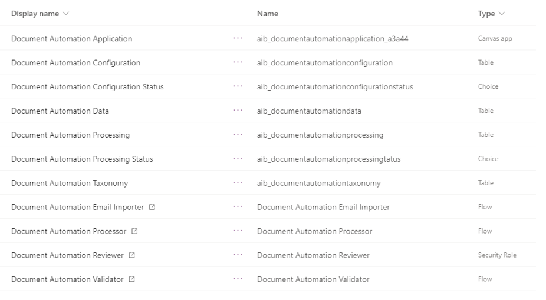
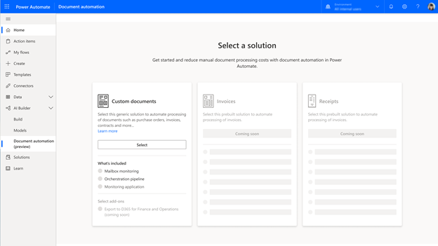
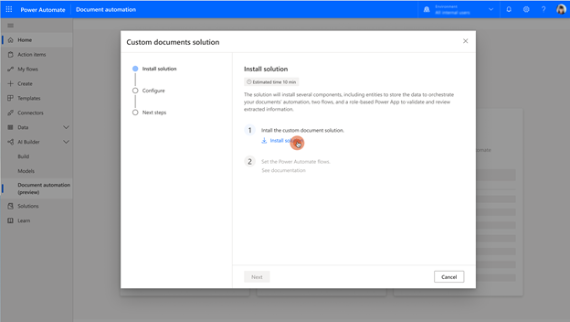
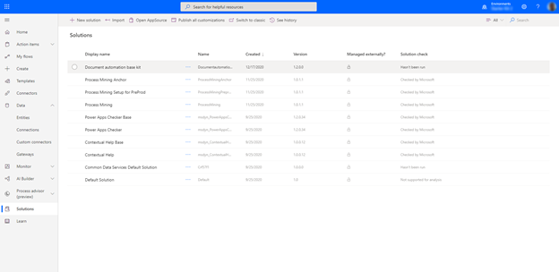
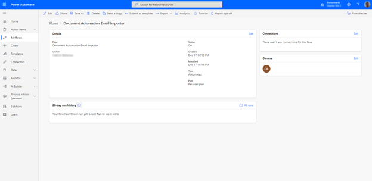
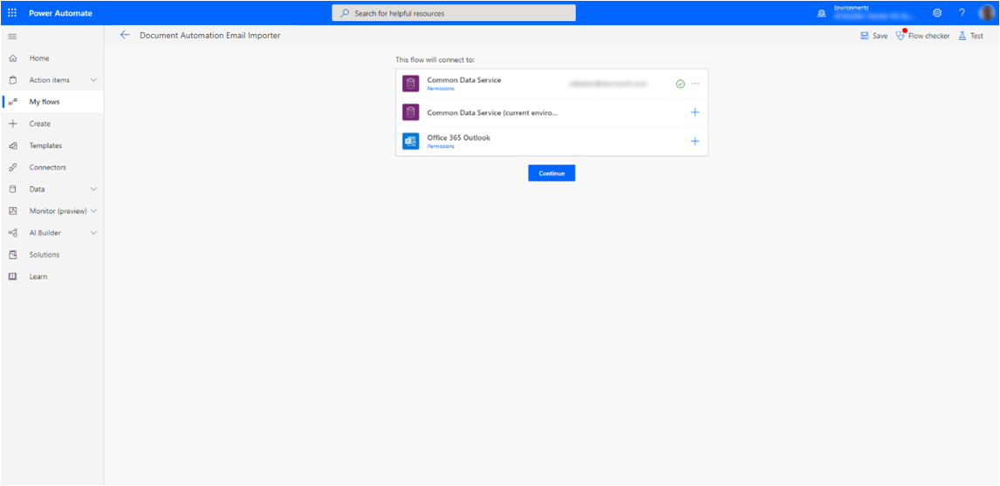
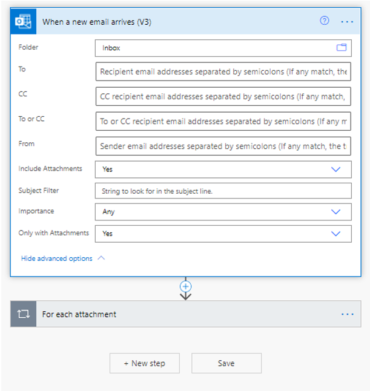
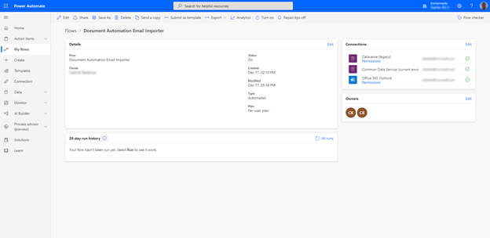

In this unit, you will

- Understand how to install the Document automation base kit.

- Learn what are the key components installed.

- Learn how to configure the connection to outlook and Dataverse.

The person installing the Document automation solution should:

- Have good knowledge of Power Platform concepts (at least Power Automate connections and Dataverse).

- Have enough privileges to configure Power Automate connections and add environment variables.

- Own the connection to the outlook service mailbox that will be used to receive the documents.

Power Users or Administrators are usually a good fit for this task.

The following items will be installed with this package:

> [!div class="mx-imgBorder"]
> 

- A Power Apps "Document Automation Application" allowing makers to configure the AI model to use for the document extraction, and users to track processing of documents and review them.

- Three Power Automate flows

  - "Document Automation Email Importer" that listens to new emails arriving in the service mailbox, extracts attachment, and creates a new processing request.

  - "Document Automation Processor" that calls the AI Builder model to extract values and store it in Microsoft Dataverse.

  - "Document Automation Validator" that acts as a placeholder for your business rules and sends documents to the validation application.

- Four Microsoft Dataverse tables

  - "Document Automation Processing" storing the document automation requests, the file to be processed and the status of the processing.

  - "Document Automation Data" storing the values extracted from the document.

  - "Document Automation Configuration" storing the information about the model to use.

  - "Document Automation Taxonomy" mapping where each model labels will be stored in the "Document Automation Data" table fields.

- Two Microsoft Dataverse choices

  - "Document Automation Processing Status" with steps of the workflow

  - "Document Automation Configuration Status" to indicate it the AI model has been configured.

To install your document automation solution in one of your environments, you need to go through the following steps:

- Install the "Document automation base kit" solution package.

- Activate the flows and data connections with your account.

The flows will run with the user credentials and data connections of the user who is installing and configuring the solution.

## Install the solution

To install and configure the Document automation solution, you must follow these steps:

1. Go to Power Automate and navigate to the AI Builder > document automation page.

1. Select the **Select** button.

    > [!div class="mx-imgBorder"]
    > 

1. Once in the wizard, select the install solution link.

    > [!div class="mx-imgBorder"]
    > 

1. You are redirected to the Power Platform admin center, accept the term of service, then select "Install."

Your document automation solution is now installed but is not activated yet. To finalize the installation and activate your document solution, you need to configure the data connections and turn on the flows used by the solution. We will start by configuring and activation the flow that captures documents to process.

1. Select the "Document automation Base Kit."

    > [!div class="mx-imgBorder"]
    > 

1. Then select "Document Automation Email Importer."

1. Select Edit in the top banner.

    > [!div class="mx-imgBorder"]
    > 

1. Select the "+" for each connection to configure the connection and select "Continue."

    > [!IMPORTANT]
    > The account that you use for the "Office 365 outlook" connection is the email account that will be used to receive the documents to process. You should use the email address to which your documents are sent to. If you are documents are received on multiple email addresses you can duplicate this flow to capture documents from all those different addresses.

    > [!div class="mx-imgBorder"]
    > 

1. You are in the authoring experience of the email importer flow. Here you can configure the email rules to filter on the specific emails that you want to process. You have to keep the "include attachments" set to "Yes" as this flow takes the document on attachment as the document to be processed. But you can configure filters on the topic, senders etc. based on your needs.

    > [!div class="mx-imgBorder"]
    > 

1. Now select "Save" and then on the back arrow on the top left to come back to the previous screen.

1. Select "Turn on" on the top banner.

    > [!div class="mx-imgBorder"]
    > 

    The document Automation Email Importer flow is now configured and activated to received documents by email.

1. Repeat steps 1-10 for the "Document Automation Processor" and "Document Automation Validator" flows.

You have successfully installed the Document automation base kit and are ready to configure it.
