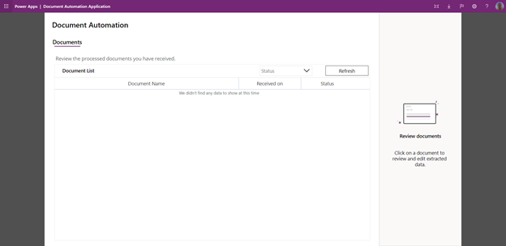
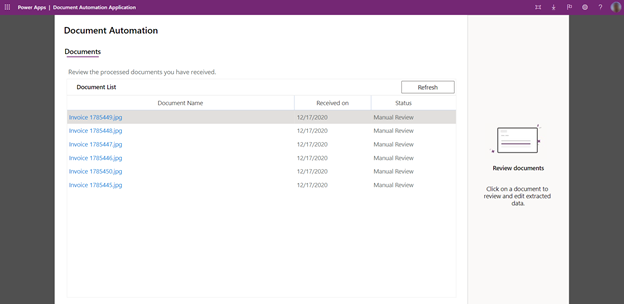
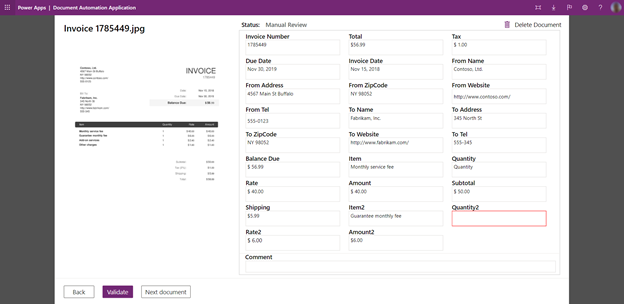
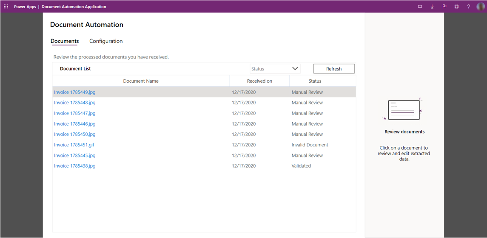
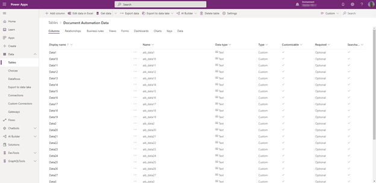

In this unit, you will

- Learn how documents are received and processed

- Understand how validator can monitor incoming documents for review

- Assess how validator can review and edit processed documents

- Learn how admin can monitor the entire processing and act

- Assess to get further by adding approvals, export to target system, and automatic validation steps

## Monitoring and reviewing processed documents

The targeted person for monitoring and reviewing documents should:

- Get a good business acumen

- Understand in which data must be extracted and eventually be imported to a target system

Business users are usually a good fit for this task.

1. When launching the "Document Automation Application", validators will see only the "Processed" documents. You can also notice that the "Configuration" tab is hidden so only power users can change the model to be used.

> [!div class="mx-imgBorder"]
> 

1. As soon as documents will arrive in the service email box, the "Document Automation Email Importer" flow will detect the new email, extract the attachment, call the AI model and will save the extracted data as a pending processing to be reviewed.

> [!div class="mx-imgBorder"]
> 

1. By clicking on the document name, you can access details, review extracted fields and edit incorrectly extracted values. Select "Validate" to save your changes. You can also skip this document and navigate to the next one to be reviewed with the "Next document" button

> [!div class="mx-imgBorder"]
> 

1. The Power user has access to all documents including the ones in error and validated.

> [!div class="mx-imgBorder"]
> 

## Limitations

- Export is not yet implemented in the "Document Automation Application." If you want to export the extracted data, please go to the Power Apps Data > Tables menu and "Document Automation Data" table, then select top button "Export data."

> [!div class="mx-imgBorder"]
> 

You are now ready to automate the processing of your documents using AI and Microsoft Power Platform.
