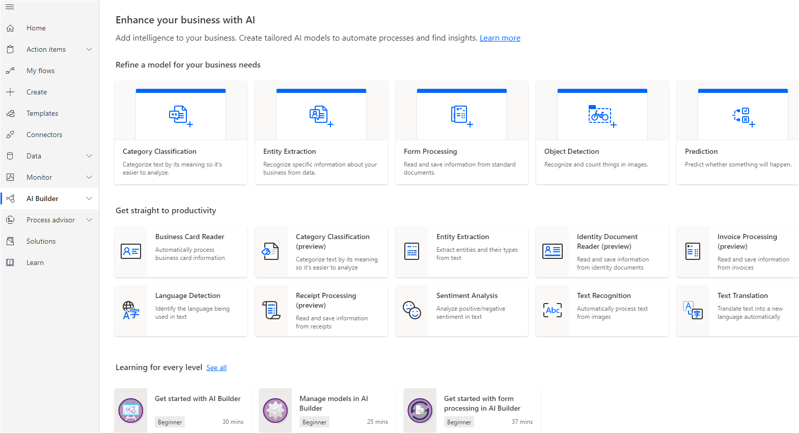
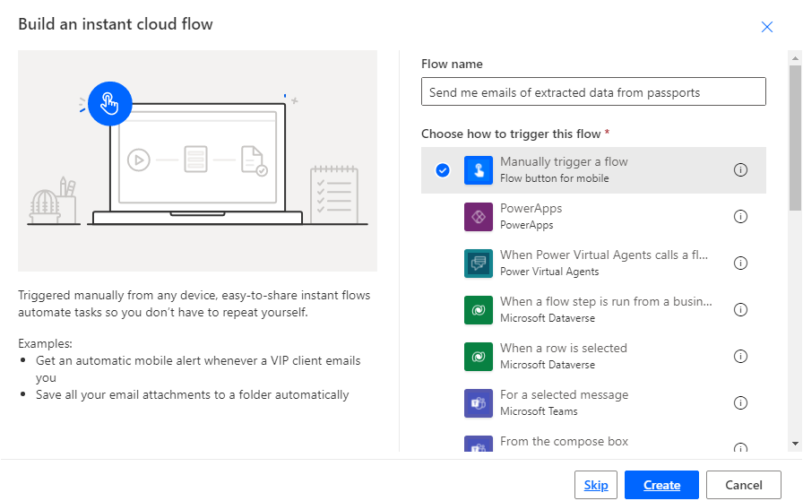
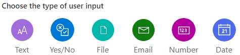
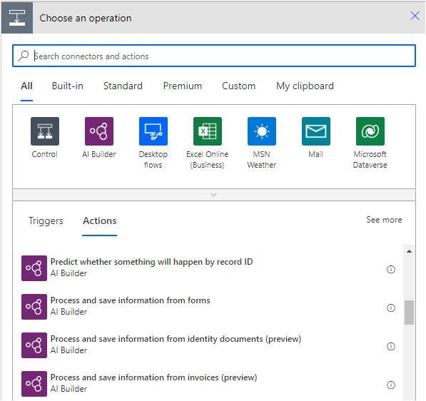
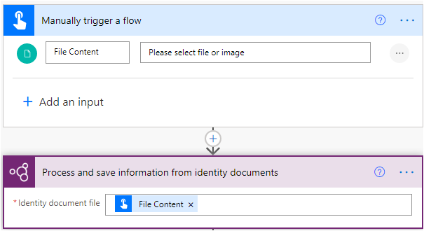
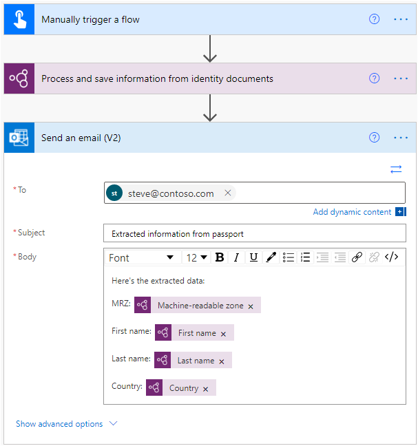
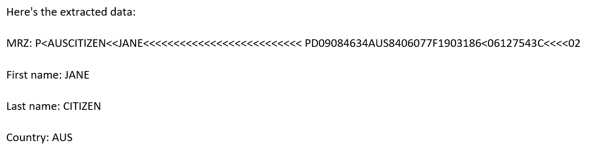

The ID reader is located on the **Build** page in AI Builder.

When you sign in to Microsoft Power Automate or Power Apps, you can go to **AI Builder** on the left menu and then select **Build**.

The AI Builder home page contains all AI capabilities that you need. In the **Get straight to productivity** section, select **Identity document reader**, where you'll learn more about this AI capability. The **Try it out** section shows the output on some sample identity documents (IDs). You can also try to upload an ID and view the extracted data. Remember, the ID reader only works with passports (all passports) and US driver licenses (more document types might be added eventually).

> [!div class="mx-imgBorder"]
> 

## Create an automated flow by using ID reader

The following sections describe how to create your first flow that uses the ID reader.

### Create a new flow

In this exercise, you'll create a manually triggered flow that will extract information from a US driver license or a passport. After the information has been extracted, Power Automate will send you an email message with the output.

1. Sign in to Microsoft Power Automate.

1. Create a new flow by going to the **Create** menu on the left and then selecting **Instant cloud flow**. Give your flow a name and then select the **Manually trigger a flow** trigger.

1. Select the **Create** button.

> [!div class="mx-imgBorder"]
> 

### Configure the trigger

After you've reviewed the **Manually trigger a flow** trigger, you'll need to configure it. Select the trigger to expand it and then select **Add an Input**. From the list of inputs select **File**.

### Scan the identity document file

Your next task is to add the AI Builder action that will extract the data.

1. Select **+ New step**.

1. Search for the **AI Builder** connector or select it from the list of connectors.

1. Select the **Process and save information from identity documents** action.

    > [!div class="mx-imgBorder"]
    > 

1. Select **File Content** for the **Identity document file** field (with this selection, AI Builder will process the file that you'll upload when you manually trigger the flow). At this point, the flow should resemble the following image.

    > [!div class="mx-imgBorder"]
    > 

1. Add the action that will send you the email that contains the extracted information. Select **+ New step** and then select the **Send an email** action, where you can specify your email address, the subject of the email, and what to enter in the body of the email. For this example, fill in the fields as follows:

    - **To** - Enter [**steve@contoso.com**](mailto:steve@contoso.com) as the email address where you want to receive the extracted data.

    - **Subject** - Enter the email subject as **Extracted information from passport**.

    - **Body** - This field should contain the [Machine Readable Zone](https://en.wikipedia.org/wiki/Machine-readable_passport), the first name, last name, and the country that is extracted from the document.

Your flow should now resemble the following image.

> [!div class="mx-imgBorder"]
> 

When you're done with writing the email pattern, you can **Save** the flow and then select **Test**. Select **Manually** on the pane and then select **Save & Test**.

Select the **Import** option to import a passport or US driver license image that you have on your PC and then select **Run flow**.

The maximum supported image size is 20 MB. Be sure to use small images for fastest processing time. You don't need to specify that you're uploading a passport or a driver license. The model will recognize each type.

If your flow ran successfully, you'll receive an email similar to the following image.

> [!div class="mx-imgBorder"]
> 

You can now modify this flow so that it fetches scans from Microsoft OneDrive or SharePoint, for instance, or so that it writes the output into an Excel spreadsheet.
