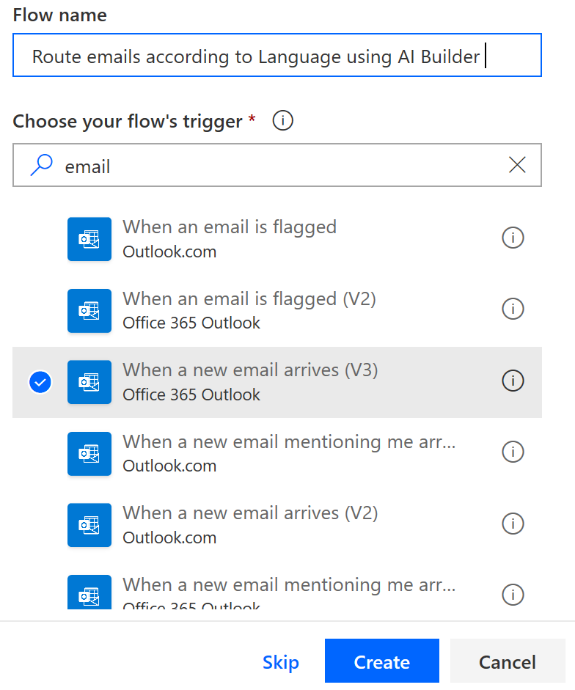
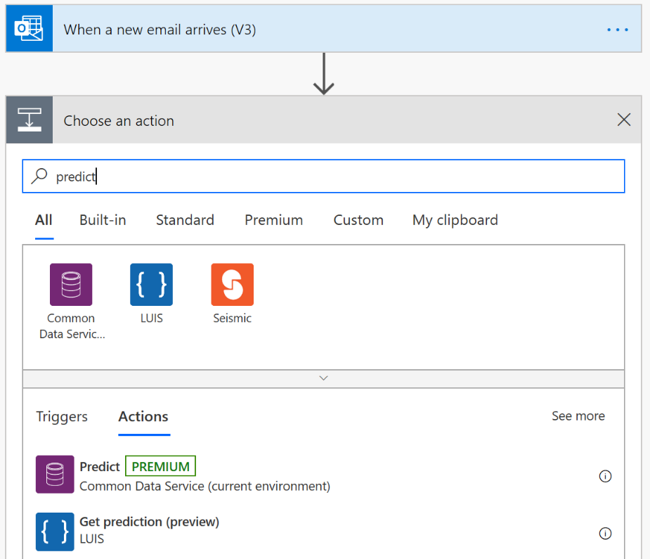
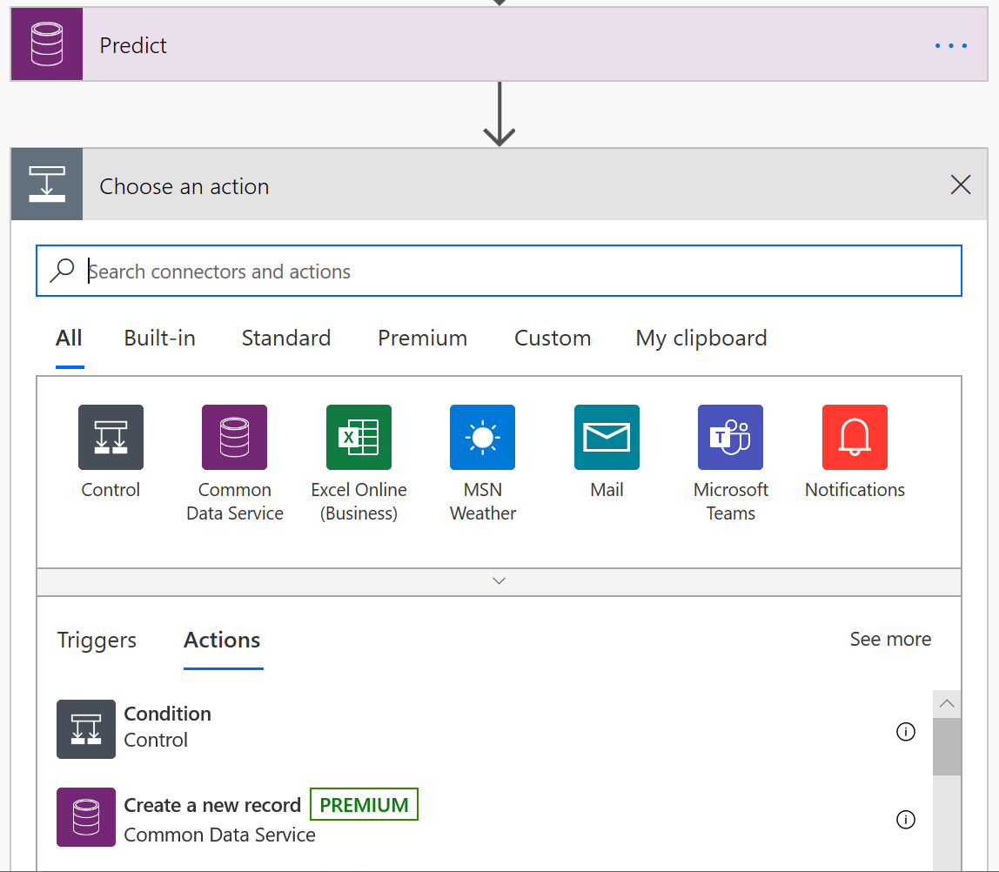
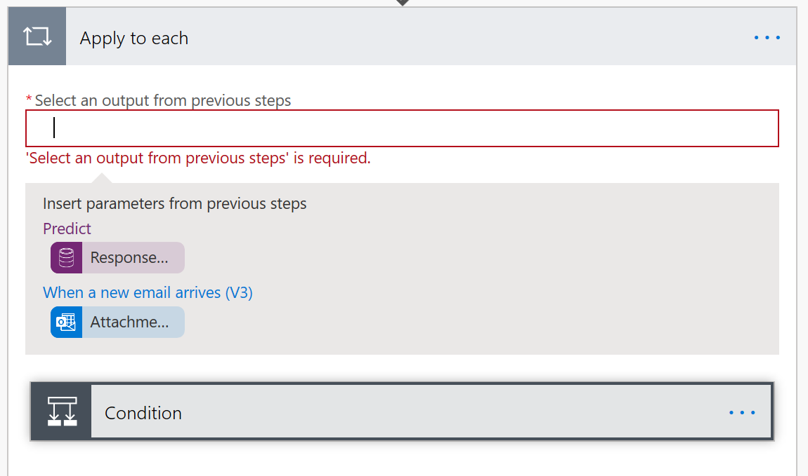
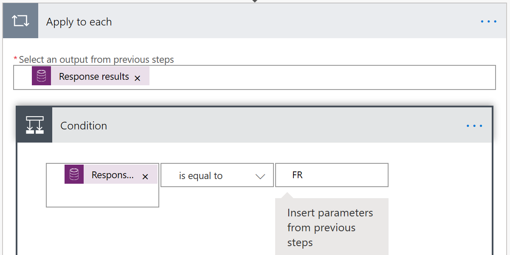
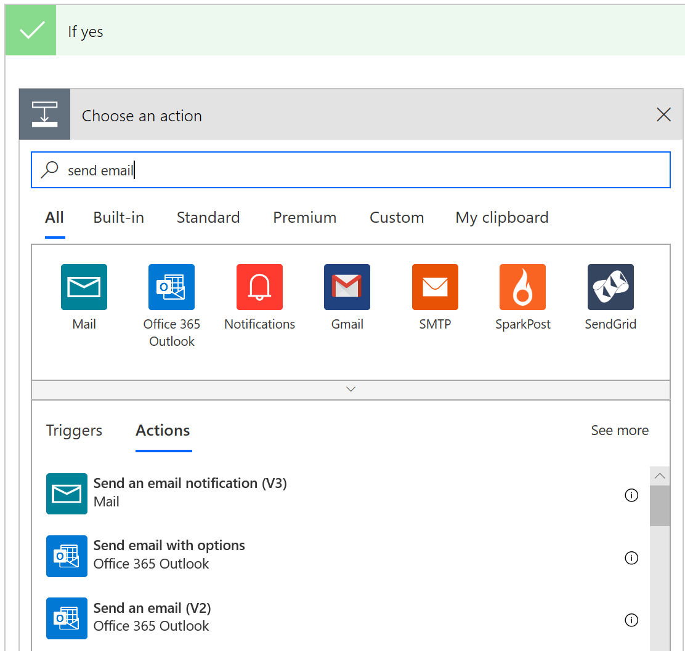
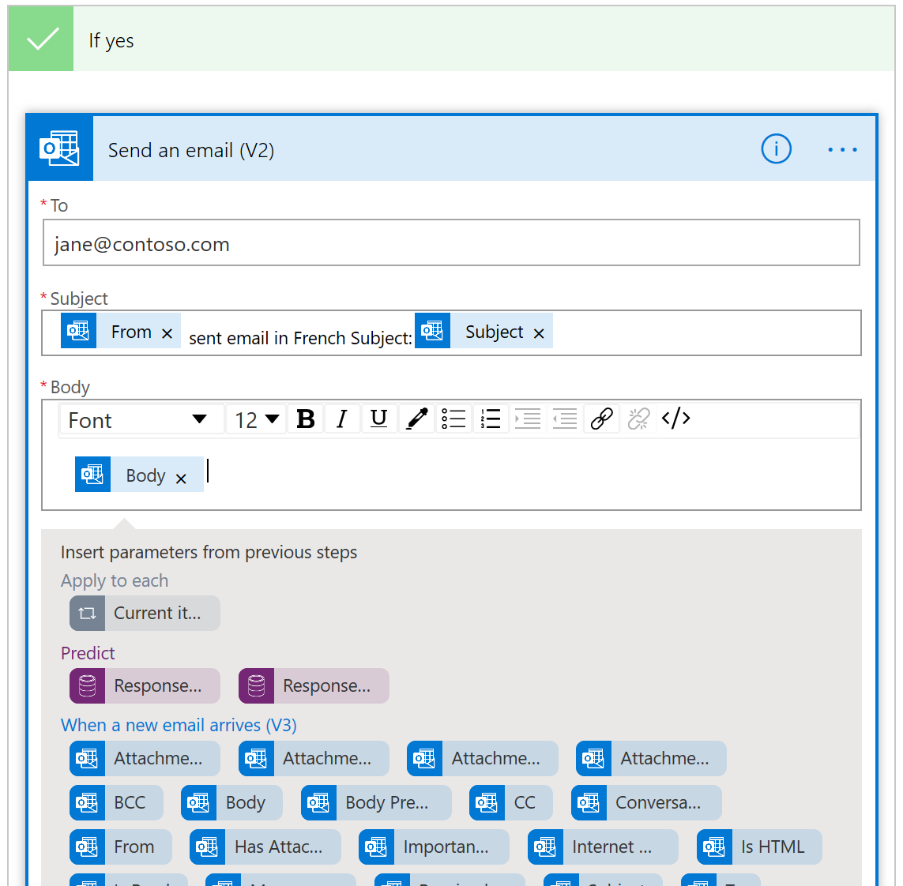

In this unit, you will:

-   Develop a simple flow with Power Automate that uses AI Builder language detection.

In this exercise, you will build a Power Automate flow that checks for the language of an email and then routes it to a specific email inbox. For more information, see the Create a flow in Power Automate documentation.

The prerequisite for this exercise is to have Common Data Service in the environment where you are building your flow.

**Create a flow that detects language and routes to a specific inbox**

To create a flow that detects language of an email and then routes it to a specific email inbox, follow these steps:

1.  Sign in to Power Automate.

2.  Select **Create** from the left navigation bar and then select **Automated flow**.

3.  Pick a name for your flow and then select **When a new email arrives** as your flow's trigger.

    

4.  Select **Create** and then **New Step**.

5.  Search for the **Predict** action and then select it.

    

6.  Select **LanguageDetection model** from the **Model** drop-down menu, and then select **Body** (or **Body** and **Subject**) from the dynamic content from previous steps.

    

7.  Select **New Step** and search for **Condition** **Control**.

    

8.  Select **Response Results Language** in the **Select output from previous steps** field.

    

9.  Select **Condition** and then enter **FR** (for French), **EN** (for English), **DE** (for German), and so on, to select what language you want to route to a particular email. For a full list of supported languages, refer to the "Name of Resource" documentation.

    

10. Scroll down the page and, under the **If Yes** condition, add the **Send an Email** action. Select a trigger according to your preferred email provider.

    

11. Customize the **To**, **Subject**, and **Body** fields by using dynamic content, such as the content shown in the following image.

    

12. Select **Save** and test the flow with a sample email.

13. To change the flow, select **Edit** flow.

Now, when emails arrive in a specified language, they will be sent to the email that is specified in your flow.

You have successfully completed this lesson on how to use AI Builder language detection in Power Automate.
