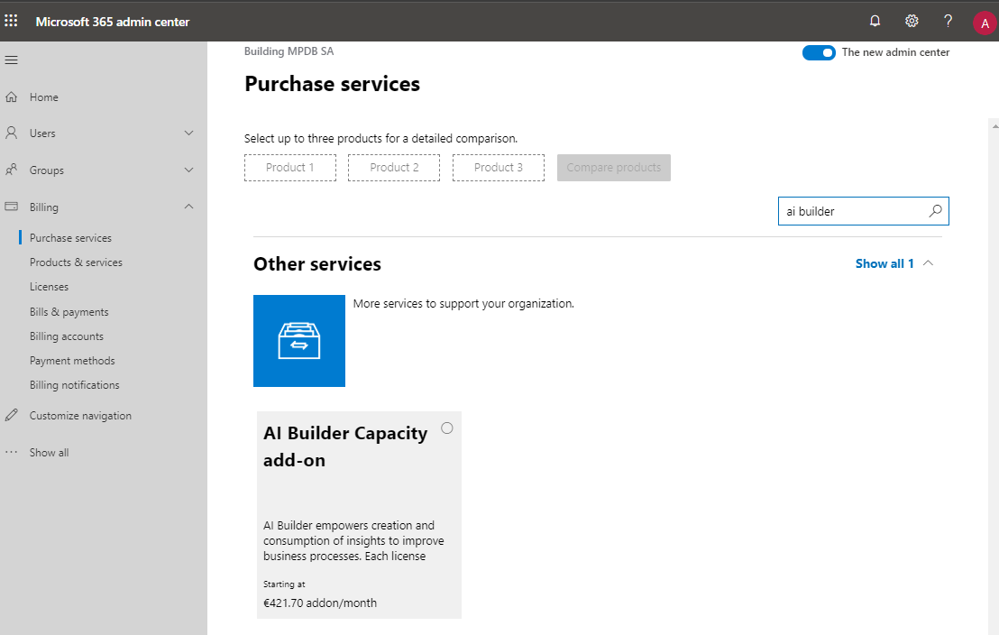
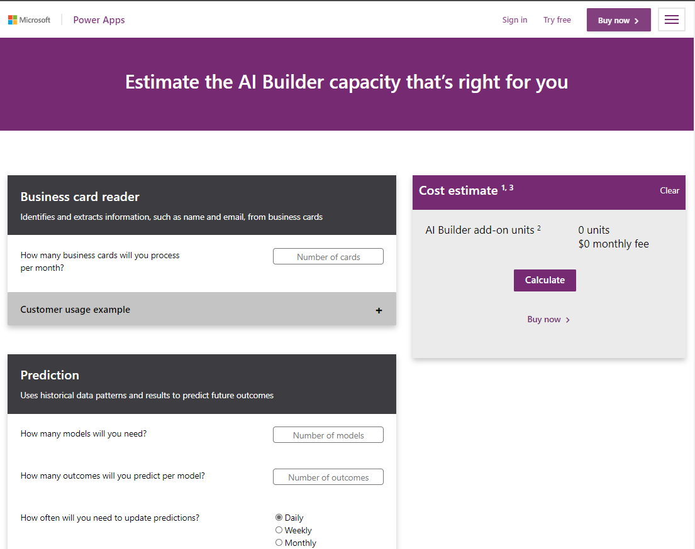
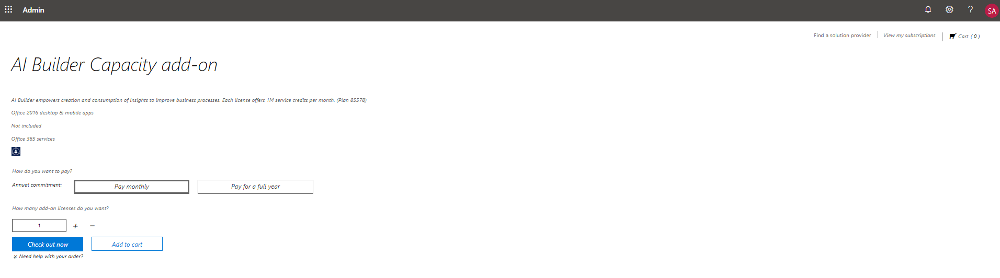
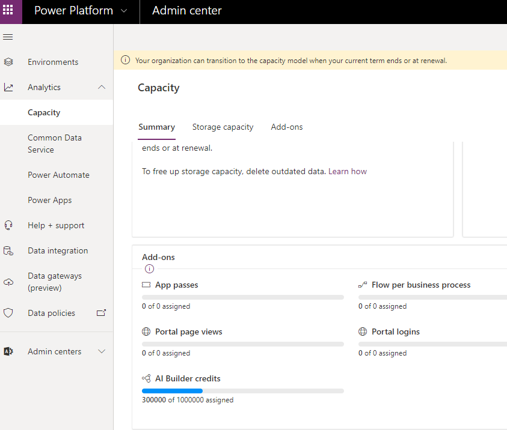

To get AI Builder capacity, you need to purchase a specific product called **AI Builder Capacity add-on**. Purchase this product through your preferred channel, whether through reseller, enterprise agreement, or direct purchase.

If you typically use Direct Channel, you can find this product at the Microsoft 365 admin center by going to <https://admin.microsoft.com>.

You need to be the billing administrator of your tenant to access this page.

In **Billing > Purchase services**, you can search for AI
Builder to find the **AI Builder Capacity add-on** service, as shown in the following image.

You can purchase several AI Builder add-ons. Each add-on will entitle your tenant to one million AI Builder credits, which is the currency that is used by AI Builder.

To know how many add-ons you need, you can use the AI Builder Calculator by going to
[https://powerapps.microsoft.com/ai-builder-calculator/](https://nam06.safelinks.protection.outlook.com/?url=https%3A%2F%2Fpowerapps.microsoft.com%2Fen-us%2Fai-builder-calculator%2F&data=02%7C01%7CAntoine.DeFontenay%40microsoft.com%7C8443f0f14c8f49421d5208d7ab801905%7C72f988bf86f141af91ab2d7cd011db47%7C1%7C0%7C637166439027827401&sdata=4jnB75CaNQoZmnuSByzAwBa5Cf%2BDDPOjgy218rn0a7M%3D&reserved=0).

The AI Builder Calculator allows you to enter your estimated use (business cards that are processed each month, number of models that you will build, and so on). Based on that information, you can calculate the AI Builder add-on capacity that you need.

If you purchase through a direct channel, follow the buying process in the Dynamics 365 admin center portal. You can configure the monthly or yearly billing cycle and the number of AI Builder capacity add-ons that you need on the following page.

At the end of this process, your tenant will automatically be entitled to AI Builder credits. This entitlement will remain as long as you keep your license active. You can use the same channel to purchase additional AI Builder Capacity add-ons or to remove some. This change will automatically adjust your entitlement of AI Builder credits at the end of the grace period.

AI Builder capacity is also included with some other first-party licenses such as Dynamics 365 Sales Enterprise Edition.

You might want to check how many AI Builder credits that your tenant is entitled to, which is a simple process.

Go to the Power Platform Admin Center and select **Analytics > Capacity**, or go to <https://admin.powerplatform.microsoft.com/analytics/capacity>.

The **Summary** tab contains a list of add-ons, including the AI Builder credits. The graph shows you the total number of credits that you own and, among them, the number of credits that have been assigned.

In this case, the tenant owns one million credits (in other words, one AI Builder capacity add-on) and has assigned 300000 of them. A later lesson will explain how to assign credits.

You now know that you need to buy the AI Builder Capacity add-on to get or add AI Builder credits to your tenant. Additionally, you have learned how to purchase the add-on: by asking your reseller, purchasing through your Enterprise Agreement, or using a direct channel on Dynamics 365 admin center. Finally, you are aware that a way to check the number of AI Builder credits that your tenant is entitled to is by going to the Power Platform Admin Center.
