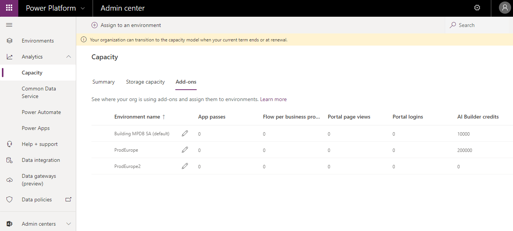
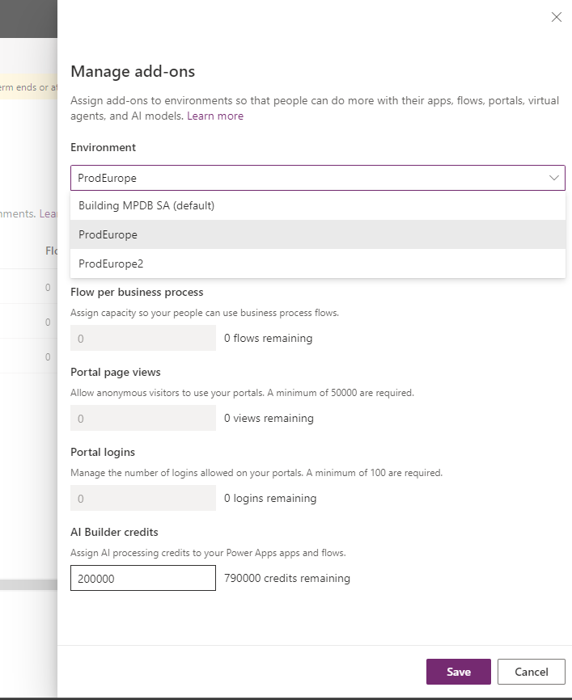
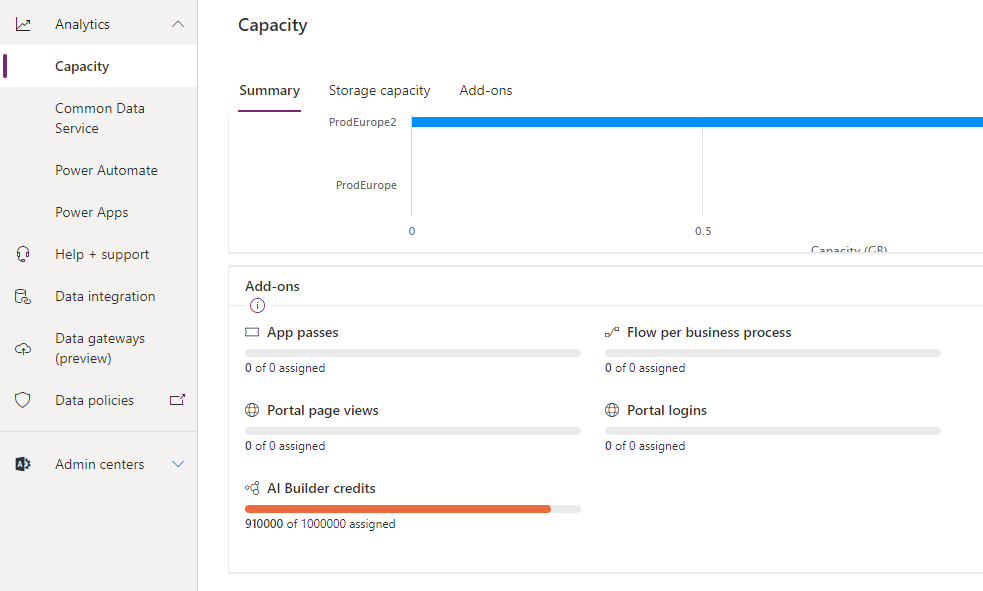

In previous lessons, you learned about the premium experiences in AI Builder, which require capacity, and then how to purchase such capacity.

In this unit, you will:

-   Identify how to manage the AI Builder capacity through assign and unassign.

-   Examine how you can check the AI Builder capacity assignment.

-   Distinguish the different ways to perform AI Builder action: Environment with AI Builder capacity assigned or AI Builder Trial license at user level.

Premium experiences, such as performing a prediction in a prebuilt model or launching a training action on a custom model such as object detection, require available capacity in the current environment.

An environment is a Power Platform concept that defines a storage and working area. Usually, an environment includes a Common Data Service database (which is required for AI Builder to work correctly) and apps, AI models, and flows that are created in it. For example, tenants might use environments to distinguish Prod environments from Dev environments, and might occasionally use them to separate areas between Enterprise divisions. An environment is also known as an organization in a dynamic namespace.

As explained in a previous lesson, when you purchase AI Builder Capacity Add-on, corresponding capacity is made available at the tenant level. To make it available at the Environment level, you need to assign it by going to the Power Platform Admin center and, in the **Analytics \> Capacity** section, selecting <https://admin.powerplatform.microsoft.com/analytics/capacity>.

If your tenant is entitled to any Power Platform Capacity Add-ons, including AI Builder Capacity Add-on, the **Add-ons** tab appears.

In this section, you will learn to assign and unassign AI Builder credits to your environments.

Select **Assign to an environment** at the top of the page to open a side panel. In this panel, select the environment that you want to modify, enter the new number of AI Builder credits that you want this environment to be assigned to, and then select **Save**.

The total of assigned AI Builder credits across an environment cannot exceed the number of available AI Builder credits at the tenant level.

If you want to reassign credits from one environment to another, reduce the capacity for the first environment before raising the capacity in the second environment.

If you assign more credits than there are remaining, you won't be able to save, and an error message will warn you that the "Quantity cannot exceed the remaining."

After you have saved the environment, the amount is directly assigned, and users can begin performing premium actions.

The goal of this assignment step is to allow an admin to correctly manage your capacity across your environments. You might want to limit the number of AI Builder credits that are used in the Dev environment so more can be used in the Prod environment. At any time, you can purchase an additional AI Builder Add-On Capacity and distribute the additional AI Builder credits among your environments.

As shown in the following image, the total number of assigned AI Builder credits can be seen in the first tab of **Analytics \> Capacity**, in the **Add-On** part of the screen, at the bottom of the page.

The preceding screenshot shows that 910,000 AI Builder credits have been assigned out of the 1,000,000 that have been purchased.

When a given environment has no AI Builder credit assigned, no premium actions are available. In that case, the only way to perform premium actions is to have an AI Builder trial license. An AI Builder trial license can be obtained by selecting the **Start trial** button in the Trial banner.

The Trial banner appears at the top of AI Builder pages in environments where no AI Builder credit is assigned.

Starting a trial allows a user to perform premium actions in environments without AI Builder capacity. AI Builder trial is limited in time, only 30 days, and is limited in capacity.

When a user with a trial is performing a premium action within an environment with AI Builder capacity, then the consumption is counted against the environment capacity.

**You are now able to identify how to manage the AI Builder capacity with assign and unassign. You also know how to check the AI Builder capacity assignment. Additionally, you can distinguish the different ways to perform AI Builder actions: in an environment with AI Builder capacity assigned or with an AI Builder trial license at the user level.**
