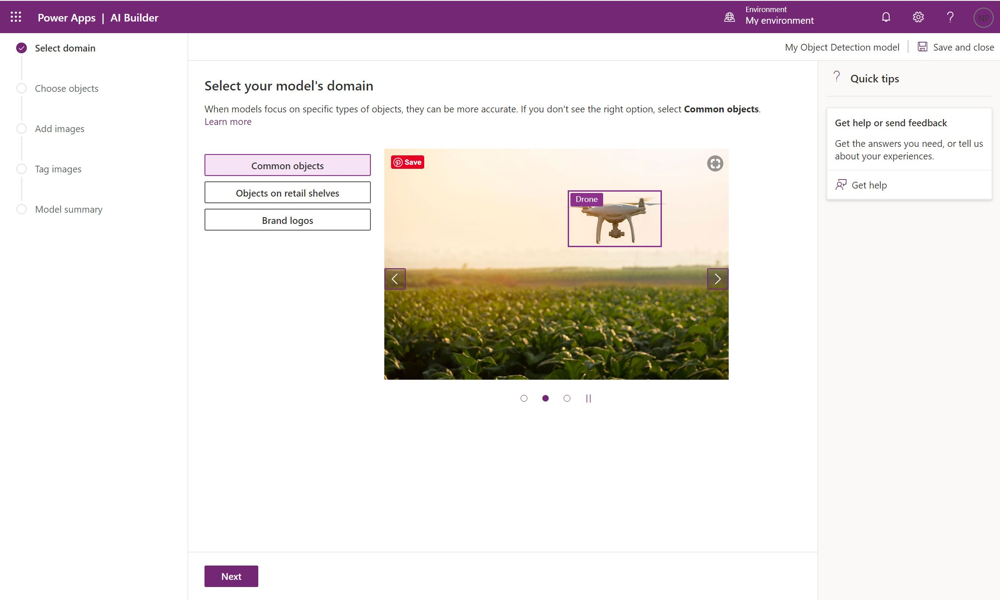
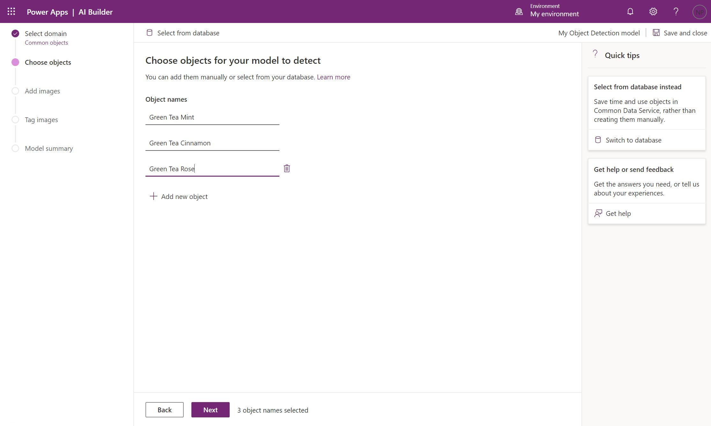
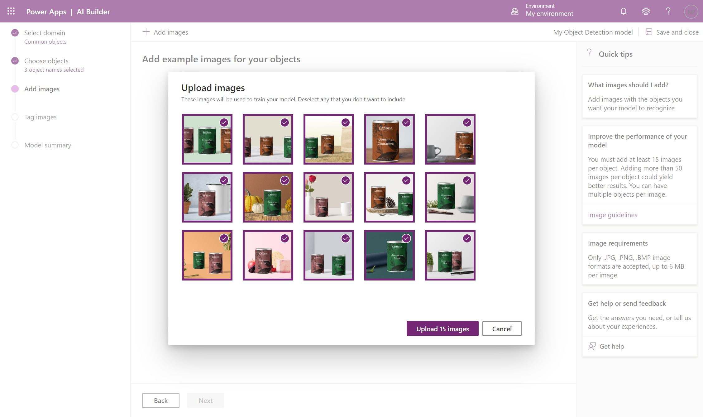
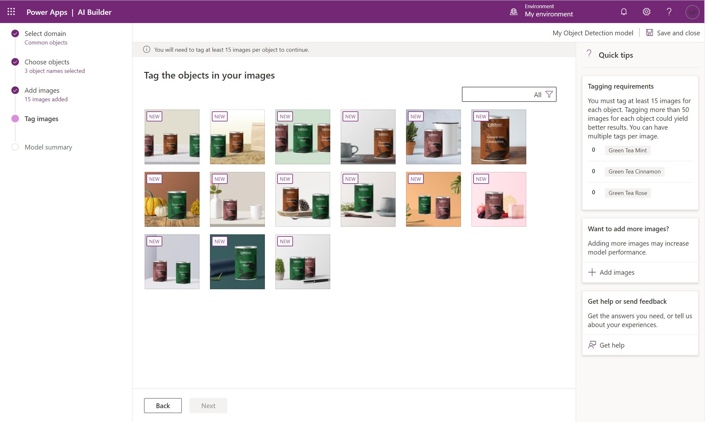
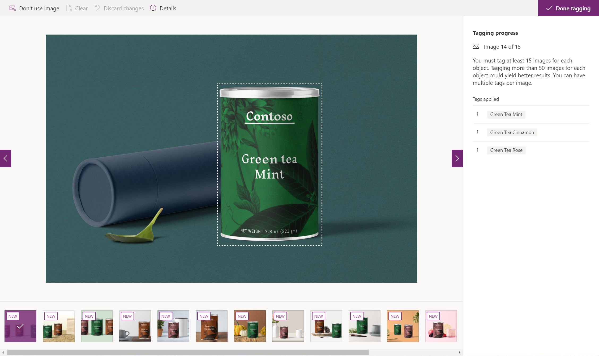
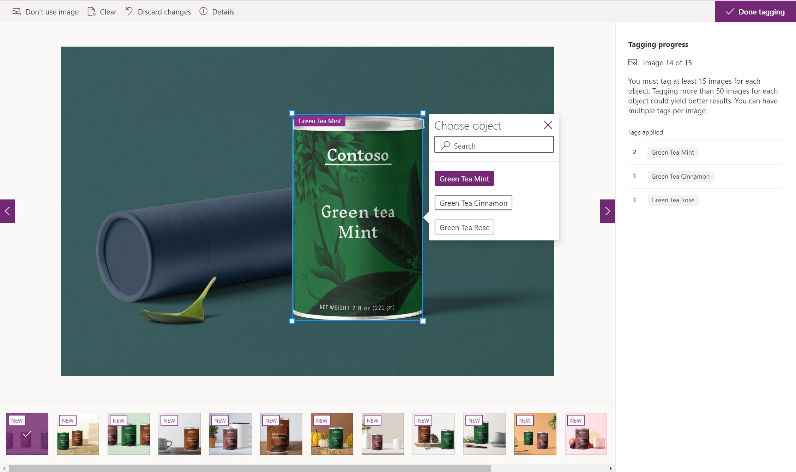

### Sign in to AI Builder

Follow these steps to sign in to AI Builder:

1.  Go to Power Apps or Power Automate and sign in with your organizational account.

2.  In the left pane, select **AI Builder > Build**.

3.  Select **Object Detection**.

4.  Enter a name for your model.

5.  If you want to create your model by using your own photos, make sure that you have at least fifteen examples that contain the object that you want to recognize. Otherwise, you can use sample data to create the model.

6.  Select **Create**.

This guided experience will walk through each step of the model creation process. You can save your work and return at any time. Progress will be saved automatically when you switch between steps.

If you want to use sample data, download the [**AIBuilder\_Lab.zip**](https://github.com/microsoft/PowerApps-Samples/blob/master/ai-builder/labs/AIBuilder_Lab.zip) file and extract it inside a folder on your computer. The documents that are used in this exercise are located in the **AIBuilder\_Lab\\Lab Images\\ObjectDetection\_Green Tea\\Train** folder.

### Select the domain

Select the domain that applies to your model. A domain helps specialize the model algorithm for better accuracy. For the purpose of this exercise, select the default value **Common objects** and then select **Next**.

### Choose objects

Define the objects that you want to recognize. If you use the sample dataset, enter the following object names: **Green Tea Cinnamon**, **Green Tea Mint**, and **Green Tea Rose**. Otherwise, enter the object names that you want to recognize. Select **Next** to continue.

### Add images
Follow these steps to add images:

1.  Select **Add images**.

2.  Select **Upload from local storage**.

3.  Select at least 15 images. (You will need at least 15 images for each of the objects that you want to tag. An image can contain multiple objects.)

4.  Select **Upload images**.

5.  After the images have uploaded, select **Next**.

### Tag images

The next step is to tag your images. You will be able to see which images have already been tagged or not.

1.  Select an image to start tagging. You'll be presented with a full-screen experience to perform the tagging. The algorithm will suggest bounding boxes around the objects in the picture that you can resize to adjust to your object.

    

You can also select and drag to draw your own boxes.

You can follow the tagging progress on the right panel. You will need to tag, at a *minimum*, 15 images for each object (an image can contain multiple objects).

2.  When you are finished, select **Done tagging**.

3.  Select **Next**.

4.  Review the summary of your model's details. If everything appears acceptable, select **Train**.

Now that you've created an Object detection model in AI Builder, you'll learn how to test your model and use it in Power Apps and Power Automate.
