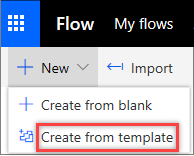
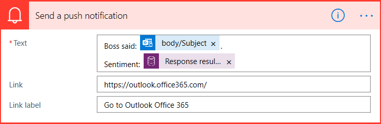

In this unit, you will:
-   Develop a simple flow with Power Automate that will use AI Builder Sentiment Analysis.

In this exercise, you will be building a Power Automate flow that will check for sentiment in an email that you receive from your boss. Sentiment will be sent as a push notification to your mobile flow app. For more information, see [Create a flow in Power Automate](https://docs.microsoft.com/power-automate/get-started-logic-flow).

The prerequisite for this exercise is to have Common Data Service and a Power Automate mobile app to receive push notifications. The mobile app is available for [Google Android](https://play.google.com/store/apps/details?id=com.microsoft.flow), [Apple iOS](https://itunes.apple.com/app/apple-store/id1094928825), and[Windows Phone](https://www.microsoft.com/p/microsoft-flow/9nkn0p5l9n84).

**Create a flow that analyzes sentiment**

Power Automate comes with many templates to help get you started with creating flows. To create a flow by using a template, follow these steps:

1.  Sign in to [Power Automate](https://ms.flow.microsoft.com/) by using your organizational account.
2.  Select **My flows**.
3.  Select **New** and then select **Create from template**.

4.  Enter **AI Builder Sentiment** to filter for templates that feature AI Builder Sentiment Analysis, select **Send a notification with the sentiment of manager's emails using AI Builder**, and then select the template.
5.  Select **Continue**. In the flow, you'll see the steps that will be used to get your email profile and your boss\'s profile before the flow is started.
6.  Scroll to the bottom of the flow steps to find the **Check if it is my manager** section. Your email address and your manager's email address are automatically filled in from the profile information that you entered.
7.  In the **Send a push notification** section, select **Text** to change the text of the notification that you'll get when an email is received from your boss. Alternatively, you can leave the text as-is.

8.  Select **Save** to save and test the flow.
9.  To change the flow, select **Edit flow**.

Now, when emails arrive from your boss, you'll get a push notification with sentiment of the email on your phone.

**You have now learned how to use AI Builder Sentiment Analysis by using Power Automate Template.**
