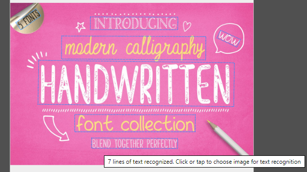

Before you begin this course, we recommend that you read the **Get started with AI Builder** module and the "What is AI Builder?" documentation.

AI Builder Text recognition is a prebuilt AI model that extracts lines of text from documents and images. AI models usually require that you provide samples of data to train before you are able to perform predictions. You can pretrain prebuilt models by using a set of samples that are provided by Microsoft so they are instantly ready for use in predictions.

When you are predicting, AI Builder Text recognition will try to identify printed or handwritten text in images or documents, with help from Azure Computer Vision OCR service technology. Thus far, only English texts are supported, and the text is extracted from JPG, PNG, BMP, TIFF images, and PDF.

Many other possible business applications for text recognition will be covered in this module.

After the image has been analyzed, a maker can retrieve the recognized text and use it in their Microsoft Power Apps and Power Automate business processes.
