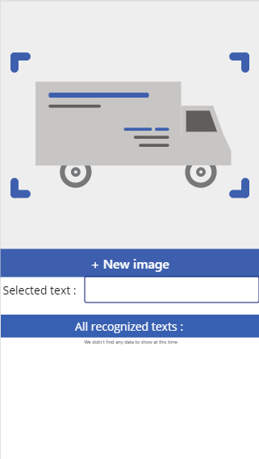
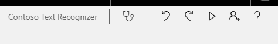
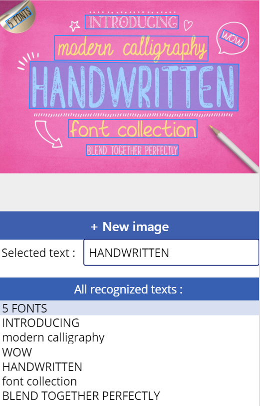

In this unit, you will:

-   Develop a simple Power Apps application that will use AI Builder Text Recognition.

-   Practice retrieving recognized text.

Your task in this unit is to take a picture, or upload an existing one from the file system, and then retrieve text lines that are present in the image. You will build a Power Apps canvas app and will use the Text recognizer component, which can be useful for assisted data entry. For more information, see "What are canvas apps in Power Apps?" and  "Use the Text recognizer component" in Power Apps documentation.

**Create an application in Power Apps**

1. Select **Create** in the **Power Apps** menu. 
2. Select **Canvas app from blank**. 
3. Name the canvas app **Contoso Text Recognizer**.
4. Select **Phone**. 
5. Select **Create**.

Your next task is to enable users to automatically retrieve the text lines that are visible in the image. 

1. From **Insert > AI Builder**, select **Text recognizer (preview)**. This control allows you to take or upload a picture and automatically recognizes the container identifier. 
2. Resize the control to fit in the screen.

**Provide feedback to the user about recognized text**

1. Select **Insert a new label**.
2. Beneath the **Text Recognizer** component, change the **Text** property to **Selected text:** 
3. Beside the **Insert a text** field, change the **Default** property to **TextRecognizer1.SelectedText**. This property will display the text that was manually selected by the user from the list of texts that were recognized by AI Builder.

**Retrieve the list of all text lines in the image and display it to the user**

To retrieve the list of all text lines that are present in the image and then display it to the user, you can insert a data table and then change the **Items** property to **TextRecognizer1.OcrObjects**. This change will bind the list of recognized text lines to the data table.

**Add a field to be displayed in the data table**

On the right pane, select **Edit Fields** and enter the word **text**, which contains the list of recognized text lines.

To make the field more meaningful, change the **FieldDisplayName** property of **text\_column1** to **All recognized texts:**, as shown in the following image.

**Test that the application** **works properly**

Select the run button on the right side of the screen.

To analyze an image, select **+ New image** and then select an image from your disk. On a mobile device, you can also take a picture with the camera.

AI Builder Text Recognition will now process the image and will display the recognized text in blue bounding boxes.

All the recognized text should be visible in the table beneath the image. You can also manually select a bounding box with your mouse on a computer or by tapping directly on a bounding box on a touch-enabled device.

The selected text will now appear in the **Selected text:** field.

AI Builder Text Recognition is able to recognize various printed character fonts and handwritten text.

You can use these results in many possible ways, such as saving it on your Common Data Service environment or other database with the help of connectors. For more information, see [Show, edit, or add a record in a canvas app](https://docs.microsoft.com/en-us/powerapps/maker/canvas-apps/add-form).
