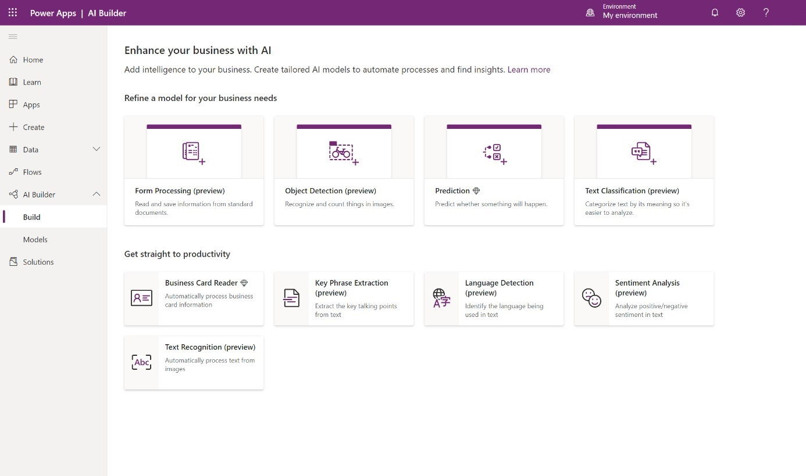
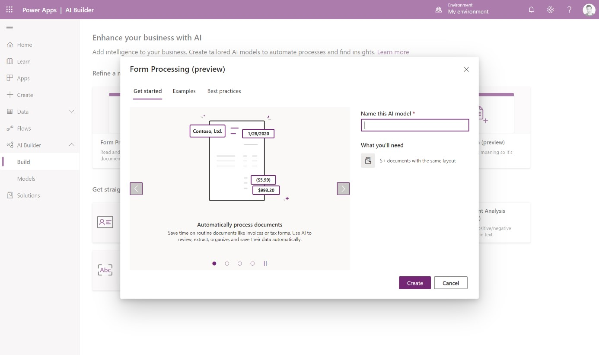

AI Builder offers several AI capabilities.

AI capabilities are brought to your apps and flows by models. A model can be built and customized by you, or it can be a prebuilt model that is ready to be used right away. Before learning about the model creation process, you should be familiar with the various model types that are available.

### Choose a model 

AI Builder comes with a wide variety of models to enhance your apps and
business processes.

Sign into Power Apps or Power Automate and select **AI Builder > Build** on the left menu.

Each tile represents a different AI capability that you can bring to
your business.

Select any tile.

### Learn about the model

Each AI Builder model has an introductory experience where you can learn more about the model.

For those models that require customization, AI Builder provides a summary of the steps that you need to take and what you need to get started. The **Examples** tab  also includes examples of how you can use the model.

For prebuilt models, AI Builder includes best practices on how to use them and buttons that you can select to get started using them right away.

### Next steps

Now that you have learned about AI capabilities, your next step is to learn how models are created and managed.
