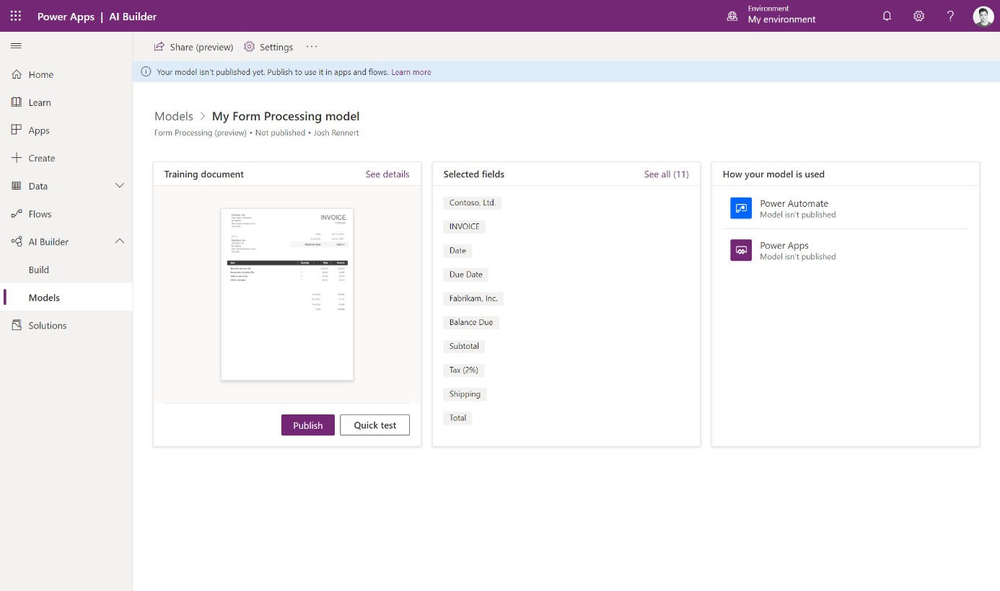
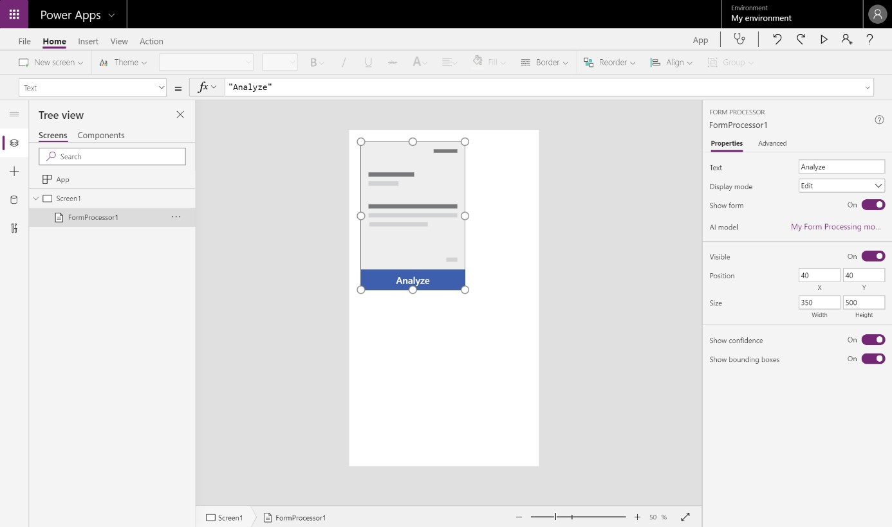
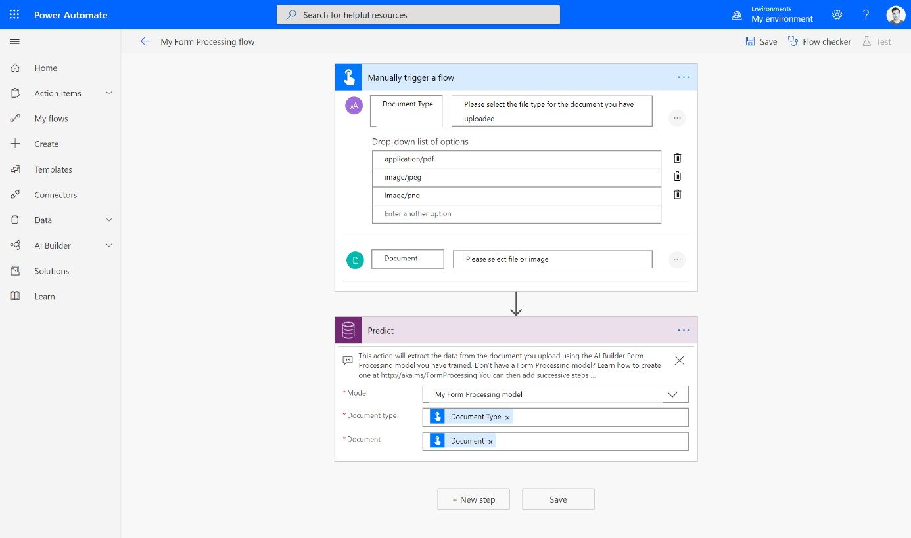

In this unit, you'll learn how to use AI Builder models in Power Apps
and Power Automate.

### View your model details

After your model has completed training, you can view important details
about your newly trained model on a details page for that model. The
information may vary depending on the model type.

Here you can see the customizations that you made to train your model.
In some cases, it shows additional insights on the training performance.
Some model types even give you the opportunity to quick test your model
to see it live in action.

You can access this page at any time from the left-side menu. Just
select **AI Builder > Models**, and search for your model name.

### Publish your model

Your model can't be used until it is published. If you are satisfied
with your model, select Publish to make it available.

There are three main ways you can use your model:

1.  As a component in an app

2.  As an action in a flow

3.  As new data in your database

Once your model is published, click Use model to see a list of the
available actions you can take to use your model.

### Use in an app

In the Use your model pane, select Create new app, which appears if your
model type supports it.

This redirects you to the canvas app creation experience, with the AI
Builder component already added to your canvas, and your model
automatically linked to the component.

You can add AI Builder components to your existing apps at any time.
Just click the Insert tab, and then select the component from the AI
Builder menu.

### Use in a flow

In the Use your model pane, select Create new flow, which appears if
your model type supports it.

This redirects you to the flow template page in Power Automate. Confirm
the connections, and then select Continue.

In the flow creation experience, you'll find the AI Builder action
already added to your flow and your model automatically linked to the
action.

You can add the AI Builder action to [solution-aware
flows](https://docs.microsoft.com/power-automate/create-flow-solution)
by searching for the Predict action under Common Data Service (current
environment), then selecting your model name from the Model dropdown
menu.

### Use in your database

Some model types write the intelligence back to your database, so you
can use it in your data views in Power Apps or Power BI.

Once you publish, some model types automatically begin scheduling the
model to write data back to your database by default. For others, you
can customize the scheduling. In the Use your model pane, select Set run
schedule to define the frequency. This option appears when the model
supports it.
