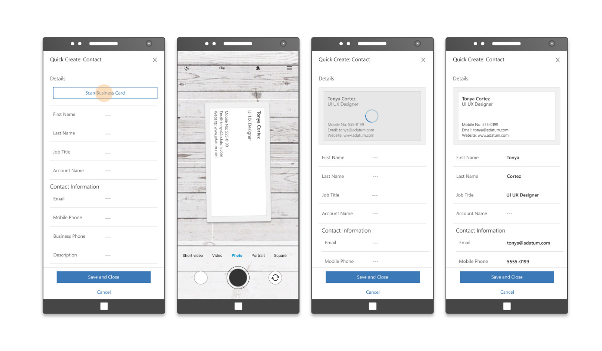

In this unit, you will:

-   Learn about AI Builder Business card reader.

-   Discover how you can integrate AI Builder Business card reader to Power Apps and Power Automate.

Before you begin this course, we recommend that you first see the "Get Started with AI Builder" module and read the [What is AI Builder?](https://docs.microsoft.com/ai-builder/overview) content.

The business card prebuilt AI model allows you to extract information from business card images. If it detects a business card in the image, the AI model extracts the information such as name, job title, address, email, company, and phone numbers.

There is a wild range of different business cards designs and formats. AI builder is constantly improving the accuracy of the business card AI model to better identify the different fields in your business cards.

Currently, only English business cards are supported, and JPG, PNG, BMP and TIFF files are supported. More languages and file formats will be added in the future.

You can use the business card reader in your model-driven apps, canvas Apps and Power Automate flows. The business card reader is also present in the Dynamics 365 Sales Enterprise "Quick Create Contact" and "Quick Create Lead" forms to allow users to automatically fill out the creation
of contacts and leads form using business card information.

**You have successfully been introduced to AI Builder Business card reader and are ready to learn more on how to use it.**
