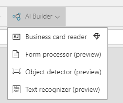
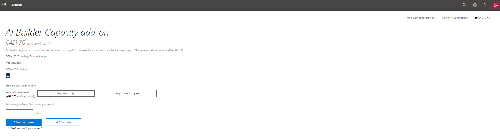
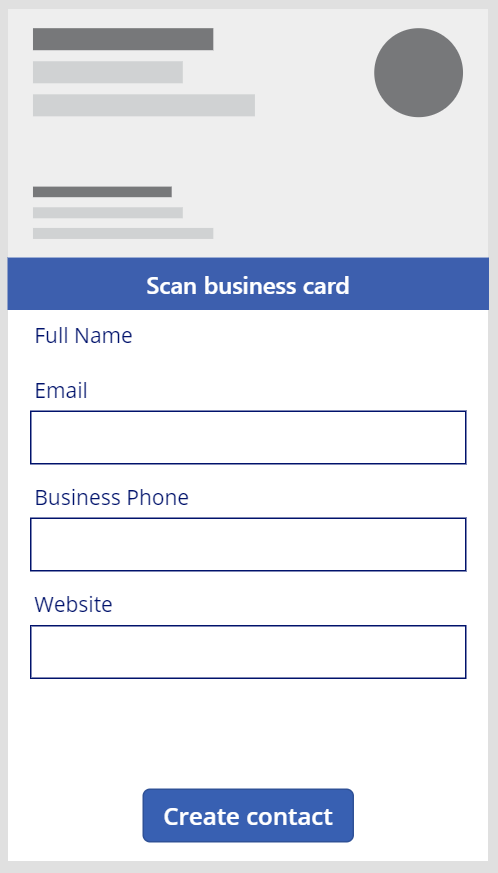
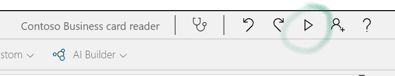
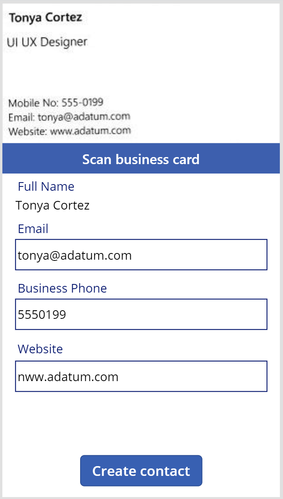

In this unit, you will:

-   Create a canvas app in Power Apps and add a Business card reader to it.

-   Extract contact information from business cards.

-   Create a new contact record in CDS using the extracted contact
    information

The goal here is to take a picture or upload an existing one from the file system and extract contact information present in the image. You will build a canvas Power App (See [What are canvas apps in Power Apps?](https://docs.microsoft.com/powerapps/maker/canvas-apps/getting-started)) and will use the Business card reader component (See [Use the business card reader component in a canvas app](https://docs.microsoft.com/ai-builder/business-card-reader-component-in-powerapps)).

**The first step is to create an application in Power Apps.**

1. Use "Create" in the Power Apps left menu and then "Canvas app from blank". 
2. Name the canvas app "Contoso Business card reader".
3. Select "Phone". 
4. Select "Create".

**Let's now enable users to automatically retrieve contact information from business cards.**

1. From the "Insert" menu and "AI Builder" bar choose "Business card reader". This is the control that will allow you to take or upload a picture and automatically recognize the container identifier. 
2. Resize the control to fit in the screen.

    

**We can bind the contact information from the business card to an existing entity from CDS using a Form.**

1. Select "Insert a new Form in edition mode". 
2. Change the "Default mode" property to "New" and the "Data source" property to the "Contacts" entity. 
3. Once the "Data Source" property is set, three fields are automatically added to the form. Click on the "Fields" property and add other contact fields to the form. Business card reader can extract 18 different fields from business cards. In this example we will add the field "Website".

**Bind the extracted contact information to the Form.**

1. Go to each of the Data Cards of the form and, in the Advanced tab, click on "Unlock to change properties".

    

2. You can now change the default value of each Data Card to map the Business card reader extracted properties. You should set the following default values:

-   Full Name\_DataCard1 "Default" property:
    "BusinessCardReader1.FullName"

-   Email\_DataCard1 "Default" property: "BusinessCardReader1.Email"

-   Business Phone\_ DataCard1 "Default" property:
    "BusinessCardReader1.BusinessPhone"

-   Website\_ DataCard1 "Default" property:
    "BusinessCardReader1.Website"

**You can always add more fields to be mapped. In this example, you can extract the following list of fields from your business cards**

| Property          | Definition                                                                                              |
|-------------------|---------------------------------------------------------------------------------------------------------|
| AddressCity       | The city address                                                                                        |
| AddressCountry    | The country address                                                                                     |
| AddressPostalCode | The postal code address                                                                                 |
| AddressStreet     | The street address                                                                                      |
| BusinessPhone     | The first phone or fax number                                                                           |
| CleanedImage      | The image after processing where the business card appears cropped and enhanced from the original image |
| CompanyName       | The company name                                                                                        |
| Department        | The organization department found                                                                       |
| Email             | The contact email found in the business card, if any                                                    |
| Fax               | The third phone or fax number                                                                           |
| FirstName         | The contact first name                                                                                  |
| FullAddress       | The contact full address                                                                                |
| FullName          | The contact full name                                                                                   |
| JobTitle          | The contact job title                                                                                   |
| LastName          | The contact last name                                                                                   |
| MobilePhone       | The second phone or fax number                                                                          |
| OriginalImage     | The original image before processing                                                                    |
| Website           | The website                                                                                             |

**Add a button to trigger the creation of a new contact using the business card information.**

1. Select "Insert a new Button" and place the button below the form. 
2. Change the property "OnSelect" to "SubmitForm(Form1)" and the property "Text" to "Create contact".

You should see this:

**Now, test that the application is working properly.**

1. Use the "run" button on to right of the screen.

    

2. To analyze a business card, select "Scan business card", and select an image you have saved. On a mobile device, you can also directly take a picture with the camera.

**Next, AI Builder business card reader processes the business card and displays extracted contact information.**

The extracted contact information is now displayed in the form's data cards. You can review it and create a new contact by clicking on "Create contact".

Feel free to add new fields to the form, AI Builder Business card reader can recognize various contact information from business cards. You can also use the extracted information not only to create records in other entities from CDS but also to use it in external data sources.

**You have learned how to build a Power App with AI Builder Business card reader component, and how to use the extracted contact information to create a new record in the Contact entity from CDS.**
