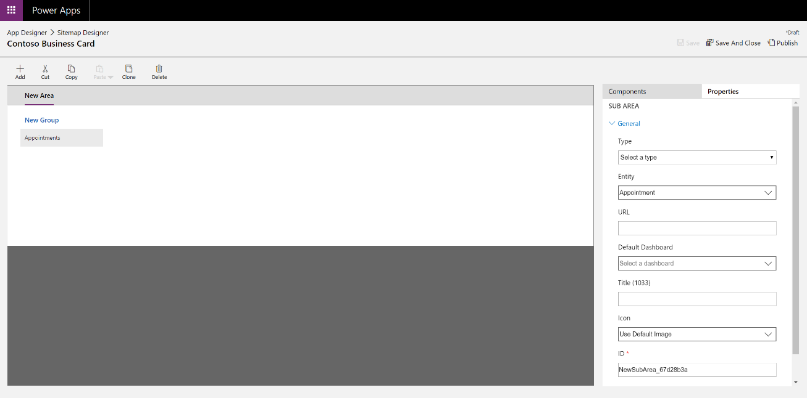
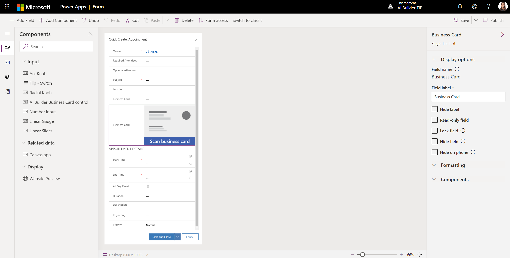
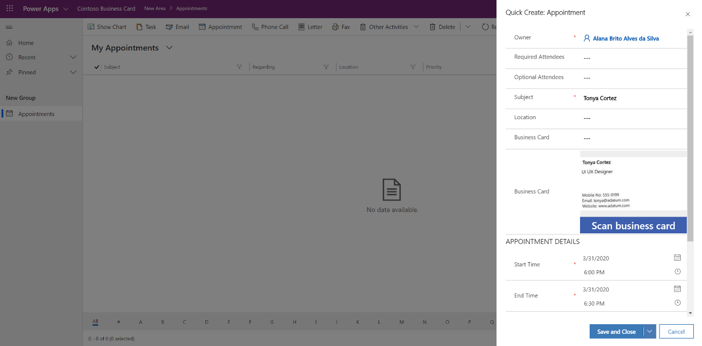

In this unit, you will:

- Create a model-driven app in Power Apps and add a Business card reader to it.

- Extract contact information from business cards.

- Create a new appointment record in CDS using the extracted contact information

The goal here is to speed up the process of creating an appointment using information from business cards. Users will extract contact information present in a business card and pre-fill the quick create appointment form with the contact information. You will build a model-driven Power App (See [What are model-driven apps in Power Apps?](https://docs.microsoft.com/powerapps/maker/model-driven-apps/model-driven-app-overview)) and will use the Business card reader component (See [Use the business card reader in model-driven apps](https://docs.microsoft.com/ai-builder/business-card-reader-component-model-driven)).

**The first step is to create a model-driven application in Power Apps.**

1. Use "Create" in Power Apps left menu. 
2. Select "Canvas model-driven from blank".
3. Name the canvas app "Contoso Business card reader".
4. In the App designer, click to edit the "Site map", then edit the sub-group. 
5. Select a CDS entity related to the form we will create that will leverage the business card reader component. For this lesson, we will use the "Appointment" entity. 
6. Click on "Save and close".

We will now update the appointment quick create form so it can leverage the business card reader. 
1. Click on "Forms". 
2. Click to edit "Appointment quick create form".

**Updating an existing form to include Business card reader component.**

You have entered the edition of the form. You can now create a new field that will host the Business card component.
1. Click on "+ Add field". 
2. Name the field "Business Card" and drag it to your form to add it.
3. Add the AI Builder business card by clicking on "+ Add component" 
4. Choose the "AI Builder business card control". Set the following properties:

   - Business Card Reader Field: Business Card (Text)

   - Full Name Field: Subject (Text)

   - Address Street Field: Location (Text)

Once the component added, you should see a page similar to the following:

You should now save and publish your updated form.

**Publishing your model-driven app and creating an Appointment using the Business card reader.**

You can now use the Quick create Appointment

1. Go back to the App Designer. Publish your application and click on the Run button. 
2. You can now test your updated form with the business card component by clicking on "+", then in "Activities", and then in "Appointment". 
3. You can scan a business card and the extracted contact fields will appear in the form. Fill out the remaining fields and save your appointment by clicking on "Save and Close".

