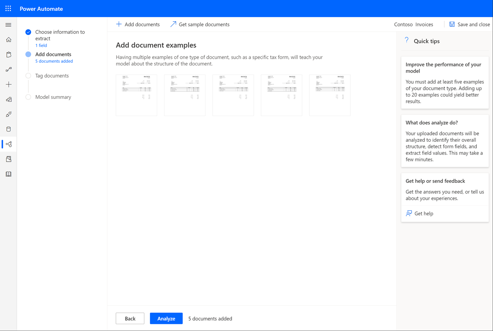
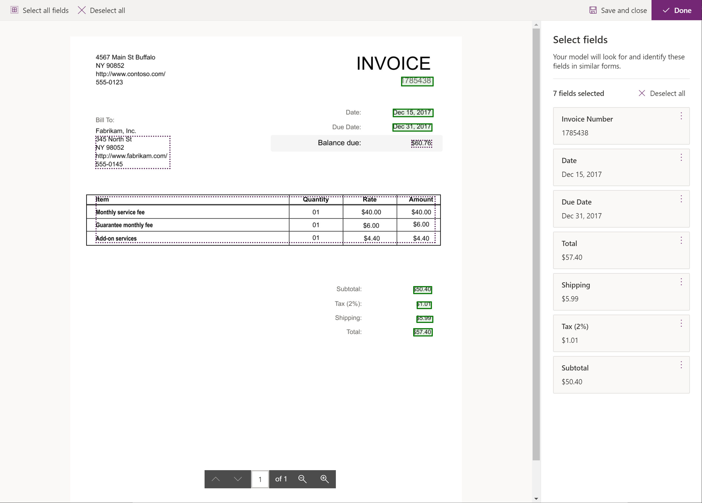

Learn how to create a form processing model in AI Builder.

### Sign into AI Builder

Follow these steps to sign into AI Builder:

1.  Go to Power Apps or Power Automate and sign in with your
    organizational account.
2.  In the left pane, select **AI Builder \> Build**.
3.  Select **Form Processing**.
4.  Enter a name for your model.
5.  If you want to create your model by using your own documents, make
    sure that you have at least five examples that use the same layout.
    Otherwise, you can use sample data to create the model.
6.  Select **Create**.

### Add documents

This guided experience will walk you through each step of the model
creation process. You can save your work and return later at any time.
Progress will be saved automatically when you navigate between steps.

If you want to use sample data, select **Get sample documents**.
Download the **AIBuilder_Lab.zip** file and extract it inside a folder
on your computer. The documents that are used in this exercise are
located in the **AIBuilder_Lab\Lab Images\FormProcessing_Invoices\Train** folder.

1.  Select **Add documents**.
2.  Select five to ten examples of your document. Only JPG, PNG, and PDF files are accepted.
3.  Verify that you have selected the correct files and then select
    **Upload documents**.
4.  After the upload has completed, select **Close**.
5.  Select **Analyze**.

### Select form fields

By using the sample documents that you have uploaded, your model will
begin to analyze the document layout to detect all the various form
fields. This process might take a few minutes to complete.

When the analysis has finished, select the thumbnail to open the field selection experience.

1.  Review the document and select all the fields that you want to save. Alternatively, select the Select all button if you want to save all fields. You can also rename the field names.
2.  If one of the fields you want to save has not been automatically detected, you can draw a rectangle around the field you are interested in, give it a name, and validate the selection. If you used the sample invoices, you can see that the address on the top left has not been detected.  

3.  If a field that you want to save has been automatically selected but does not contain all the values for that field, you can adjust the selection by selecting the field, resizing the selection and validating the selection. In the sample invoices, you see that this is the case for the Bill to field.  

4.  When you are finished, select **Confirm Fields**. If you have only selected automatically detected field, instead of Confirm Fields you will see the **Done** button, in this case you can jump to the Summary and train section down this page.

**Confirm fields**

When drawing new fields, or resizing automatically detected fields, you are presented with all the documents that you have uploaded. In this step you will need to draw the fields that are marked as pending on the right panel. By doing this you are going to teach your AI Builder model to recognize these fields in documents of this type.

To draw a field on a document, just start drawing a selection on the document and you will be asked to which field it corresponds to. You can also click on the option **Draw in document** on the fields list to the right to star the selection process for that field.

If a field is not present on one of the documents, click on the option **Field not in document**.

**Summary and train**

Once you are done selecting your fields:

1.  Select Next.
2.  Review the summary of your model's details. If everything looks acceptable, select Train.
### Next steps

Now that you've created a form processing model in AI Builder, you'll
learn how to test your model and use it in Power Apps and Power
Automate.
