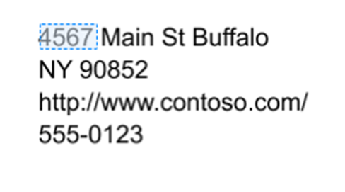

The following procedures will show you how to create a Form processing model in AI Builder. This guided experience will walk through each step of the model creation process. You can save your work and return at any time. Progress will be saved automatically when you go between steps. 

## Sign in to AI Builder

Follow these steps to sign in to AI Builder:

1.  Go to Power Apps or Power Automate and sign in with your organizational account.
2.  In the left pane, select **AI Builder > Build**.
3.  Select **Form processing**.
4.  Enter a name for your model.
5.  If you want to create your model by using your own documents, make
    sure that you have at least five examples that use the same layout.
    Otherwise, you can use sample data to create the model.
6.  Select **Create**.

## Choose information to extract 

In this step you define the fields and tables you want to teach your model how to extract. 
 
If you don’t have your own documents, in the next steps you will have the possibility to download sample invoices. If you want to use the sample data as you follow this guided experience, define fields like: Invoice number, Invoice date, total and a table called items. 

## Add documents

If you want to use sample data, select **Get sample documents**.
Download the **AI Builder Form processing Sample Data.zip** file and extract it inside a folder
on your computer. The documents that are used in this exercise are
located in the **AI Builder Form processing Sample Data\Invoices Version 2\Train** folder.

1.  Select **Add documents**.
2.  Select five to ten examples of your document. Only JPG, PNG, and PDF files are accepted.
3.  Verify that you have selected the correct files and then select **Upload documents**.
4.  After the upload has completed, select **Close**.
5.  Select **Analyze**.

## Tag documents

By using the sample documents that you have uploaded, your model will begin to analyze the document layout to detect all the various form fields. This process might take a few minutes to complete. 

When the analysis has finished, you will be shown the documents that you have uploaded. Now you need to tag the fields and tables you want your model to learn how to extract.   

### Tag fields

To tag a field, simply draw a rectangle around the field you're interested in and select to which field name it corresponds to. 

At anytime you can resize to adjust your selection.

When you hover over different words in your documents, light blue boxes appear. These indicate that you can draw a rectangle around those words to select a field.

### Tag tables

AI Builder can detect tables in your documents. These are highlighted on a dotted rectangle. Select the detected table you want and assign it to the table you have defined on the previous step.

> [!NOTE]
> Drawing tables that haven't been automatically detected isn't currently supported. If you defined a table that is not automatically detected, go back to the Choose information to extract step and remove that table.

### Field or table not in document

If a field or table is not present in one of the documents you have uploaded for training, just use the Field not in document (or Table not in document) option. 

### Tag all documents 

All the documents that you have uploaded are presented for you to tag. Some of the fields might be automatically detected in successive documents, in that case confirm that the selection is correct.

## Summary and train

After you have selected your fields, follow these steps:

1.  Select **Next**.
2.  Review the summary of your model's details. If everything looks acceptable, select **Train**.

## Next steps

Now that you've created a Form processing model in AI Builder, you'll
learn how to test your model and use it in Power Apps and Power
Automate.
