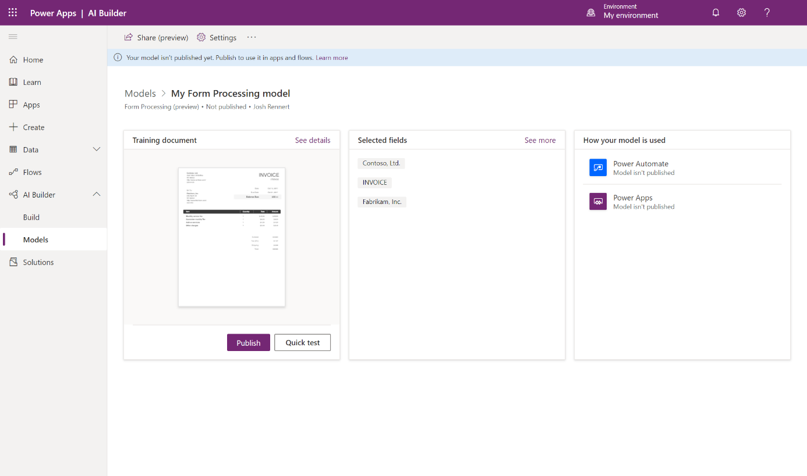
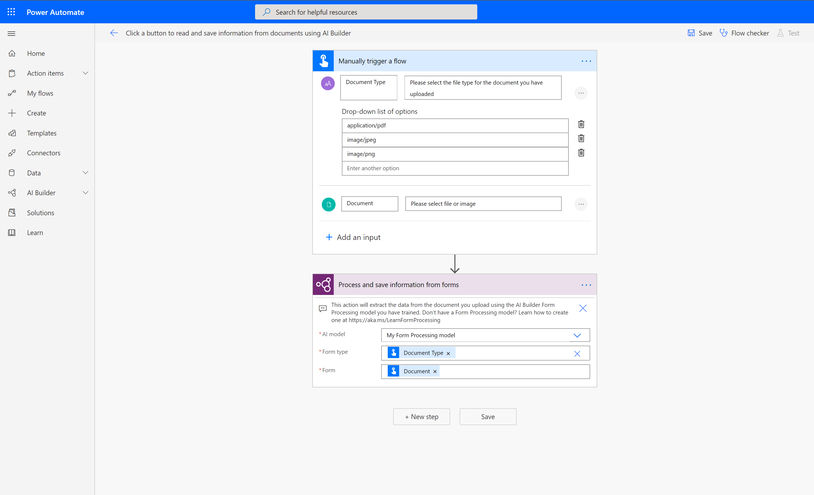
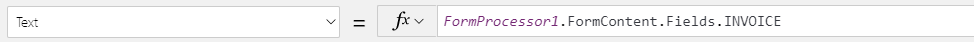
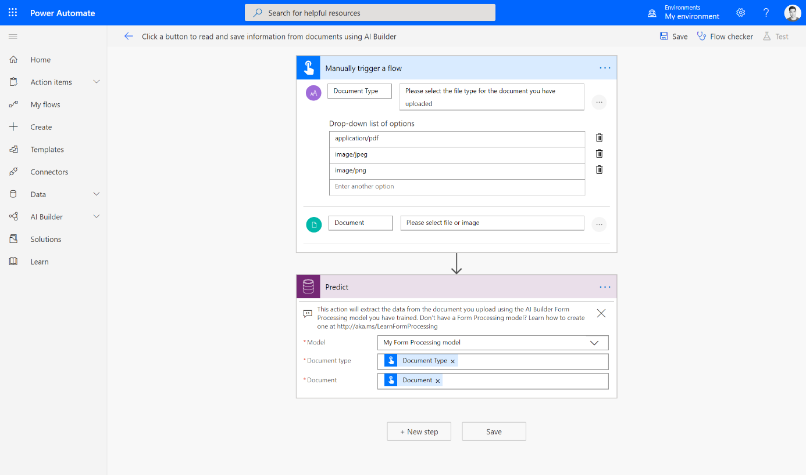

Learn how to use your form processing model in Power Apps and Power
Automate.

### Quick test

After your model has completed training, you can view important details
about your newly trained model on a details page.

{width="6.3in" height="3.7222222222222223in"}

To quickly see your model in action, select **Quick test**.

Drag and drop or upload an image from your device to test. If you are
using sample data, you can go to the **AIBuilder\_Lab\\Lab
Images\\FormProcessing\_Invoices\\Test** folder for a test image.

You will now be able to view the detected fields that you chose and the
associated confidence scores for retrieving the individual fields
compared to the trained model.

### Publish your model

Your model can't be used until you publish it. If you are satisfied with
your model, select **Publish** to make it available for use.

### Use your model in Power Apps

Now that your model is published, you can use your form processing model
in a canvas app. A special component is available for you to add that
analyzes any image and extracts the text based on your trained form
processing model.

{width="6.3in" height="3.725in"}

1.  Select **Use model**.

2.  Select **Create new app** to begin the canvas app creation
    experience.

3.  Within your canvas app, a form processor component is automatically
    added and linked to your published form processing model.\
    \
    Going forward, you can select **Insert \> AI Builder** to view the
    list of AI Builder components and then select **Form processor** to
    add a form processor component. You will need to ensure that you
    select the correct model. Only published models will appear in the
    drop-down list.

4.  Select **Insert** and then add a **Label** component.

5.  To bind the **Label** component to one of the form fields, select
    the **FormContent** property on the formula bar. This selection
    retrieves the details of the extracted form fields and tables.

6.  To choose a field to display, select one of the names from the
    **FormContent \> Fields** property. If you want to select table
    content, select one of the names from the **FormContent \> Tables**
    property.

{width="6.3in" height="0.27152777777777776in"}

7.  Select **Play** on the upper right of the Power Apps studio to
    preview the app.

8.  Select **Analyze**, and then select the image that you used to quick
    test earlier.

    A preview of your document shows the detected fields and the values
    that were detected for the fields that you chose.

### Use your model in Power Automate

After your form processing model is published, you can also use it in a
flow. You can use the **Predict** action to take advantage of the
results of your model.

{width="6.3in" height="3.7222222222222223in"}

1.  In Power Automate, on the left menu, select **Templates**.

2.  In the search bar, search for "ai builder form processing."

3.  Select **Click a button to read and save information from documents
    using AI Builder**.

4.  Under the **Predict** action, select your published model next to
    **Model**. The **Document type** and **Document** fields will
    automatically appear and be completed after you select your model.

5.  Select **Save**.

6.  Select **Test**.

7.  Select **I'll perform the trigger action** and then select **Save &
    Test**.

8.  Under **Document**, import the image that you used to quick test
    earlier. Under **Document Type**, select the corresponding file
    type. If you are using the sample data, you would select
    **image/jpeg**.

9.  Select **Run flow**.

10. After the flow run has started, select **Done**.

11. After the flow runs, expand the **Predict** action. The details of
    all various outputs that are related to the form fields that you
    selected are shown. You can use these details in your flows.
