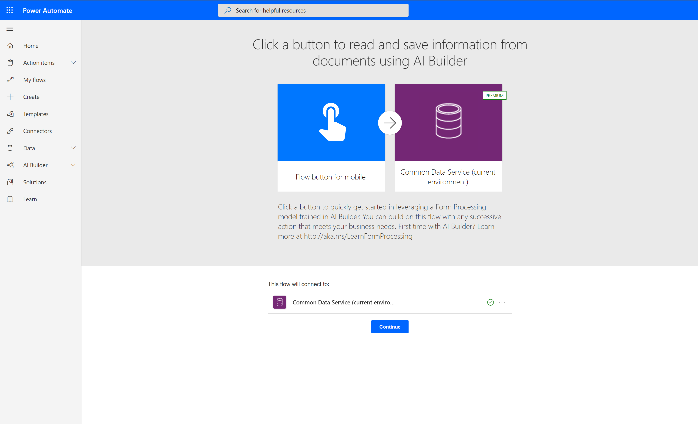
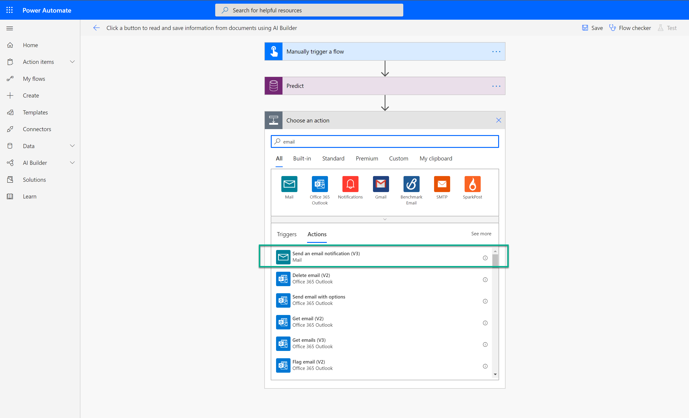
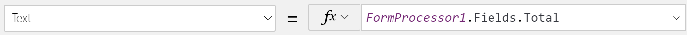

Learn how to use your Form processing model in Power Apps and Power
Automate.

## Quick test

After your model has completed training, you can view important details
about your newly trained model on a details page.

To quickly see your model in action, select **Quick test**.

Drag and drop or upload an image from your device to test. If you are
using sample data, you can go to the **AI Builder Form processing Sample Data\Invoices Version 2\Train** folder for a test image.

You will now be able to view the detected fields that you chose and the
associated confidence scores for retrieving the individual fields
compared to the trained model.

## Publish your model

Your model can't be used until you publish it. If you are satisfied with
your model, select **Publish** to make it available for use.

## Use your model in Power Apps

Now that your model is published, you can use your Form processing model
in a canvas app. A special component is available for you to add that
analyzes any image and extracts the text based on your trained form
processing model.

1.  Select **Use model**.
2.  Select **Create new app** to begin the canvas app creation
    experience.
3.  Within your canvas app, a Form processor component is automatically
    added and linked to your published Form processing model.
    
    Going forward, you can select **Insert > AI Builder** to view the
    list of AI Builder components and then select **Form processor** to
    add a Form processor component. You will need to ensure that you
    select the correct model. Only published models will appear in the
    drop-down list.
4.  Select **Insert** and then add a **Label** component.
5.  To bind the **Label** component to one of the form fields, select
    the **FormContent** property on the formula bar. This selection
    retrieves the details of the extracted form fields and tables.
6.  To choose a field to display, select one of the names from the
    **FormContent > Fields** property. If you want to select table
    content, select one of the names from the **FormContent > Tables**
    property.

7.  Select **Play** on the upper right of the Power Apps studio to
    preview the app.
8.  Select **Analyze**, and then select the image that you used to quick test earlier.

    A preview of your document shows the detected fields and the values
    that were detected for the fields that you chose.

## Use your model in Power Automate

After your Form processing model is published, you can also use it in a
flow. You can use the **Predict** action to take advantage of the
results of your model.

1.  Select **Use model**.
2.  Select **Create new flow** to begin the flow creation experience.
3.  Make sure you are logged in flow and click **Continue** to confirm the creation of the flow. 

    

4.  You will see that the flow has been already configured with a manual trigger that will prompt for a document and to specify the document type once you run the flow, as well as the predict action with the model.
5.  Let’s now add an action to send an email with what is extracted by your model. To do so, click on **+ New step**. A choose action card will appear, search for email, and select the **Send an email notification**  

    

6.  Set in the **To** field the email address you wish to send the email to, set the **Subject** field as well. In the email body include one of the fields detected by the model. You will see those in the flyout panel on the right. To retrieve a field, look for its name followed by value. If you used the sample data, you can for example select the total amount field by searching: **Total value**  

    

7.  Let’s now test the flow. Select **Save**.
8.  Select **Test**.
9.  Select **I'll perform the trigger action** and then select **Save Test**.
10.  Under **Document**, import the image that you used to quick test earlier. Under **Document Type**, select the corresponding file type. If you are using the sample data, you would select **image/jpeg**.
11.  Select **Run flow**.
12.  After the flow run has started, select **Done**.
13.  After the flow runs successfully, an email will be sent to the email you set with the content you defined.
