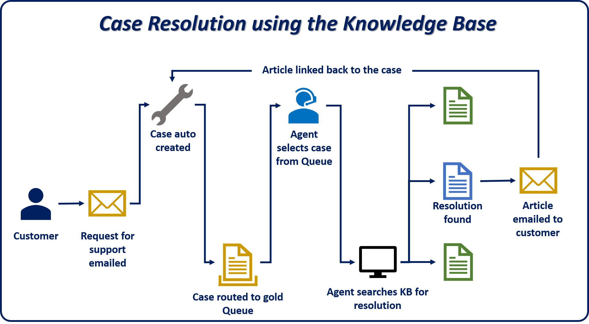

One of the major advantages of the Microsoft Dynamics 365 knowledge management solution is that agents can search for knowledge articles directly from a case record while they work to resolve a customer's issue. Out of the box, Dynamics 365 includes a **Knowledge Base Search** control that can be accessed from the **Related** pane for a case. When an agent selects the **Knowledge Base Search** button, the knowledge base is shown, and the title of the case that's being worked on is automatically entered in the search field. Any articles that match the information in the case title are listed in the search results. Therefore, agents don't have to leave the case record that they're working on to look for potential resolutions to the case.

Customer service agents can view, link, or email an article directly from within the **Knowledge Base Search** control. For every article that an agent views in the control, a view is registered and added to the view count. Knowledge managers can use the view count to track the articles that are most often viewed and those that aren't as relevant. If an article provides a resolution to the case that an agent is working on, the agent can link the article to the case or email the resolution to the customer. In both instances, a relationship between the case and article is created. Knowledge managers can consume relationship information on the **Analytics** tab for the article.

The example in the following image shows how all these pieces work together.

By default, only the Case entity can search the knowledge base. But you can set up other entities to search it too, and the **Knowledge Base Search** control can be embedded on the page for those entities. For example, an organization uses Dynamics 365 to follow up on leads, and it has articles that are relevant to leads. In this scenario, the Lead entity can be set up to search the knowledge base, and the **Knowledge Base Search** control can be added to the **Lead** page.

This module will focus on effectively setting up, showing, and consuming article information on the Case entity and other entities in Dynamics 365. You'll also learn what the experience is like for users who resolve cases by using the knowledge base. Finally, this module will showcase some of the analytical options that are available as part of the knowledge management solution.
