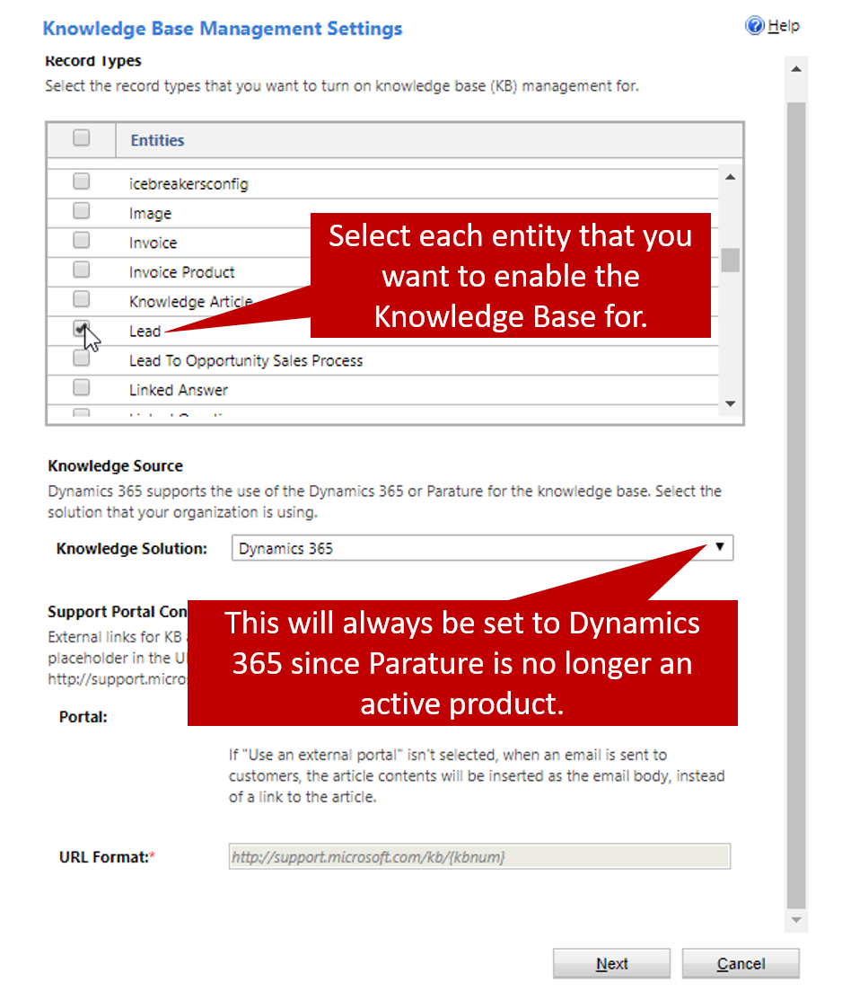
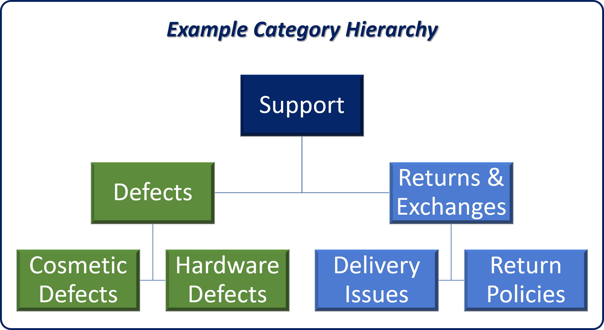

Before the **Knowledge Base Search** control can be used to search for knowledge articles, the knowledge search functionality must be turned on for them. You must also set up the knowledge base functionality for your organization by setting up two items:

- **Embedded Knowledge Search:** Define which entities can use the **Knowledge Base Search** control and which knowledge base is used.
- **Categories:** By defining article categories, you make it easier to find articles during searches and when the knowledge base is surfaced in a customer service portal.

To set up the knowledge base functionality, go to **Settings** \> **Service**, and then, in the **Knowledge Base Management** section, select **Embedded Knowledge Search** or **Categories**.

After you set up knowledge management, users will be able to:

- Search for relevant articles in Dynamics 365 while they're working on a record.
- See the content of the article inline. Any images and videos in the article will also be shown.
- Give timely and consistent information to customers when they work on cases, by using different actions. For example, an agent can open an article and share the information with a customer. Alternatively, the agent can email the customer a link to the article.

## Embedded knowledge search

When you're setting up the knowledge base functionality, the first thing that you should set up is the embedded knowledge search functionality to define which entities in Dynamics 365 will be able to use the **Knowledge Base Search** control. By default, the Case entity is the only entity that can use the control, but you can set up additional entities to use it as needed.

> [!IMPORTANT] 
> Turning on knowledge search for an entity just lets the knowledge base search functionality be used on that entity. You must still set up the **Knowledge Base Search** control for the entity on the entity page. For example, if you turn on knowledge search for the Lead entity, agents won't be able to search for articles until you add the control to the **Lead** page.

Information about adding the **Knowledge Base Search** control to a page will be provided in the next unit.

The following knowledge base management settings are available for the embedded knowledge search functionality:

- **Record Types:** Select the record types to turn on knowledge base management for. (By default, it's turned on only for case records.)
- **Knowledge Source:** Define the knowledge base to use.

> [!NOTE]
> Parature has been discontinued. You'll always select *Dynamics 365* in this field.

- **Support Portal Connection:** Turn on the knowledge base for external portals.

  - You must define the URL format for articles.
  - You don't have to set this field if you're using Dynamics 365 portals. (The use of Dynamics 365 portals is set up by default.)

After you've defined the entities to use with the knowledge base, you can select **Next** and then **Finish**. The knowledge base will be turned on for the selected entities, and you can set up the **Knowledge Base Search** control on the entity pages.

For more about setting up knowledge search, see [Use embedded knowledge search to set up knowledge management](https://docs.microsoft.com/dynamics365/customer-engagement/customer-service/set-up-knowledge-management-embedded-knowledge-search).

## Categories

Categories can be used to define a hierarchy structure for organizing articles in Dynamics 365. The example in the following image shows one way that categories can be structured.

As each article is created, it can be associated with one or more categories. These categories are surfaced in Dynamics 365 portals, and agents can expand them to see the articles that apply to each category.

> [!VIDEO https://www.microsoft.com/videoplayer/embed/RE2IJmn]

For more about working with article categories, see [Configure and manage category for knowledge articles](https://docs.microsoft.com/dynamics365/customer-engagement/portals/configure-knowledge-categories-articles).
