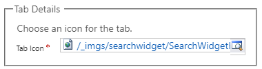
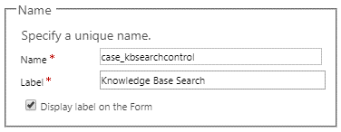
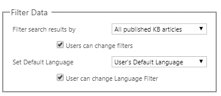
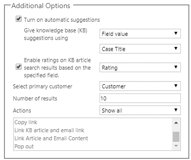

After the Dynamics 365 knowledge search functionality has been set up and article categories have been defined, the next step is to set up the **Knowledge Base Search** control for each entity page where it will be consumed. By default, the control is already set up for the Case entity. If you set it up for any other entities, it must also be set up on the relevant page for each of those entities.

## Before you begin

To set up the **Knowledge Base Search** control, you must customize the pages where it will appear. If you aren't familiar with the customization of pages in Dynamics 365, see [Customizing Dynamics 365 forms](https://docs.microsoft.com/dynamics365/customer-engagement/customize/create-design-forms).

## Working with Customer Service Hub pages

The Dynamics 365 Unified Interface is used for both the Sales Hub and Customer Service Hub apps. Although both apps provide the same navigation, functionality, and visual experience, the pages that you must customize vary, depending on the app that you're using. The Sales Hub app and apps like Field Service and Project Service use the same pages that are used in other apps: **Account**, **Contact**, and **Opportunity**. But the Customer Service Hub app includes special pages that are called Interactive Experience pages. These pages are used for many of the primary entities that appear in the Customer Service Hub. Make sure that you customize the correct page for the app that will show the information.

The following table shows which page you customize for the three entities that are most often used, depending on the app where they will appear.

| Entity  | Customer Service Hub page          | Sales Hub page |
|---------|------------------------------------|----------------|
| Account | Account for Interactive Experience | Account        |
| Contact | Contact for Interactive Experience | Contact        |
| Case    | Case for Interactive Experience    | Case           |

As you begin to add or edit the **Knowledge Base Search** control on pages, make sure that you're using the correct page.

## Unlocking the Related pane

To add the **Knowledge Base Search** control to specific pages, go to **Settings** \> **Customizations** \> **Customize the System**. From the solution, expand the entity to customize (for example, **Case**), and then select the page to work with. 

> [!NOTE] 
> Remember: the **Knowledge Base Search** control on the **Case** page, you must customize the **Case for Interactive Experience** page.

The **Knowledge Base Search** control is available in the **Related** pane on the **Case** page. By default, the **Related** pane is locked, and you can't edit it. To unlock the **Related** pane, select it, and then select **Change Properties**. Clear the **Lock the section on the Form** check box, and then select **OK**. You can now edit the pane.

If the page that you're working with doesn't have a **Related** pane, you can add it. On the **Insert** tab, select **Section**, and then select the **Reference** pane.

> [!NOTE] 
> You might also have to unlock the **Reference** pane on existing pages before you can edit it.

## Setting up the Knowledge Base Search control

After you've unlocked the **Related** pane, you can set up the **Knowledge Base Search** control by selecting it and then selecting **Change properties**. The control has the following sections:

- **Tab Details:** This section shows the path of the web resource that's being used for the tab icon in the pane. You can change this icon if needed.

   Any icon that you want to use must first be added as a web resource.

   

   For more about using web resources, see [Web resources for Customer Engagement](https://docs.microsoft.com/dynamics365/customer-engagement/developer/web-resources).

- **Name:** This section shows the name of the control and the label that's used for it. You can specify whether the label is shown on the page.

   

- **Filter Data**: This section determines which knowledge articles are shown in the control by default. You can specify whether users can change the filters that are used.

   You can also specify the default language that articles are shown in. By default, the language is set to the user's default language. (An article translation for the language must exist.) You can specify whether users can change the language filter.

   

   For more about article translations, see [Translate a knowledge article in multiple languages](https://docs.microsoft.com/dynamics365/customer-engagement/customer-service/customer-service-hub-user-guide-knowledge-article#translate-a-knowledge-article-in-multiple-languages).

- **Additional Options:** This section provides additional settings that determine how the control searches for data, how many articles are returned, and which actions are available to users in the control. It includes the following fields:

    - **Turn on automatic suggestions:** Select this check box to turn on automatic article suggestions.
    - **Give knowledge base (KB) suggestions using:** Select the field that should provide the search value that's used to provide automatic article suggestions. (By default, *Case Title* is selected.)
    - **Enable ratings on KB article search results based on specified field:** Select this check box to turn on ratings for articles, based on the specified field. (By default, *Rating* is selected.)
    - **Select primary customer:** Select the field that should be used as the primary customer field for the association. (By default, *Customer* is selected.)
    - **Number of results:** Enter the number of articles that should be returned in search results. (By default, *10* is entered.)
    - **Actions:** Select the article actions that should be available for each record that's returned in the search results. Examples of actions include copying the link, linking the article, and emailing the link. (By default, *Show all* is selected.)

   

After you've finished defining the **Knowledge Base Search** control for a page, you must save and publish the customizations before they will be visible in the application.

> [!VIDEO https://www.microsoft.com/videoplayer/embed/RE2IOFZ]

For more about setting up the **Knowledge Base Search** control, see [Add the Knowledge Base Search control to forms](https://docs.microsoft.com/dynamics365/customer-engagement/customer-service/add-knowledge-base-search-control-forms).
