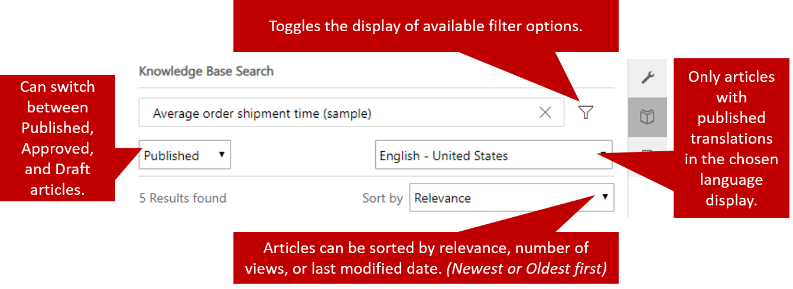
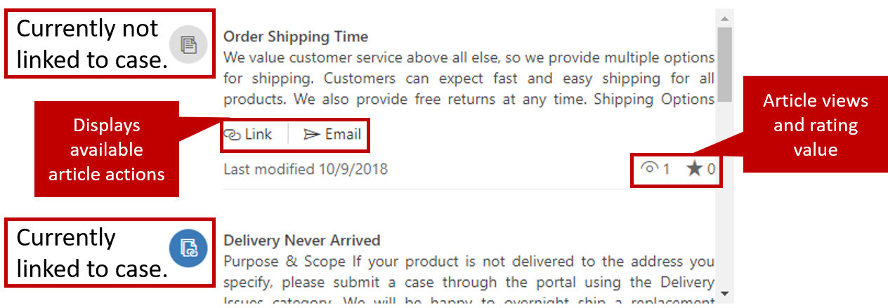
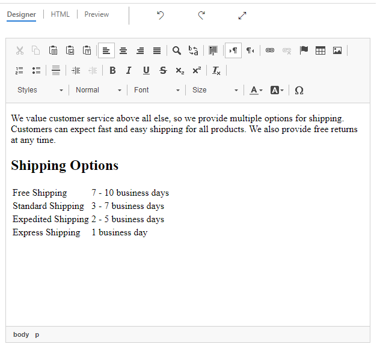

After the knowledge base is set up, and the **Knowledge Base Search** control has been added to the appropriate entity pages, agents can start using the control to look for knowledge articles.

As agents try to resolve issues for customers, they can use the knowledge base to check for potential resolutions to those issues. To access the **Knowledge Base Search** control, select the **Knowledge Base Search** button in the **Related** pane on the **Case** page.

When the **Knowledge Base Search** control is loaded, the search field is automatically filled with the title of the current case (or the value of whichever other field was specified for the control). Agents can override the field value at any time. For example, if the current results don't provide an adequate answer, the agent can enter keywords. The control will look for those keywords in the case title, article keywords, and article content, and return any matches.

By default, the **Knowledge Base Search** control shows only the published article versions that are in the user's default language. But agents can select the filter button and change the filter to search draft, approved, or published articles. If the ability to change the language filter was set on the control, they can also select the language to see articles in. The articles that are returned from the search can be sorted by article relevance, number of views, and date of last modification (newest or oldest first).

> [!IMPORTANT] 
> Articles in other languages will be presented to agents only if translated versions of the articles are available in those languages.

For more about creating article translations, see [Translate a knowledge article in multiple languages](https://docs.microsoft.com/dynamics365/customer-engagement/customer-service/customer-service-hub-user-guide-knowledge-article#translate-a-knowledge-article-in-multiple-languages).

A short snippet of each article that's returned will be shown. The following information and options for the article are also shown:

- The date when the article was last changed
- The number of times that the article has been viewed
- The current rating value of the article
- An option to link the article to the current case
- An option to email the article to a customer (When you email an article, you also link the article to the current case.)

A color-coded icon next to each article indicates whether the article is currently linked to the case. Multiple articles can be linked to a single case.

For example, a customer calls to ask some questions about the average shipment time for orders. While you're on the phone, the customer expresses concern that the order hasn't arrived. In this example, you can link both articles to the case, because both cover topics that you discussed with the customer, and both offer potential solutions to the issue.

When an agent selects the article title in the **Knowledge Base Search** control, the article is shown in the control and is formatted just like the article. The formatted article will have the same view and rating information. The same actions that are available for the snippet will be available for the article.

## Emailing a knowledge article

When an agent chooses to email an article to a customer, Dynamics 365 automatically creates an email that includes the content of the article. The article email window uses the same "what you see is what you get" (WYSISYG) editor that's used to create articles. The agent can completely edit content of the article in the email before it's sent.

> [!VIDEO https://www.microsoft.com/videoplayer/embed/RE2IWj0]
