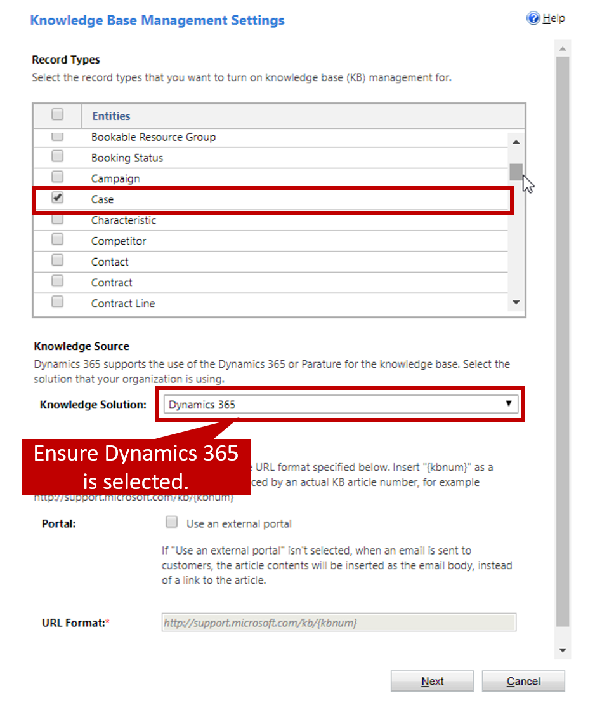
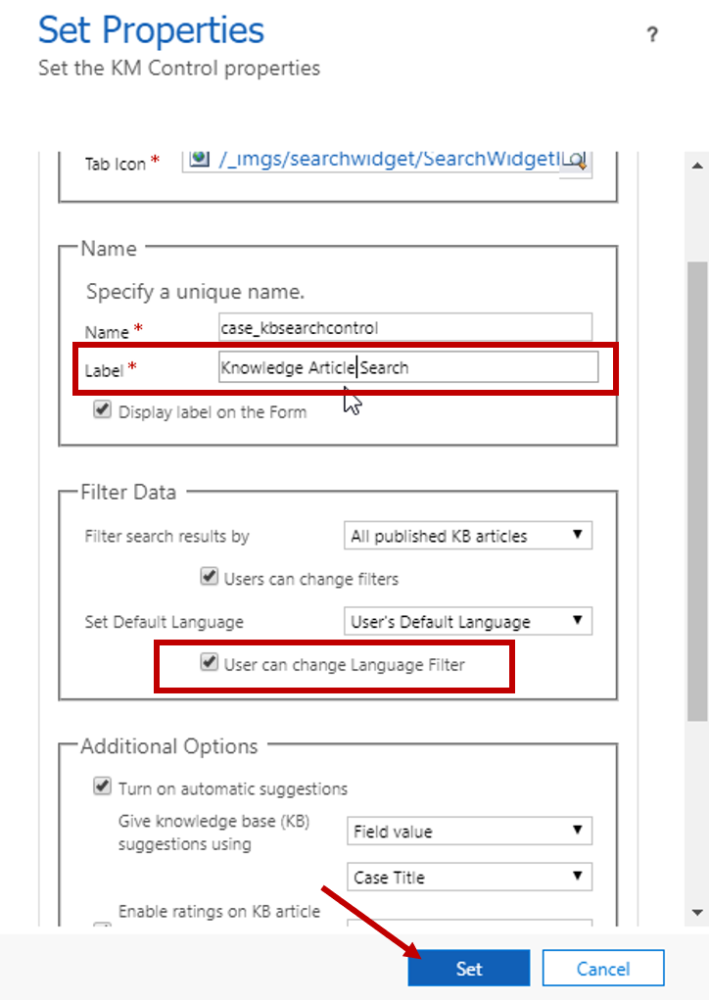
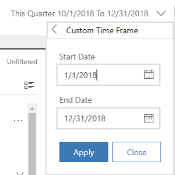
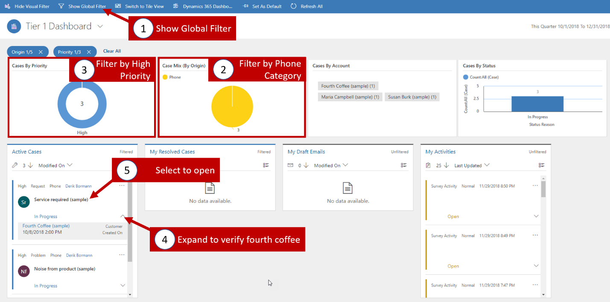
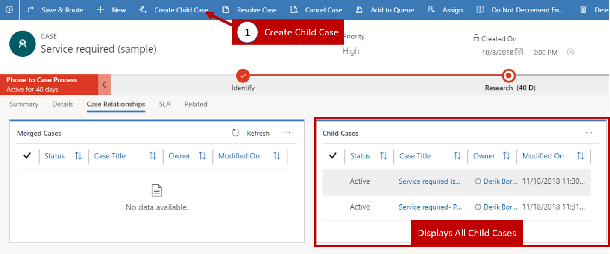
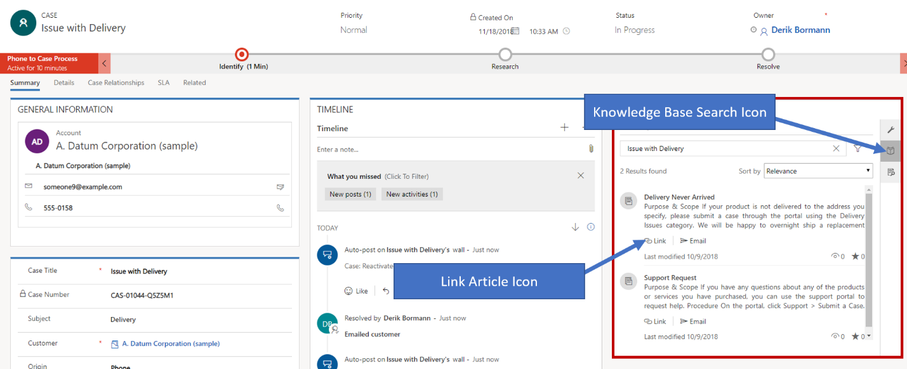

Microsoft Dynamics 365 for Customer Service lets an organization service its customers in many ways, depending on the specific needs of those customers, the organization's service model, and other determining factors. One feature that organizations can take advantage of is the **Knowledge Base Search** control.

This hands-on-lab will walk you through the process of setting up the feature and putting the **Knowledge Base Search** control on specific page. You can then use the control to find knowledge articles that can help you resolve cases.

### Before you begin

This exercise works best when you have sample data to use. Dynamics 365 lets you add sample data as needed. If no sample data is installed in the environment that you're working in, follow these steps to install some.

1. If necessary, on the main application navigation bar, select the drop-down arrow next to **Dynamics 365**, and then select **Dynamics 365 – custom**.
2. On the navigation bar, select the drop-down arrow next to **Settings**, and then select **Data Management**.
3. Select **Sample Data**.
4. Select **Install Sample Data**.
5. Close the **Sample Data** page.

## Learning objectives

At the end of this exercise, you'll be able to perform the following tasks:

- Set up the knowledge search feature.
- Change the **Knowledge Base Search** control settings on a page.
- Use the **Knowledge Base Search** control to resolve a case.

Estimated time to finish this exercise:15 to 20 minutes

### Scenario

You work for an organization that is starting to use the Dynamics 365 knowledge base, and several articles have recently been created. You've been asked to make sure that agents can use the **Knowledge Base Search** control from the Case entity. If necessary, agents should be able to change the article language to see whether articles are available in other languages.

### High-level steps

1. Set up the embedded knowledge search feature.
2. Set up the **Knowledge Base Search** control on the **Case** page.
3. Use the Customer Service Hub to identify any high-priority phone cases.
4. Add a phone call follow-up activity to a case.
5. Add a child case for an existing case.
6. Use an article to resolve a case.

### Detailed steps

#### Set up embedded knowledge search

1. On the main application navigation bar, select the drop-down arrow next to **Dynamics 365** to show the available application modules.
2. Select **Dynamics 365 – custom**.
3. On the navigation bar, select the drop-down arrow next to **Settings**, and then select **Service Management**.
4. Under **Knowledge Base Management**, select **Embedded Knowledge Search**.
5. Under **Record Types**, make sure that **Case** is selected. If it isn't, select the check box.
6. Under **Knowledge Source**, make sure that the **Knowledge Solution** field is set to Dynamics 365.

7. Select **Next**.
8. On the confirmation page, select **Finish**.

**Set up the Knowledge Base Search control on the Case page**

1. On the navigation bar, select the drop-down arrow next to **Settings**, and then select **Customizations** \> **Customize the System**.
2. In the **Default Solution**, expand **Entities**, and then expand the **Case** entity.
3. Select **Forms**.
4. Open the **Case for Interactive Experience** page.
5. Double-click the **Related** pane to open the properties. (Alternatively, select the pane, and then select **Change Properties**.)
6. Clear the **Lock the section on the Form** check box.
7. Select **OK**.
8. Double-click the **Knowledge Base Search** control to open the properties. (Alternatively, select the control, and then select **Change Properties**.)
9. Under **Name**, change value of the **Label** field to Knowledge Article Search.
10. Under **Filter Data**, select the **User can change Language Filter** check box under the **Set Default Language** field.

   

11. Select **Set**.
12. Select **Save** on the **Case** page.
13. Select **Publish** to publish your customizations.
14. Close the **Case** page, and then close the Solution Explorer window.

#### Use the Customer Service Hub to identify high-priority cases

1. In Customer Service Hub, select the **Site Map** icon, and then select **Dashboards**.
2. Select the down arrow next to this quarter data range, and then select custom period.
3. Set the period:
    - **Start Date:** 1/1/2018
    - **End Date:** 12/31/2018
   
4. Select **Apply**.
5. On the command bar, select **Show Global Filter**.
6. Find the **Case Mix (By Origin)** chart, and select the **Phone** slice.
7. In the **Cases by Priority** chart, select the **High** category.
8. Find the **Service required (sample)** case, select the down arrow, and make sure that the customer is Fourth Coffee (sample).
9. Select the **Service required (sample)** case to open it.

   

10. In the record timeline, select **Add Info and Activities**.
11. Select **Phone Call** on the menu.
12. Enter the following information for the phone call:
    - **Subject:** Follow-up call
    - **Call From:** Your user record
    - **Call To:** Yvonne McKay (sample)
    - **Direction:** Outgoing
    - **Duration:** 15 minutes
    - **Priority:** Normal
    - **Regarding:** Service required (sample)

   

13. Select **Save** to save the activity.
14. Close the **Service required (sample)** case for now.

### Create a child case from an existing case

As you're working on this case, Yvonne mentions that she won't be able to try any of the solutions that you find, because she also can't sign in. She needs to have her password reset for this item. You must capture this issue in a child case.

1. On the command bar, select **Create Child Case**, and then select **Save**.
2. Enter the following information for the child case:

    - **Case Title:** Service required - Password Reset
    - **Case Type:** Problem
    - **Origin:** Phone

3. Select **Save**.
4. To view child cases, select the **Case Relationships** tab.

   

5. In the **Child Cases** sub-grid, select the **Service required - Password Reset** case to open it.
6. Select the **Details** tab. The parent case will appear in the **Additional Details** section.
7. Go back to the parent case by selecting the link for the **Service required (sample)** case.
8. In the **Related** pane, select the **Knowledge Base Search** button.
9. Select one of the suggested articles, and then select the **Link** button.

   

10. On the **Case Relationships** tab, make sure that the article that you linked to appears in the **Associated Knowledge Records** sub-grid.
12. In the **Phone to Case Process** flow, select **Next Stage** until you reach the **Resolve** stage.
13. In the **Resolve** stage, select **Finish**.
14. Select **Resolve Case** to resolve the parent case.
15. Select **Confirm** to confirm your decision to resolve the case.
16. In the **Resolve Case** dialog box, in the **Resolution** field, enter Went on site to fix the issue.
17. Change the value of the **Billable Time** field to 1 hour.

   

18. Select **Resolve** to resolve the parent case together with all related child cases.
19. On the **Case Relationships** tab, make sure that any child cases are also resolved.

   
