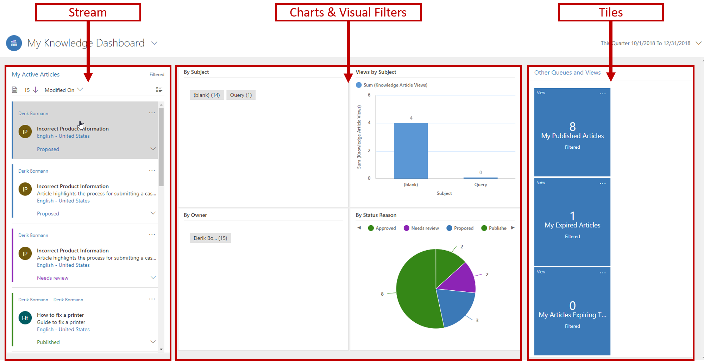
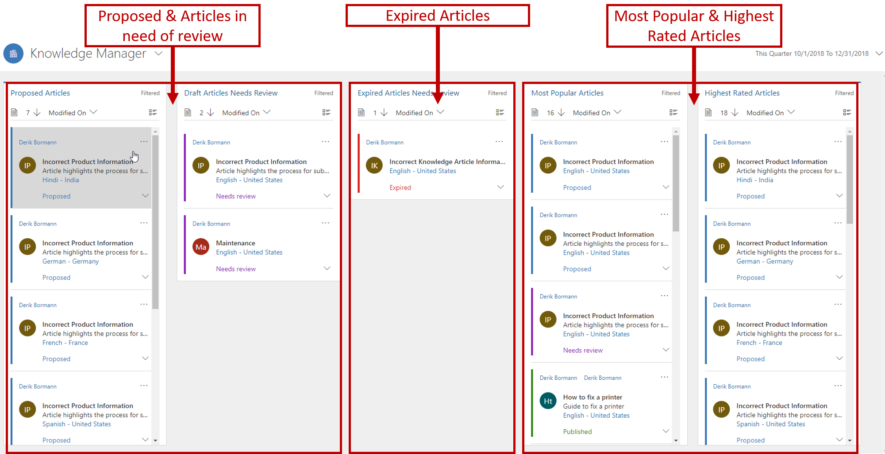
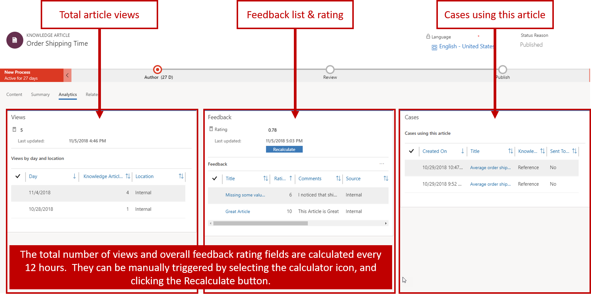

After knowledge articles have been published and are being consumed by customers and agents, knowledge managers might find it helpful to review article analytics to gain insight into what's going on. Microsoft Dynamics 365 includes two dashboard pages that knowledge managers and authors can use to monitor the status of articles:

- **My Knowledge Dashboard** page
- **Knowledge Manager** dashboard

## My Knowledge Dashboard page

The **My Knowledge Dashboard** page is designed for authors. It gives the author a visual snapshot of the number and status of the articles that he or she is working on. It helps authors quickly learn which articles are expiring during the month, which articles are in review, and so on.

The **My Knowledge Dashboard** page provides the following data:

- **My Active Articles stream:** This stream shows the active articles that are assigned to the author.
- **Charts and visual filters:** The charts provide a count of relevant records in the stream. For example, you can see articles by status, owner, or subject. The charts also act as visual filters. Authors can drill down into a chart to see data that interests them the most.
- **Other Queues and Views section**: The tiles in this section aggregate data in the stream and help monitor the volume of articles. By default, this section includes the following tiles: **My Published Articles**, **My Expired Articles**, and **My Articles Expiring This Month**.

If the **My Knowledge Dashboard** page doesn't provide the specific information that you need, you can create additional or alternative interactive dashboards to satisfy your needs.

For more about setting up interactive dashboards, see [Configure interactive experience dashboards](https://docs.microsoft.com/previous-versions/dynamicscrm-2016/administering-dynamics-365/mt622067(v=crm.8)).

## Knowledge Manager dashboard

The **Knowledge Manager** dashboard is designed specifically for knowledge managers. It lets them quickly find out the most popular articles, articles that need review, or the highest-rated articles. If the articles require any action, knowledge managers can also take it directly from the dashboard.

For more about monitoring articles by using dashboards, see [Monitor knowledge articles with dashboard](https://docs.microsoft.com/dynamics365/customer-engagement/customer-service/customer-service-hub-user-guide-knowledge-article#monitor-knowledge-articles-with-dashboards).

## Tracking article information

For each article, two tabs let you track basic article information and analytical information:

- Summary
- Analytics

## Summary tab

The **Basic settings** pane of the **Summary** tab has lots of information that's relevant to the article. Much of this information isn't data that you can edit. Instead, it's updated by the system as changes are made to the article. This information includes the article language, public number, and version numbers.

The **Timeline** pane provides timeline information for the article. The timeline shows all the related activities that are associated with the article. It also lets you add activities to the record. You can also use the timeline to view notes that reviewers have made about the article, or to see specific tasks that might be required prior to the article is publications.

Finally, the **Related information** pane provides access to records that are either related to or associated with the article. You can open the following records by using the buttons along the right edge of this pane:

- **Related Versions:** This record shows a complete version history of the article. You can view the previous versions of the article, and can even revert to a previous version if you have to.
- **Related Translations:** This record shows a list of the different translations that are available for the article.
- **Related Categories:** This record shows the categories that the article is associated with. Categories are used for article location and analytics. They help provide better article organization when articles are used in a portal knowledge base.
- **Related Articles:** This record shows any articles that are similar to the article or that have been related to it.
- **Related Products:** This record shows the products that the article is associated with.

## Analytics tab

The ability to track content helps you assess the value of that content to your organization and your customers. By knowing and understanding when, where, and how many times an article is viewed, you can determine how much customers and team members rely on the information in the article. This data is extremely useful when you create future content curation plans. It can help you decide what content you'll deliver in the future, how you'll deliver it, where you'll deploy it, and what style or structure you'll use to write it.

Article view counts and other statistics are available on the **Analytics** tab. This tab includes the following panes:

- **Views:** This pane shows the total number of times that the current article has been viewed. This number represents the total combined views for all versions and translations of this article. The number is automatically updated every 12 hours, but you can also calculate it manually.

   The **Views by day and location** sub-grid shows the individual article views on specific days.

- **Feedback:** This pane captures all the feedback and ratings for articles, and updates the articles accordingly.

   The **Feedback** sub-grid shows all feedback that has been received for the current article.

   The **Rating** field shows the average rating of the article, based on the amount of feedback and the number of ratings that have been received. The rating is automatically updated every 12 hours, but you can also calculate it manually.

- **Cases:** This pane lists the cases that have used the current article. You can open each of these cases to view its details. In this way, you can gain valuable insight into the questions that customers are asking and the approaches that they tried before they asked for help. This data can help you expose your articles better and provide more useful information to your customers and team members.

For more about tracking article details, see [Track basic details of an article](https://docs.microsoft.com/dynamics365/customer-engagement/customer-service/customer-service-hub-user-guide-knowledge-article#track-basic-details-of-an-article).
