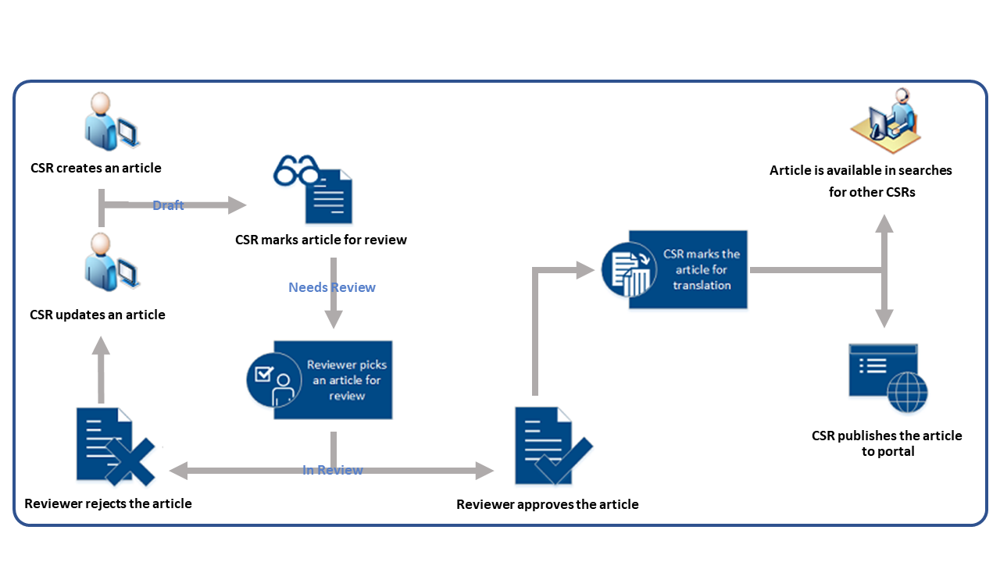

Knowledge Management is the process of creating, managing, using, and sharing the knowledge and information of an organization. The goal of any knowledge management solution is to make the best possible use of the information that the organization has and to make it as easy as possible to consume that information.

The **Knowledge Manager** module in Microsoft Dynamics 365 lets organizations provide information to both their employees and customers by creating and managing knowledge articles that people might be looking for.

Knowledge articles can address any number of issues that customers and employees encounter as they use an organization's products or services. The types of knowledge articles can include solutions to common issues, product or feature documentation, answers to frequently asked questions (FAQs), and product briefs. By using the rich text editor that's provided, organizations can create knowledge articles, format the content, embed videos or images, and more.

The knowledge management solution lets you:

- **Create and design knowledge articles:** Create rich and well-formatted content for emails and knowledge articles by using rich text editor.
- **Manage the article lifecycle:** Use out-of-box business process flows to manage article lifecycles, or create new processes.
- **Manage the article version history:** Manage updates to articles without disrupting the live or published articles.
- **Translate articles:** Provide translations of an article in multiple languages.
- **Publish articles:** Publish articles as soon as they're approved, or schedule them for later publication. You can also set expiration dates on articles.
- **Track and analyze article statics:** Track how many time an article is used, viewed, and sent to customers.

## Dynamics 365 knowledge articles

Knowledge articles are created in the Dynamics 365 Customer Service Hub. The knowledge management solution gives you the flexibility to implement a knowledge management solution that's tailored to your organization's needs. Although it's highly configurable, it's released with a predefined default knowledge management process to help you get started.

The following image shows an example of the default process for creating and using knowledge articles in the Customer Service Hub.

> [!VIDEO https://www.microsoft.com/videoplayer/embed/RE2ITLi]

Next we'll examine the process for designing a knowledge management solution in Dynamics 365. You'll learn more about the knowledge management lifecycle, creating articles, working with the article editor, version control, publication options.

For more about the Dynamics 365 knowledge management solution, see [Knowledge management process](https://docs.microsoft.com/dynamics365/customer-engagement/customer-service/customer-service-hub-user-guide-knowledge-article#knowledge-management-process).
