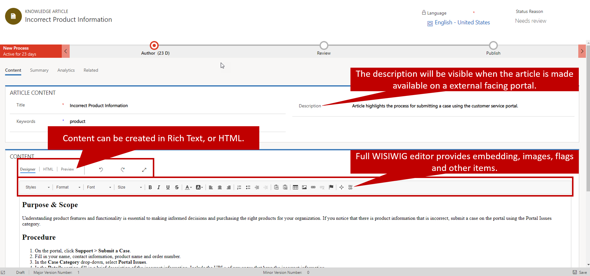
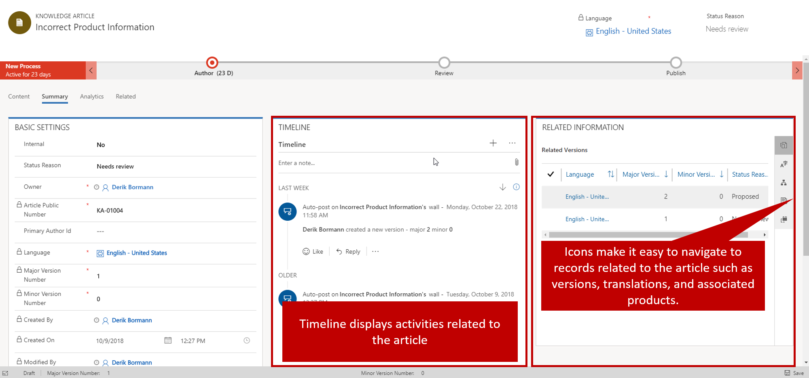

An effective knowledge management solution is more than just a repository of issues and solutions. It should be easy to navigate, provide clear and concise solutions, have current and relevant information, and be easily accessible across platforms.

As you get ready to build a knowledge repository and define specific knowledge articles in Microsoft Dynamics 365, it's important that you understand the overall vision for the repository. Here are some questions to consider:

- What will the article be used for?
- Who will consume the article?
- What must be included in the article to make it most useful to the people who consume it?
- Is the article related to a specific product?
- Will the article need to be available in multiple languages? If so, which languages?
- Is the article time-sensitive?

This list represents just a few of the things that need to be considered. Each organization will have specific requirements that must be met.

Dynamics 365 provides several options that will help you create and manage articles based on organizational requirements. It features a rich text editor that makes it easy to include items like images and videos in articles, to help explain things better and make the articles more engaging. Additionally, you can write, edit, search, publish, and translate articles to make them more effective and relevant to your audience.

A knowledge article has 3 tabs that are used to manage the content, and view analytics.  

Those tabs are:

- Content: Includes title, keywords, description and content designer.
- Summary: Includes time line and other related information.
- Analytics: Includes article analytical information.

**Article Creation:**

Knowledge Articles are created from within the Customer Service Hub.  They can be created by anyone with the specific permission to do so. In addition to being able to specify who can create articles, people in an organization can also be designated as article approvers.   

When an article is first created, you should define the following:

### Content tab

When you first create a knowledge article, you must enter the following information in the **Article content** section on the **Content** tab:

- **Title:** The title communicates the subject and purpose of the article in a concise manner.
- **Keywords:** Keywords are used to search the knowledge base for articles. Separate the different keywords with commas.
- **Description:** The description provides a short overview of the article. This text appears in the search results and is used for search engine optimization.

When you design a knowledge article, you must make sure that the content is not only relevant to the people who will consume it but also easy to consume, so that user can fully ingest all the content that's presented. For example, you can add a link to a video that demonstrates the procedure or process that's presented, links to other relevant content, or embedded HTML to provide more dynamic content. The Dynamics 365 content designer supports these advanced styling features and more.

The content editor is in the **Content** section. It consists of three tabs:

- **Designer:** Write and edit the article content. This tab includes enhanced and rich text editing capabilities.
- **HTML:** View an HTML preview of the article content. You can also write and edit the article on this tab.
- **Preview:** See how your content will look like on devices like desktop computers, tablets, or mobile devices.

For more about the different capabilities of the content editor, see [Create and manage knowledge articles](https://docs.microsoft.com/dynamics365/customer-engagement/customer-service/customer-service-hub-user-guide-knowledge-article).

### Summary tab

The **Summary** tab has lots of other information that's relevant to the knowledge article. Much of this information is updated by the system as changes are made to the article. But you can edit some of it. Here are the two main fields that you might need to update:

- **Internal:** You can mark the article for internal use only. In this case, people from outside your organization won't be able access the article (for example, from a portal). This setting can be useful for articles that focus more on internal processes that aren't relevant to external users.
- **Status Reason:** You can specify the status of the article to indicate whether it's proposed, in review, or waiting for review.

Some information on the **Summary** tab doesn't appear until the article record is saved for the first time. For example, **Related information** and **Timeline** are two important panes that become available when the record is first saved.

- **Timeline:** This pane shows all the related activities that are associated with the knowledge article. You can also add activities directly to the record.
- **Related information:** This pane provides access to records that are related to or associated with the knowledge article. You can open the following records by using the buttons along the right edge of this pane:

    - **Related Versions:** This record shows a complete version history of the article. You can view the previous versions of the article, and can even revert to a previous version if you have to.
    - **Related Translations:** This record shows a list of the different translations that are available for the article.
    - **Related Categories:** This record shows the categories that the article is associated with. Categories are used for article location and analytics. They help provide better article organization when articles are used in a portal knowledge base.
    - **Related Articles:** This record shows any articles that are similar to the article or that have been related to it.
    - **Related Products:** This record shows the products that the article is associated with.

For more about creating knowledge articles, see [Create a knowledge article](https://docs.microsoft.com/dynamics365/customer-engagement/customer-service/customer-service-hub-user-guide-knowledge-article#create-a-knowledge-article).

Other tasks, like creating article translations, working with versions, and setting publishing options, will be covered in later modules.
