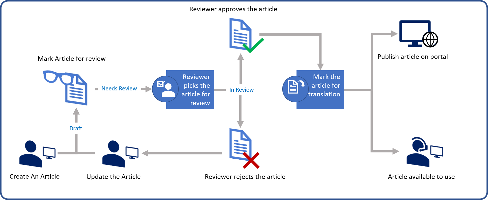
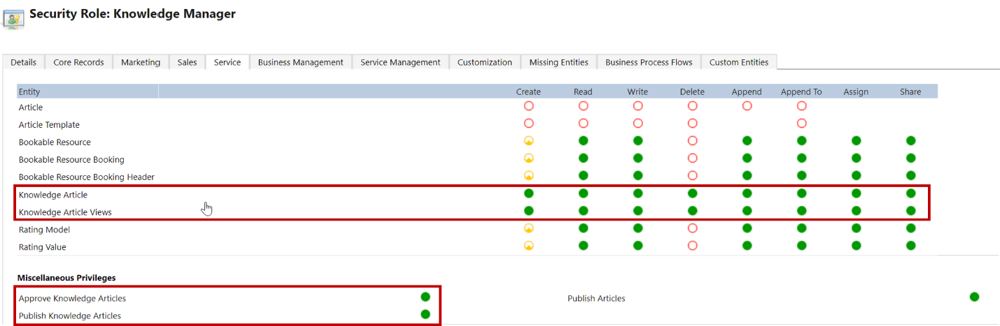
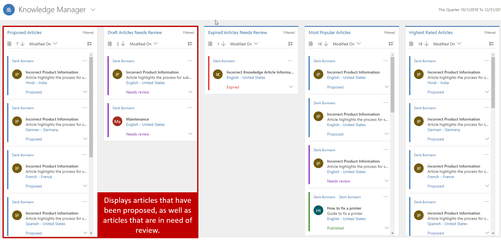
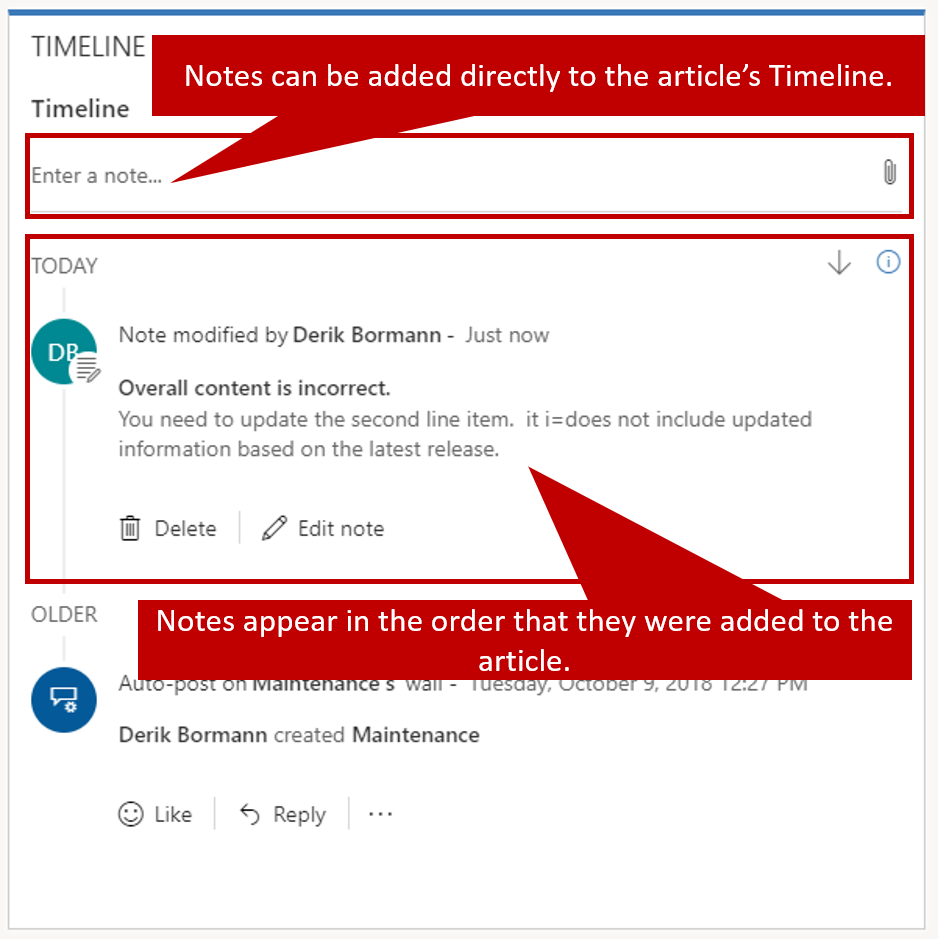
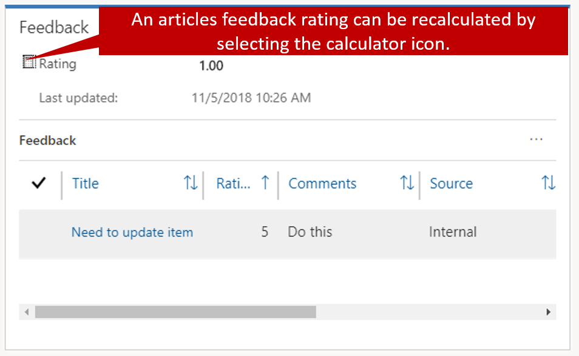

As we mentioned in the overview unit, an efficient knowledge management and article approval lifecycle helps guarantee not only that the knowledge content is accurate, but also that the most current and relevant content is available to users. Out of the box, the knowledge management lifecycle resembles the following image.

- **Draft:** The process starts someone such as a customer service representative creating and proposing a Draft version on an article.
	- The article is marked for review by an approver.
- **Approved / Rejected:** A reviewer evaluates the content in the article and can either approve or reject the article.
- If the article is rejected:
	- It is sent back to the original article author for either edits or updates. 
	- The process repeats until the article in ultimately approved.  
- If the article is approved:
	- It is set to an Approve state and is ready for publishing

- **Scheduled:** The article is scheduled to be published. Date information such as publish and expire dates are provided.    
	- The article is set placed into a Scheduled state until the publish date is reached. 

- **Published:** Once the articles publish date is reached it goes into a Published state. Published articles are available:
	- On case records being worked on by agents 
	- Customer facing Portals

- **Expired:** An article that reaches its expire date are moved into an Expired state.  (Not Shown) 

A knowledge article may go through many revisions, approvals, and reviews in the lifecycle. In many cases, after a knowledge article is expired, it goes back through the process of additional approvals to be republished. 

**Security roles used in the lifecycle process**

Users who are going to create knowledge articles will need to have the necessary permissions to do so.  Permissions are defined on the Knowledge Article entity and can be accessed on the service tab of any security role.  

After article content is created, it should be reviewed to make sure that it's accurate. Knowledge articles can be reviewed in two ways:

- **Marked for review:** Articles that are marked for review start appearing on the **Knowledge Manager** dashboard. From there, they can be assigned to specific people or to a queue.
- **Directly assigned:** Articles can be assigned directly to specific people or to a queue.

After an article is marked for review and starts to appear on the **Knowledge Manager** dashboard, the knowledge manager can assign it to specific team members or a queue for review.

For more about marking articles for review, see [Mark a knowledge article for review](https://docs.microsoft.com/dynamics365/customer-engagement/customer-service/customer-service-hub-user-guide-knowledge-article#mark-a-knowledge-article-for-review).

## Reviewing a knowledge article, and rejecting or approving it

Knowledge articles should be reviewed for accuracy before they're published or made available to other people. When an article requires review, a reviewer can perform the following actions:

- Select an article that's assigned to him or her for review.
- Suggest review feedback.
- Approve the content of the article.

There are multiple ways to add feedback and suggestions to an article. First, notes can be added directly to an article in the **Timeline** pane on the **Summary** tab. After a note is added, it appears in the timeline.

Additionally, article feedback can be added to draft articles, approved articles, or even published articles that are currently being used. Feedback lets people do things like add comments that suggest specific edits, or provide an overall rating for an article.

Article feedback can be added and viewed in the **Feedback** pane on the **Analytics** tab. As feedback is captured, ratings can be defined. The **Rating** field shows the current article rating. The value of this field is recalculated on a predefined schedule, but you can manually trigger a recalculation at any time by selecting the calculator symbol next to the field name.

One good way to make sure that articles are current and accurate is to update them, based on article feedback and notes that you receive. After an article has been updated, you can assign it back to the reviewer for approval or publication. Select **Assign** on the command bar, and then select the user or team to assign the article to.

For more about reviewing and approving articles, see [Review and reject or approve a knowledge article](https://docs.microsoft.com/dynamics365/customer-engagement/customer-service/customer-service-hub-user-guide-knowledge-article#review-and-reject-or-approve-a-knowledge-article).

For more about updating knowledge articles to capture feedback, see [Update knowledge articles to capture feedback](https://docs.microsoft.com/dynamics365/customer-engagement/customer-service/customer-service-hub-user-guide-knowledge-article#update-knowledge-articles-to-capture-feedback).
