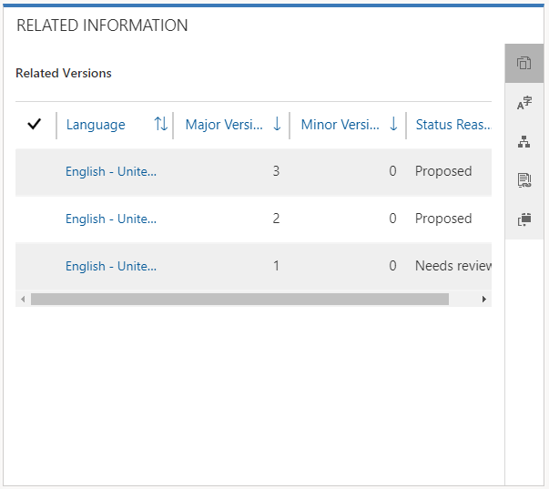
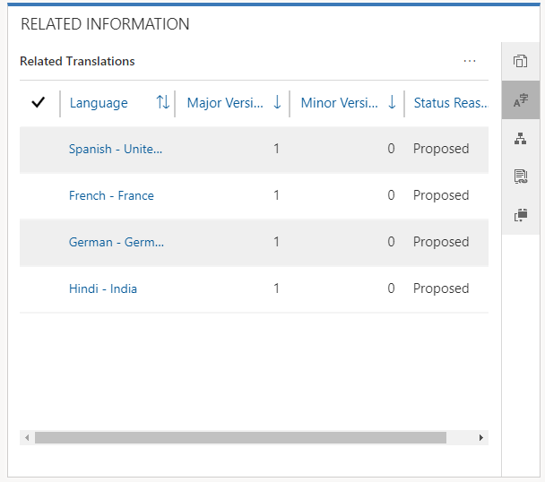
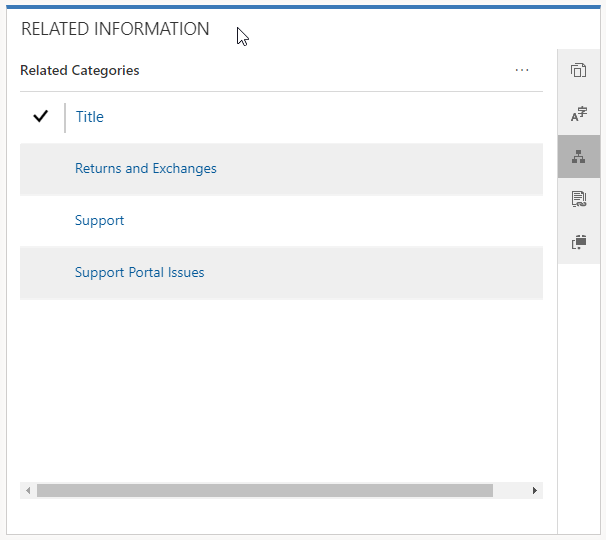

As you build your knowledge repository, you might find that articles that are in development, or even articles that have already been published, require updates to reflect new features or a new way of running a procedure. As those updates are made, previous versions of the article are stored.

Microsoft Dynamics 365 article versioning helps organizations manage updates to knowledge articles without disrupting the live or published articles. By storing versions of a knowledge article, you can keep articles up to date with the latest information but also keep track of changes throughout the lifecycle of your products and services.

Two types of versions can be created for knowledge articles:

- **Major version:** This version type represents a major change in features or functionality.

    For example, a new feature that has been added to a software application completely changes the application functionality.

- **Minor version:** This version type represents a minor change that doesn't necessarily affect functionality.

    For example, a screen in an application's user interface changes, but the overall result of the screen isn't affected.

You can add major and minor versions by using the command bar on the page where you define the title, keywords, and detailed information for the article. When a version is first created, it has the same content, information, and permissions as the current version. You can then update and revise the information in the new version. The article will have **Major Version Number** and **Minor Version Number** fields that are automatically updated to reflect the new version number.

> [!IMPORTANT]
> Fields like **Major Version Number**, **Minor Version Number**, **Language**, and **Article Public Number** are automatically filled in by the system. You can't change the values in those fields.

For more about creating article versions, see [Create and manage article versions](https://docs.microsoft.com/dynamics365/customer-engagement/customer-service/customer-service-hub-user-guide-knowledge-article#create-and-manage-article-versions).

## Translating articles into multiple languages

In addition to being easily accessible, articles that you create must also be easily consumed by all your customers, no matter what country or region they're from. Dynamics 365 lets you create translated articles, so that you can provide the same self-help content in multiple languages, but without having to manage multiple copies of the same article. For example, a knowledge article that explains how to replace a printer cartridge might have Spanish, French, and Hindi versions. Those translated versions can then be emailed to customers who speak those languages.

When an article is translated into another language, Dynamics 365 creates a new major version that's associated with that language.

For example, to create a French version of a knowledge article, select the **Translate from** button on the command bar, and then select **French** in the list of available languages.

> [!IMPORTANT]
> When you create a version of an article for a different language, the article isn't actually translated into that language. You must supply the translated and formatted text for the article yourself. Third-party language translators can help, and tools like Microsoft Flow can provide some automation of the process.

For more about creating article translations, see [Translate a knowledge article in multiple languages](https://docs.microsoft.com/dynamics365/customer-engagement/customer-service/customer-service-hub-user-guide-knowledge-article#translate-a-knowledge-article-in-multiple-languages).

## Article categories

By associating an article with one or more categories, you make it easier to find and consume the article in different areas of the application. Users can take advantage of article categories when they search for an article directly from a case. Article categories can also be used to organize articles when users access them through a customer portal.

To create article categories, go to **Settings** \> **Service Management**, and then, in the **Knowledge Base Management** section, select **Categories**. You can also define category hierarchies, like Hardware \> Printers \> Drums & Rollers. In this way, you can create an article hierarchy for specific categories.

To add a category to an article, select **Associate Category** on the command bar. A single article can be associated with multiple categories.

## Managing article versions, translations, and categories

Article management consists of publishing and archiving different versions of each article to provide the most accurate information to your customers and internal employees. Although a single article might have multiple versions to reflect things like translations, major edits, or minor edits, only one version of an article can be published at a time. It's important to keep track of the changes that are made to each version, and to publish versions only at the appropriate time.

You can manage article versions in the **Related information** pane on the **Summary** tab of the knowledge article.

On the right edge of the **Related information** pane, you'll see several buttons that let you work with related records. The following related records are relevant to versions, translations, and categories:

- **Related Versions:** This record lists all the major and minor versions for the current article. From here, you can:

    - Edit or update a version.
    - Create a new major or minor version.
    - Delete a version.

    > [!IMPORTANT]
    > If you delete an article version, the action is permanent and can't be undone.

- **Related Translations**: This record lists all the translations that are available for the current article. From here, you can:

    - Edit or update a translation.
    - Create a new major or minor version of a translation.
    - Delete a translation or version of a translation.

- **Related Categories:** This record lists all the categories that are associated with the current article. From here, you can:

    - Add article categories.
    - Edit existing article categories.
    - Remove an article category.

Now that you've learned how to effectively manage and maintain article versions, translations, and categories, you're ready to move on to information about publishing articles. You'll learn how article versions, translations, and categories should be involved in the publication process.

> [!VIDEO https://www.microsoft.com/videoplayer/embed/RE2IOG9]
