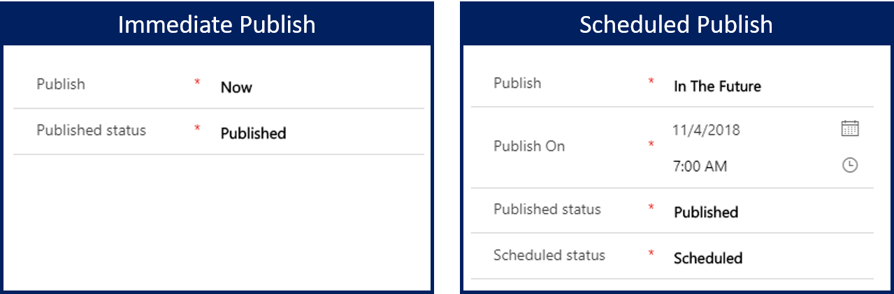
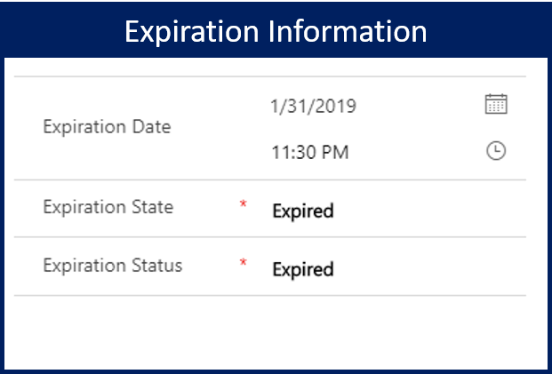
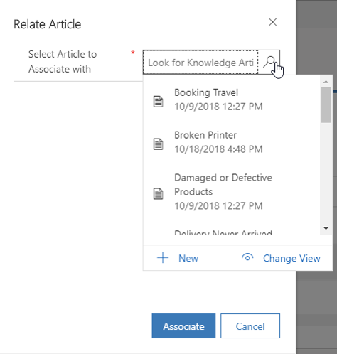

After a knowledge article has been reviewed and approved, it's ready to be published. After an article is published, internal and external users can use it when they resolve cases, or they can access it from a portal.

Microsoft Dynamics 365 provides two options for publishing articles:

- **Immediately:** You can publish the article right away. You might use this option if, for example, the article content is related to sign-in issues that multiple customers are reporting right now.
- **Scheduled publish:** You can delay publication until a specific time. You might use this option if, for example, the organization's merchandise return policy will be changing on the first of the month. An article can be written in advance and published when the new procedures are in place.

Before you publish an article, we recommend that you take one last look at it. Consider whether there's anything else that might help users and customers find it more easily or consume it more effectively. For example, here are some questions that you might consider:

- Is the article somehow related to other articles?
- Should the article be associated with other products or services?
- Should both internal and external users be able to consume the article?

Depending on your answers to these questions, you can use the following buttons on the command bar for the article:

- **Related Article:** Associate the current article with one or more similar articles that are stored in Dynamics 365. Related articles can be viewed from the **Related Articles** record in the **Related Information** pane on the **Summary** tab.
- **Related Product:** Associate the current article with one or more similar Dynamics 365 products that are stored in the product catalog. Related products can be viewed from the **Related Products** record in the **Related Information** pane on the **Summary** tab.
- **Mark Internal:** Mark the article for internal use only. External customers won't be able to consume the article from a portal. 
	- To publish a knowledge article, select **Publish** on the command bar. In the dialog box that appears, you can:

- **Define when the article is published:** In the **Publish** field, select whether you want to publish the article right away or in the future. 
	- If you select In The Future, select the date and time of publication in the **Publish On** field.

   

- **Define a status for the published article:** In the **Published Status** field, select the status that the article should be set to after it's published.
	- By default, Published is selected.

- **Define whether the article expires:** In the **Expiration Date** field, select the date and time when the published article should expire.

    - Expired articles are no longer available in searches.
    - If you set an article to expire, in the **Expiration Status** field, select the status that the article should be set to after it expires.

   

- **Define whether the article translations should be published:** To publish all approved article translations together with the article, in the **Publish approved related translations with article** field, select Yes.
	- Each article translation must be approved before it can be published. Article translations that haven't been approved won't be published.

After an article is published, it will remain published until the expiration date is reached (if an expiration date has been defined), or until the article is manually unpublished.

> [!VIDEO https://www.microsoft.com/videoplayer/embed/RE2IOG4]

For more about scheduling and publishing an article, see [Schedule or publish an article](https://docs.microsoft.com/dynamics365/customer-engagement/customer-service/customer-service-hub-user-guide-knowledge-article#schedule-or-publish-an-article).

**Update published knowledge articles**
When a knowledge article is in the Published or Scheduled state, it can be updated directly by users who have the publish privilege associated with their user record.  If the article being updated has information that complements an existing knowledge article, the existing article can be associated with the current knowledge article.

 

For more about updating published articles, see [Update published knowledge articles](https://docs.microsoft.com/dynamics365/customer-engagement/customer-service/customer-service-hub-user-guide-knowledge-article#update-published-knowledge-articles).

