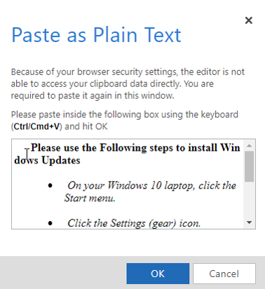
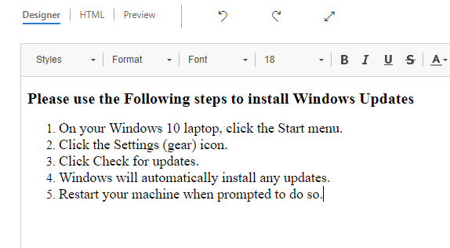
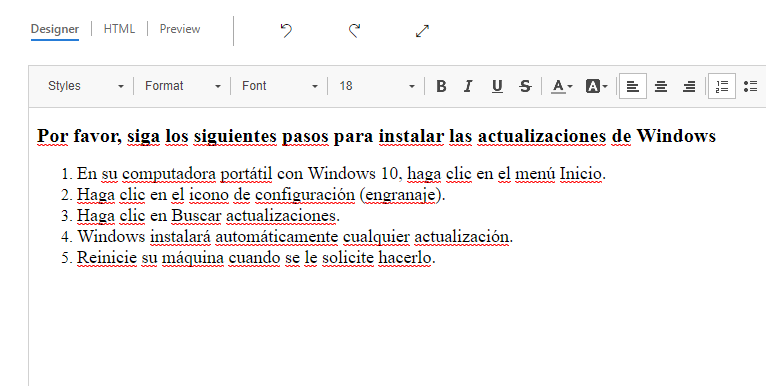
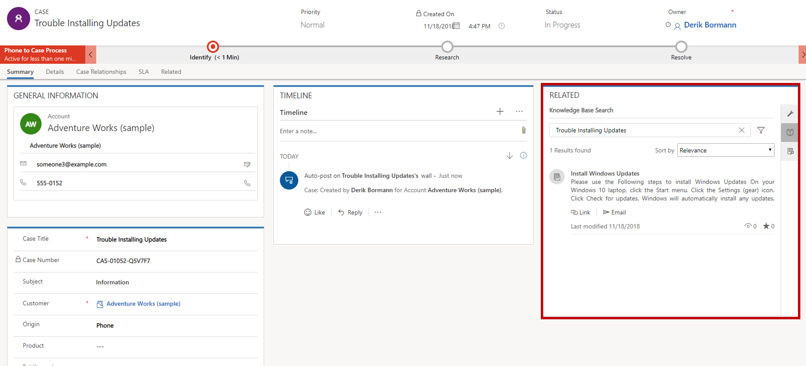

This exercise works best when you have sample data to use. Dynamics 365 lets you add sample data as needed. If no sample data is installed in the environment that you're working in, follow these steps to install some.

1. If necessary, on the main application navigation bar, select the drop-down arrow next to **Dynamics 365**, and then select **Dynamics 365 – custom**.
2. On the navigation bar, select the drop-down arrow next to **Settings**, and then select **Data Management**.
3. Select **Sample Data**.
4. Select **Install Sample Data**.
5. Close the **Sample Data** page.

## Learning objectives

At the end of this exercise, you'll be able to perform the following tasks:

- Create knowledge articles.
- Create article translations.
- Publish articles.

Estimated time to finish this lab: 15 to 20 minutes

## Scenario

You're the knowledge base expert at your company. You've been asked to create a new knowledge base article that instructs users how to install updates on laptops that run Microsoft Windows.

## High-level steps

1. Create a new knowledge article.
2. Submit the article for review.
3. Approve the article.
4. Create an article translation.
5. Publish the article.

## Detailed steps

### Create a new knowledge article and an article translation

1. If necessary, on the main application navigation bar, select the drop-down arrow next to **Dynamics 365**, and then select **Dynamics 365 – custom**.
2. In the site map, under **Service**, select **Knowledge Articles**.
3. On the command bar, select **New**.
4. In the **Article Content** section, enter the following information:

    - **Title**: Install Windows Updates
    - **Keywords**: Windows, Updates, Laptop, PC
    - **Description**: Instructions on how to install Windows Updates on your laptop.

5. Select and copy the following text:

    **Please use the following steps to install Windows Updates**
    - On your Windows 10 laptop, click the Start menu.
    - Click the Settings (gear) icon.
    - Click Check for updates.
    - Windows will automatically install any updates.
    - Restart your machine when prompted to do so.

6. In the **Content** section, select the **Paste as Plain Text** button.
7. Paste the text that you copied into the text box, and then select **OK**.

   

8. Format the text so that it looks like the following image.

   

9. Select **Save**.
10. In the **New Process** flow at the top of the window, select the **Author** stage.
11. In the **Article Subject** field, select **Query** \> **Information**.
12. Set the **Mark for Review** field to Complete.
13. Select **Next Stage**.
14. In the **Review** stage, select **Approve**.
15. Select **Approve** to finish the approval.
16. Close the dialog box.
17. On the command bar, select **Translate**.
18. Select **Spanish-United States** as the language.
19. Select **Create**.
20. If you're prompted to open the article translation, select **Yes**.
21. Select and copy the following text:

    **Por favor, siga los siguientes pasos para instalar las actualizaciones de Windows**

    -En su computadora portátil con Windows 10, haga clic en el menú Inicio.
    - Haga clic en el icono de configuración (engranaje).
    - Haga clic en Buscar actualizaciones.
    - Windows instalará automáticamente cualquier actualización.
    - Reinicie su máquina cuando se le solicite hacerlo.

22. In the **Content** section, select the **Paste as Plain Text** button.
23. Paste the text that you copied into the text box, and then select **OK**.
24. Format the text so that it looks like the following image.

   

25. Select **Save**.
26. On the command bar, select **Approve**.
27. In the **Confirm Approve article** dialog box, select **OK**.

### Publish the article

1. In the site map, under **Service**, select **Knowledge Articles**.
2. Find the English version of the "Install Windows Updates" article, and open it.
3. On the command bar, select **Publish**.
4. Define the publishing settings as shown here:

    - **Publish:** Now
    - **Published status:** Published
    - **Expiration Date:** One month from the current date
    - **Expiration State:** Expired
    - **Expiration Status:** Expired
    - **Publish approved related translations with article:** Yes

5. Select **Publish**.

### Test the article

1. In the Customer Service Hub, in the site map, select the wrench symbol to go to **Cases**.
2. On the command bar, select **New Case**.
3. Enter the following information for the new case:
    - **Case Title:** Trouble installing updates
    - **Subject:** Information
    - **Customer:** Adventure Works
    - **Origin:** Phone
4. Select **Save**.
5. In the **Related** pane, select the **Knowledge Base Search** button.

Notice that the "Install Windows Updates" article is listed.

