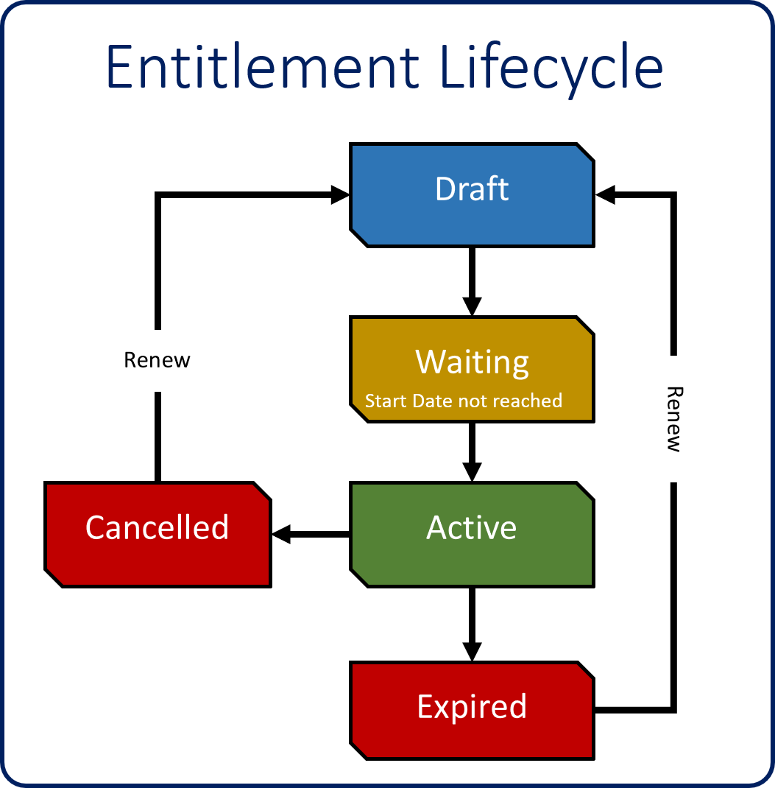

Service-based organizations often provide service contracts that entitle their customers to an allotted amount of support over a specified period. The amount of support might be a specific number of cases or a specific length of time.

Microsoft Dynamics 365 can help organizations manage, track, and enforce these allotments by providing two mechanisms for managing the level of service that a customer is entitled to:

- **Service level agreements (SLAs):** SLAs track and define what should happen when a case is opened, like the initial response time by a support engineer or the time that it takes to resolve the case.
- **Entitlements:** Entitlements are agreements that define the level and type of support that a customer is entitled to.

> [!NOTE]
> SLAs aren't the primary focus of this module. They will be discussed only as they pertain to entitlements. For more about SLAs, see the "Microsoft Dynamics 365 service level agreements (SLAs)" module on Microsoft Learn.

Entitlements define specific support details that were promised to a customer. These details include the coverage dates (period), and either the number of cases or the length of time that's allotted.

For example, during the period when an entitlement is active, a customer might be entitled to place 35 phone calls to a help desk team. Another customer might be entitled to a total of 100 hours of technical support via multiple channels of communication.

Dynamics 365 entitlements can help support both the preceding examples. They can be used to manage and enforce a variety of scenarios, including:

- Management of warranty contracts.
- Service-specific contracts.
- Incident-based support contracts.
- Time-based support contracts.

The Dynamics 365 entitlement management system is based on these elements:

- **Entitlements:** An entitlement is the actual agreement that defines the specific support details that are provided to the customer. A typical entitlement defines the specific coverage period, the allotment types/terms, the supported channels, and the products that are covered.
- **Entitlement channels:** You can define one or more channels that specify the coverage that's provided for a specific product or item.
- **Entitlement templates:** You can use entitlement templates to quickly create and define entitlement options, based on the different types of entitlements that are offered to customers.

## Entitlement lifecycle

Each entitlement record follows a specific lifecycle. The following image shows the entitlement lifecycle.

- **Draft:** When an entitlement is first created, it's in **Draft** status. While an entitlement is a draft, you can edit all the details of the record, including the number of cases, the channels and products, and the coverage dates. You can't attach cases to an entitlement that's in **Draft** status.
- **Waiting:** Entitlements that are in **Waiting** status have been activated and are waiting for the entitlement start date to be reached. Because the entitlement has been activated, you can't edit any details of the record. Because the start date hasn't been reached, you can't attach cases to the entitlement.
- **Active:** An entitlement is considered active when it has been activated and the current date is within the specified coverage dates. While an entitlement is active, new cases can be attached to it, but the details of the entitlement record can't be edited. To edit the details, you must first inactivate the entitlement.
- **Expired:** An entitlement expires after the end date is reached. After an entitlement expires, you can't attach any cases to it.
- **Canceled:** An entitlement can be canceled at any point while it's active.
- **Renewals:** Only expired or canceled entitlements can be renewed.

Over the course of this module, we'll examine other aspects of entitlements in more detail. For example, you'll learn how to create entitlements, define terms and channels, and use entitlements with cases. You'll also learn and tips and tricks for using entitlements.
