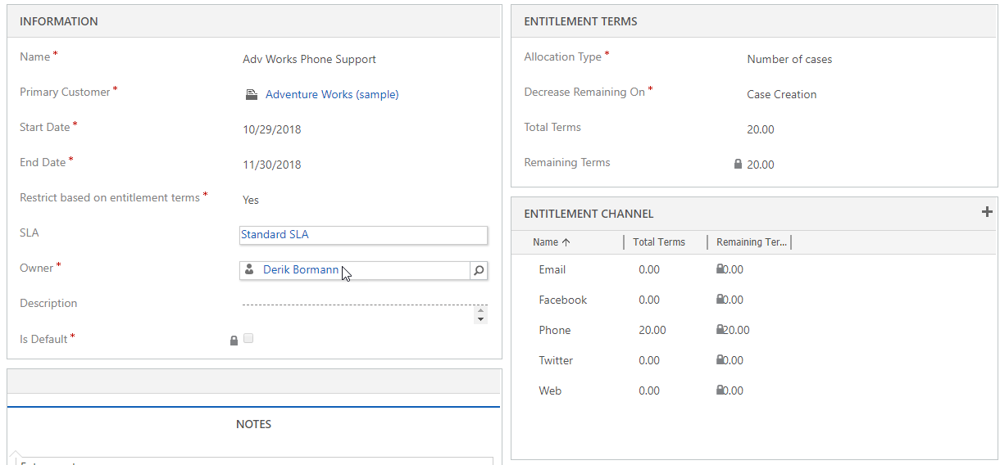

Before an organization creates entitlements for its customers, it needs to understand when a specific entitlement might be applicable. Additionally, it needs to consider the specific circumstances that might dictate what's required from the entitlement. This information can help the organization determine what its standard entitlement offering will look like and what situations the standard entitlement might not work in. Although every organization is different and entitlement needs will vary, there will likely be standard things that can help drive you in the right direction.

Here are some of the questions that you might consider:

- Should entitlements be based on time or number of cases?
    - What happens if customers exceed their allotted amount of time or number of cases?
    - When should items be deducted from the available allotment? (For example, should items be deducted when cases are created or when they're resolved?)
- Do we need entitlements that are associated with specific products, like warranty contracts?
    - Is there a standard set of products that will use warranty contracts?
    - Are there specific channels that should be used?
- What channels can cases be opened from?
    - Do we need to limit the available channels?
    - Are the channels limited for warranty work?
- What happens if a customer has more than one entitlement?
    - How will the agent determine which entitlement to attach the case to?
    - Should one of the entitlements be the default entitlement for the customer?
    - Will we limit who can open cases against specific entitlements?
- Are any service level agreements (SLAs) applicable?

These questions can help determine what entitlements are needed from the standpoint of an individual customer, and what situations might be better served by entitlement templates.

## Creating entitlements

To create entitlements, go to **Settings** \> **Service Management**, and then, in the **Service Terms** section, selecting **Entitlements**.

When you create an entitlement, you must provide the following information:

- **Name:** Enter the name of the entitlement record. This name will appear in lookup fields when you search for an entitlement.
- **Primary Customer:** Define the customer that the entitlement is associated with.
- **Start Date:** Date cases can be attached to the entitlement after it's set to active.
- **End Date:** The date when the entitlement will expire.
- **Restrict based on entitlement terms:** Specify whether entitlement terms can be exceeded. If you set this option to *Yes*, entitlement terms are enforced.
- **Allocation Type:** Define the type of entitlement. Two options are available: *Number of cases* and *Number of hours*.
- **Total Terms:** Define the total number of cases or hours that's allotted, depending on the allocation type. Note that, although this field isn't required, it's a best practice to enter a value.
- **Decrease Remaining On:** Specify when the case should be deducted from the remaining terms. Two options are available: *Case Resolution* and *Case Creations*.

### Allocation Type and Decrease Remaining On fields

The **Allocation Type** and **Decrease Remaining On** fields both affect when cases are deducted from an entitlement. It's important to understand how the **Decease Remaining On** field deducts items from the remaining terms on an entitlement, because this can have a significant effect on the number of remaining cases that are currently available.

When the **Allocation Type** field for an entitlement is set to Number of cases, you can set the **Decrease Remaining On** field to either Case Creation or Case Resolution. If you select Case Creation, any new case that's created will decrease the remaining terms by 1. If you select Case Resolution, the remaining terms won't be decreased until the case is resolved.

For example, if a customer's entitlement has five cases available, setting the **Decrease Remaining On** field to Case Resolution might not be the best option, because the customer might have eight active cases that are currently being worked on. As those cases are resolved and deducted from the remaining terms, you might find that there aren't any left when you try to resolve cases 6, 7, and 8. This scenario is where the **Restrict based on entitlement terms** option comes into play. If you set this option to Yes, you can't resolve cases 6, 7, and 8, because they will cause the entitlement terms to be exceeded. That can be a significant problem, because agents might have spent hours resolving those items, and now they can't be closed.

If you set the **Decrease Remaining On** field to Case Creation and the **Restrict based on entitlement terms** option to Yes, the remaining terms will be decreased as cases are created. You then won't be able to add cases 6, 7, and 8 at all. Therefore, agents won't waste any time on those cases.

When the **Allocation Type** field for an entitlement is set to Number of hours, the **Decrease Remaining On** field can be set only to *Case Resolution*.

For example, if a customer's entitlement has 10 hours available, Case Resolution is the best option, because the total time that's spent on the case is calculated based on the all the "closed activities" that are associated with the case. The total time of those activities is rolled up and then deducted from the remaining terms.

> [!NOTE]
> When a case is closed, only activities that are marked as finished are included. Open activities aren't included. Therefore, it's important that agents close all relevant activities.

Here are some other points to consider about how the Case Creation and Case Resolution options affect the remaining terms:

- **Case Creation:**
    - If you create a new case that's associated with an entitlement, the remaining terms are decreased.
    - If you associate an existing case with an entitlement, the remaining terms are decreased.
    - If you cancel a case that's associated with an entitlement, the remaining terms are increased.
    - If a case is updated so that it's associated with a different entitlement, the remaining terms on the first entitlement are increased.

- **Case Resolution:**
    - If you resolve a case that's associated with an entitlement, the remaining terms are decreased.
    - If you reactivate a case that's associated with an entitlement, the remaining terms are increased.

- **Changing from Case Resolution to Case Creation:** When a new entitlement is first created, the **Decrease Remaining On** field is set to Case Resolution. Occasionally, people activate an entitlement but realize later that the **Decrease Remaining On** field should have been set to Case Creation. If you just inactivate an entitlement and change the value to Case Creation, open cases that are currently attached won't decrease the remaining terms. Instead, you must remove the entitlement from the case and then add it back.

> [!VIDEO https://www.microsoft.com/videoplayer/embed/RE2IJmq]

For more about creating entitlements, see [Create an entitlement](https://docs.microsoft.com/dynamics365/customer-engagement/customer-service/create-entitlement-define-support-terms-customer#create-an-entitlement).
