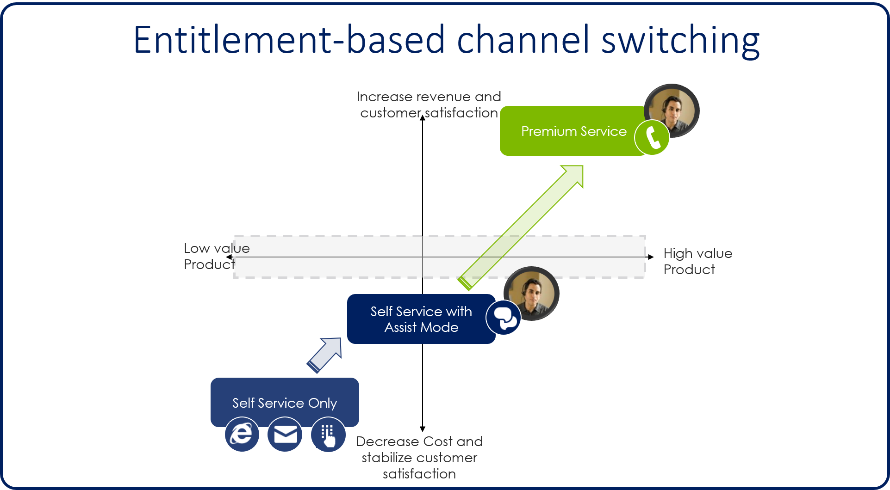
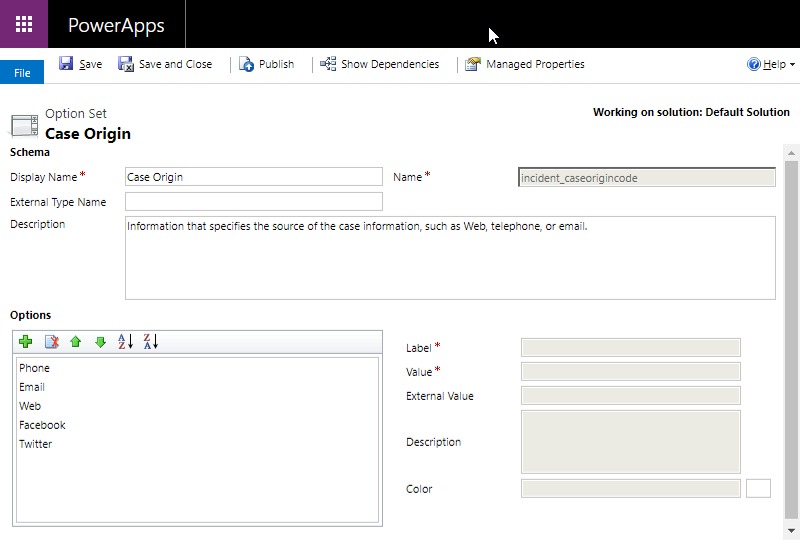
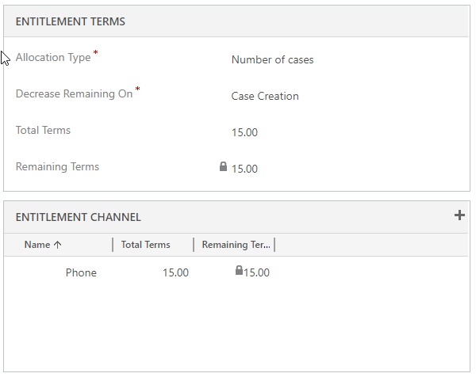
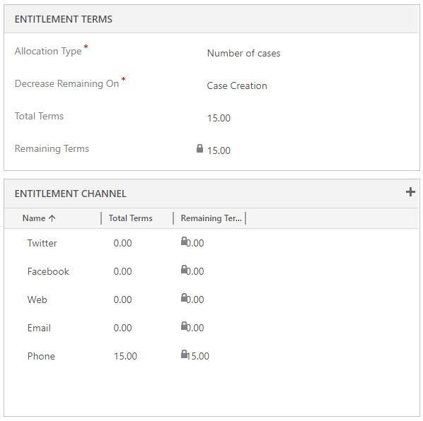

These days, support organizations offer their customers more ways to initiate contact and request support. When organizations take advantage of multiple channels to support their sales, marketing, or service strategies, the solutions that they offer are referred to as multi-channel or omni-channel solutions. Although these solution types are often mentioned together, they're different.

- **Multi-channel:** A multi-channel solution offers two or more channel experiences to customers. Data isn't necessarily shared across channels, and the experience isn't consistent.
	- For example, a customer starts a support request via chat but is then transferred to an agent. The customer then has to provide all his or her information again.

- **Omni-channel:** An omni-channel solution offers two or more channel experiences to customers, and the customer experience is consistent across channels. The context of the case and customer is used to streamline the experience across apps.
	- For example, a customer starts on a self-service portal but then starts a chat conversation. All the pages that the customer has opened are available to the agent.

By providing multi-channel or omni-channel solutions to your customer, you help guarantee that each customer can interact with your organization by using the option that's best for him or her. When you provide multi-channel or omni-channel solutions, you must also consider the effect on the organization. Although it's important to make sure that customers have a consistent experience when they work with the different channels, it's also important to remember that each channel is actually different.

For example, an agent who takes a phone call from a customer can work only on that case at that moment. But agents who support customers who are using chat channels can handle multiple cases at the same time. Therefore, those channels help improve efficiency and reduce costs.

By designing omni-channel solutions, you can control the channels that customers use and direct specific types of requests to different channels. As customers engage with a specific channel, they're offered escalation options that start moving them through different channels.

In this example, a customer starts with a self-service option like a portal. He or she is then escalated to a chat with either an agent or a bot. Finally, the customer is routed to a live agent on the phone.

## Working with entitlement channels

Microsoft Dynamics 365 lets you specify which channels a customer can use to submit cases against an entitlement. Why is that important? Although more and more customers are embracing different support channels, like chat, email and social media, many customers still want to get support though more personal channels, like a phone call. But customers who prefer phone calls are likely to occupy more of an agent's time. Therefore, agents who provide support over the phone service fewer customers.

You can define the channels that are available for specific entitlements. Therefore, you can limit the number of cases that a customer can open over the phone. You can even create phone-only support contracts that have higher costs associated with them.

When you create entitlements, you can define the specific channels that are available to open cases against that entitlement. You can also define the maximum number of cases that can be opened through a specific channel. Out of the box, the channels that are available for entitlements are the same channels that are listed in the **Origin** field when a new case is created: Phone, Email, Web, Facebook, and Twitter.

You can add more channels by going to **Settings** \> **Customizations** \> **Customize the System** \> **Option Sets** and adding them to the **Case Origin** global option set. After new channels are added to the option set, they can be used as entitlement channels.

When you add an entitlement channel, you just limit the number of cases that can be opened through that channel. You don't limit or prevent the use of additional channels.

Here is an example.

In the preceding image:

- In the **Entitlement Terms** section, the total number of cases that can be opened against the entitlement is 15. In the **Entitlement Channel** section, 15 is also the maximum total terms for the Phone channel. Therefore, no more than 15 cases can be opened through the phone channel.
- But note that, because we aren't defining any other channels, we aren't limiting the number of cases that can be opened through other channels.
- It's possible to open, for example, 10 cases via email, two via the web, and three via Facebook, and not open a single case through the phone channel, provided that we don't exceed the total terms for the entitlement.

If we want to limit the entitlement so that only phone calls can be used for the 15 total cases, we can set it up as shown here.

Because we've specified that the total terms for all other channels is 0 (zero), the contract is a phone support–only contract. Therefore, all 15 of the available cases that can be opened against this contract can be through the phone channel.

Entitlements that have these kinds of requirements aren't very uncommon, and they're a great way to take advantage of entitlement templates, which we'll discuss in another module.

> [!VIDEO https://www.microsoft.com//videoplayer/embed/RE2IM17]
