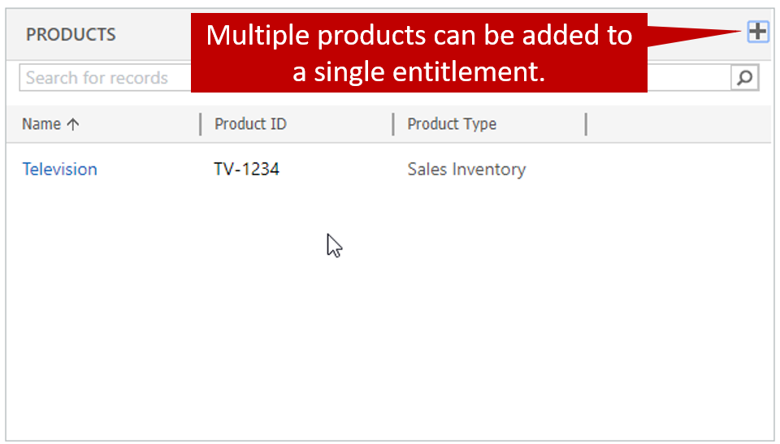
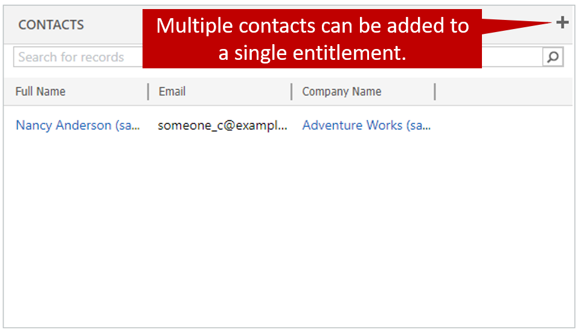

Now that we've looked at some of the basics of entitlements, like initial creation and term definition, let's examine some other considerations that often come up when organizations work with entitlements.

## Product-specific entitlements

Because products can be added to an entitlement, entitlements are often used for things like warranty contracts. Let's say that a customer buys a TV and, according to the warranty contract, gets an unlimited number of support calls for one year. In this situation, you can just add the TV to the **Products** section of the entitlement and define the total terms as something like 9,999 (you can't actually specify unlimited terms). When an entitlement includes products, if a product is specified on a new case, the entitlement is available for selection on that case.

## Limiting contacts

Customers sometimes also want to limit which employees can call in and open cases against a support contract. A customer might buy a support contract for a specific reason, like down systems or critical events, and might prefer that the contract not be used for smaller issues, like password or sign-in issues. Therefore, one or more contacts can be added to an entitlement. When an entitlement includes contacts, if a contact is specified on a new case, the entitlement is available for selection on that case.

After a product or contact is added to a case, only valid entitlements for that product or contact are available for selection.

If no product or contact is added to the case:

- All valid entitlements for the customer are available for selection.
- An error is generated if an invalid product or contact is selected later.

Although the ability to define specific products and contacts for entitlements provides lots of flexibility, there are some thing to consider. Most importantly, although multiple products and contacts can be added to a single entitlement, you can't limit specific products to specific people.

For example, the following products and contacts are specified for an entitlement:

- Products:

    - 3D Printer
    - 4K Display

- Contacts:

    - Marcie Henderson
    - Jackson Smith

In this entitlement, you can't limit Marcie to calls about the 3D printer and Jackson to calls about the 4K display. Because both contacts and products are specified, both contacts can open cases for both products by using the entitlement.

To limit each contact to a specific product, you must create two separate entitlement records: one for Marcie and the 3D printer, and one for Jackson and the 4K display.

## Additional considerations for entitlements

### Restrict based on entitlement terms

By setting the **Restrict based on entitlement terms** option to Yes, you can prevent cases from being opened if they will cause the total remaining terms for an entitlement to be exceeded. By default, this option is set to No. Therefore, it's possible to exceed the number of cases or hours that are available on an entitlement.

### Service level agreements

If a service level agreement (SLA) is specified for an entitlement, any new cases that are opened against the entitlement will use that SLA. If a new case is associated with an entitlement that doesn't have an SLA, the default SLA for the organization will be used. If there's no default SLA, no SLA will be used. The following table explains the scenarios in more detail.

<table>
<thead>
<tr>
<th>Scenario</th>
<th>Applicable SLA</th>
</tr>
</thead>
<tbody>
<tr>
<td>A case is created, but no entitlement is associated with it.</td>
<td>
<ul>
<li>If the organization has a default SLA, it's applied to the case.</li>
<li>If the organization doesn't have a default SLA, no SLA is applied to the case.</li>
</ul>
</td>
</tr>
<tr>
<td>A case is created, and an entitlement is associated with it.</td>
<td>
<ul>
<li>If the entitlement has an active associated SLA, the associated SLA is applied to the case.</li>
<li>If the entitlement doesn't have an active associated SLA, but the organization has a default SLA, the default SLA is applied to the case.</li>
<li>If the entitlement doesn't have an active associated SLA, and the organization doesn't have a default SLA, no SLA is applied to the case.</li>
</ul>
</td>
</tr>
</tbody>
</table>

### Customers that have multiple entitlements

If multiple entitlement records are associated with a customer, it can sometimes be difficult to decide which entitlement should be used when a new case is opened. In this situation, it can be helpful to use things like products, contacts, and channel terms. The list of available entitlements will then be filtered, depending on the options that are selected.

Another approach is to define a default entitlement for the customer. When a default entitlement is specified for a customer, it will be used if no entitlement is defined on a new case. You can define an entitlement as the default entitlement after it has been activated.

> [!IMPORTANT]
> If you inactivate the default entitlement to make changes, it won't automatically be the default entitlement when it's reactivated. You must redefine it as the default entitlement after you reactivate it.

## Additional links

- [Activate or deactivate an entitlement](https://docs.microsoft.com/dynamics365/customer-engagement/customer-service/create-entitlement-define-support-terms-customer#activate-or-deactivate-an-entitlement)
- [Set an entitlement as default entitlement](https://docs.microsoft.com/dynamics365/customer-engagement/customer-service/create-entitlement-define-support-terms-customer#set-an-entitlement-as-default-entitlement)
- [Associate entitlements to cases](https://docs.microsoft.com/dynamics365/customer-engagement/customer-service/create-entitlement-define-support-terms-customer#associate-entitlements-to-cases)
- [Cancel an entitlement](https://docs.microsoft.com/dynamics365/customer-engagement/customer-service/create-entitlement-define-support-terms-customer#cancel-an-entitlement)
- [Renew an entitlement](https://docs.microsoft.com/dynamics365/customer-engagement/customer-service/create-entitlement-define-support-terms-customer#renew-an-entitlement)

> [!VIDEO https://www.microsoft.com/videoplayer/embed/RE2IOG6]
