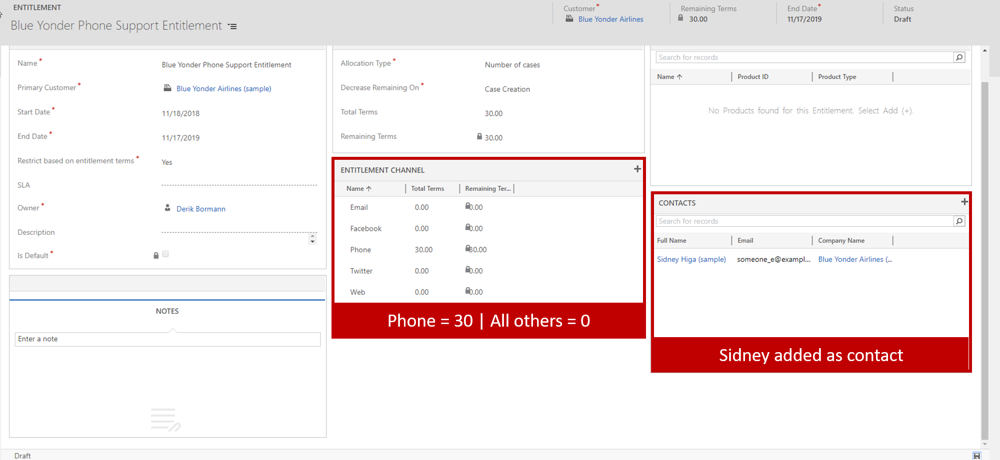
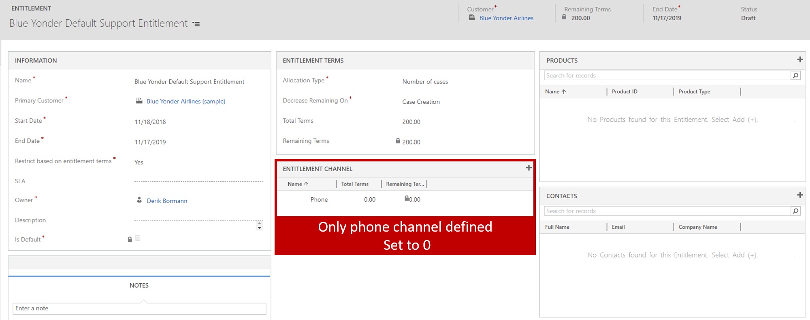
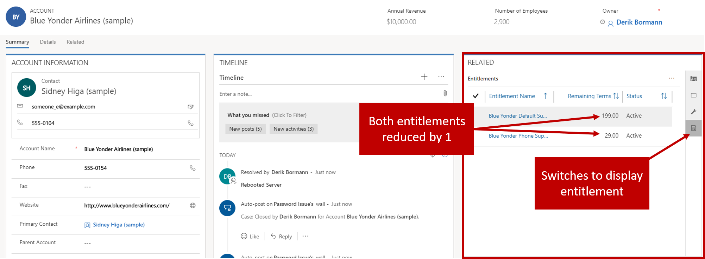

The exercises work best when you have some sample data to work with. Depending on if the environment you are
working with, you may want to install some sample data to assist with exercises. Dynamics 365 does provide the ability to add sample data as needed. If the environment you are working in does not have any sample data installed, follow the steps below to install the sample data into your environment.

1. If necessary, on the main application navigation bar, select the drop-down arrow next to Dynamics 365, and then select Dynamics 365 – custom.
2. On the navigation bar, select the drop-down arrow next to Settings, and then select Data Management.
3. Select Sample Data.
4. Select Install Sample Data.
5. Close the Sample Data page.

## Learning objectives

At the end of these exercises, you'll be able to perform the following tasks:
	- Create entitlement records in Dynamics 365.
	- Define entitlement channels.
	- Limit entitlement products and contacts.
	- Define default entitlements.
	
Estimated time to finish this lab: 15 to 20 minutes

You're a customer service manager at a support center that's named Contoso. Sidney Higa, a contact at Blue Yonder Airlines, has contacted you about the company's support plan. Blue Yonder is implementing a new ticket system and foresees several issues. Therefore, the company wants to open a phone support–only plan that only Sidney can use. This plan should last one year and should let Sidney open 30 phone cases.

Blue Yonder realizes that other issues might arise. But it wants all cases that aren't opened by Sidney to be opened through the web, email, Facebook, or Twitter, not over the phone. Therefore, the company wants another support plan that everyone besides Sidney will use. This support plan should be limited to the web, email, Facebook, and Twitter channels. The company feels that 200 cases will be enough for this plan.

### High-level steps

1. Create a phone support–only entitlement that has these characteristics:
    - It's limited to the phone channel.
    - It's limited to Sidney Higa.

2. Create a default entitlement for Blue Yonder that has these characteristics:
- 	Create Entitlement records in Dynamics 365
- 	Define Entitlement Channels
- 	Restrict Entitlement Products and Contacts
- 	Define Default Entitlements
	- 	Cases can't be opened over the phone.
	- 	It's set as the company's default entitlement.

3. Activate both entitlements.

### Detailed steps

You are a Customer Service Manager at a support center called Contoso. A Sidney Higa who is a contact at Blue Yonder Airlines has contacted you regarding their support plan. They are implementing a new ticket system and foresee several issues coming up. They want to open a phone support only plan that will last for one year and provide only Sidney with the ability to open 30 phone cases.

#### Create the phone support–only entitlement

1. On the main application navigation bar, select the drop-down arrow next to Dynamics 365, and then select Dynamics 365 – custom.
2. On the navigation bar, select the drop-down arrow next to Settings, and then select Service Management.
3. Select Entitlements.
4. On the command bar, select New.
5. Enter the following information for the new entitlement:
- Name: Blue Yonder Phone Support Entitlement
- Primary Customer: Blue Yonder Airlines (sample)
- Start Date: The current date
- End Date: One year from the current date
- Restrict based on entitlement terms:Yes
- Allocation Type:Number of cases
- Decrease Remaining On: Case Creation
- Total Terms: 30

6. Select Save to save the entitlement and leave it open.

#### Add channel terms

1. In the Entitlement channel sub-grid, select the plus sign (+).
2. In the Name field, select Phone, and set the Total Terms  Field to 15.
3. Repeat steps 1 and 2 to add the following additional channel terms:
-  Name = Twitter and Total terms = 0
-  Name = Email and Total terms = 0
-  Name = Facebook and Total terms = 0
-  Name = Web and Total terms = 0
	-  Create an Phone Support Only Entitlement
	-  Phone Channel Only
	-  Sidney Higa Only
-   Create a Default Blue Yonder Entitlement
	-  No Phone allowed
	-  Should be default.

#### Limit the entitlement to Sidney Higa

1. In the Contacts sub-grid, select the plus sign (+).
2. Add Sidney Higa as the contact.

Your completed entitlement will resemble the following image.

On the main application Navigation Bar, click the Module Drop Down Selector and then click Dynamics 365 - custom.

#### Activate the entitlement

1. On the command bar, select Activate to activate the entitlement record.
2. On the Confirm Entitlement Activation page, select Activate.
3. Close the entitlement.

#### Create the default entitlement for Blue Yonder

1. In the Entitlement grid, on the command bar, select New.
2. Enter the following information for the new entitlement:
-  Name: Blue Yonder Default Support Entitlement
-  Primary Customer: Blue Yonder Airlines (sample)
-  Start Date: The current date
-  End Date: One year from the current date
-  Restrict based on entitlement terms: Yes
-  Allocation Type: Number of cases
-  Decrease Remaining On: Case Creation
-  Total Terms: 200
3. Select Save to save the entitlement and leave it open.

#### Add channel terms

1. In the Entitlement channel sub-grid, select the plus sign (+).
2. In the Name field, select Phone, and set the Total Terms field to 0. (You just have to define phone support, so that it can be restricted.)

Your completed entitlement will resemble the following image.

#### Activate the default entitlement

- Name: Blue Yonder Phone Support Entitlement
- Primary Customer: Blue Yonder Airlines (sample)
- Start Date: Today's Date
- End Date: 1 year from Today
- Restrict based on entitlement terms Yes
- Allocation Type:Number of cases
- Decrease Remaining On:Case Creation
- Total Terms: 30

1. On the command bar, select Activate to activate the entitlement record.
2. On the Confirm Entitlement Activation page, select Activate.
3. To make sure that the entitlement is used by default, select Set as Default.

### Exercise: Apply entitlements to cases

Sidney Higa has contacted you about an issue, but Blue Yonder's system is down. You must create a new case and link the company's entitlement to the case.

### High-level steps

1. Create a new case.
2. Associate the entitlement.
3. Add a phone call.
4. Resolve the case to reduce the remaining terms for the entitlement.

### Detailed steps

#### Create a new case from Sidney Higa

1. Start Customer Service Hub in Dynamics 365.
2. In the site map, select the wrench symbol to open the Cases page.
3. On the command bar, select New Case.
4. Enter the following information for the new case:
- Case Title:System down
- Customer:Blue Yonder Airlines (sample)
- Origin:Phone
- Entitlement:Blue Yonder Phone Support Entitlement
5. In the Phone to Case process, select the Identify stage.
6. Set the Find Contact field to Sidney Higa (sample).
7. Select Save to save the case.

#### Add a phone call activity to the case
	
- Email with Total terms to 0
- Facebook with Total terms to 0
- Web with Total terms to 0
1. In the Timeline section, select Add Info and Activities.
2. On the menu that appears, select Phone Call.
3. Enter the following information for the phone call activity:
- Subject:Called Customer about resolution
- Call From: Your user record
- Call to:Sidney Higa
- Direction:Outgoing
- Duration:15 Minutes
- Description:Called customer and the issue was resolved by rebooting the server.
4. Select Save.
5. In the Timeline section, for the phone call activity that you just created, select the ellipsis button (...) next to Delete.
6. On the menu that appears, select Close Activity.
7. On the Close Phone Call page, enter the following information:
-  State: Completed
-  Status:Made
8. Select Close.

#### Resolve the case

1. On the command bar, select Resolve Case.
2. In the Resolution field, enter Rebooted server, and set the Billable time field to 30 Minutes.
3. Select Resolve.
4. On the Command Bar click the Activate button to activate the Entitlement record.

#### Create a new case from another user

1. On the command bar, select New Case.
2. Enter the following information for the new case:
-  Case Title:Password Issue
-  Customer:Blue Yonder Airlines (sample)
-  Origin:Email

3. Select Save to save the case.

Notice that the Blue Yonder Default Support Entitlement was automatically added to the case.

#### Resolve the case

1. On the command bar, select Resolve Case.
2. In the Resolution field, enter Rebooted server, and set the Billable time field to 30 Minutes.
3. Select Resolve.

#### View the remaining terms for the entitlement

1. In the site map, select Accounts.
2. Select Blue Yonder Airlines.
3. In the Related section, select the Entitlement icon.

Notice that both the phone support–only entitlement record and the default entitlement record have been reduced by 1.

- Name:Blue Yonder Default Support Entitlement
- Primary Customer:Blue Yonder Airlines (sample)
- Start Date:Today's Date
- End Date:1 year from Today
- Restrict based on entitlement terms: Yes
- Allocation Type:Number of cases
- Decrease Remaining On:Case Creation
- Total Terms:200

4. Click Save to save the Entitlement and leave it open.

##### Add Channel Terms

1. In the Entitlement Channel sub-grid, click the plus sign (+)
2. Select Phone and set the Total Terms to 0 (we only need to define phone support, so it can be restricted.)

Your completed entitlement will resemble the image below:

Activate the Default Entitlement

3. On the Command Bar click the Activate button to activate the Entitlement record.
4. On the Confirm Entitlement Activation screen, click the Activate button.
5. To ensure the entitlement is used by default, click the Set as Default button.

### Exercise: Applying Entitlements to cases

Blue Yonder has contacted you about an issue and their system is down. You need to create a new case and link their entitlement to the case.

### High Level Steps:

1. Create a new case.
2. Associated the Entitlement.
3. Add a Phone Call.
4. Resolve the case to decrement the Entitlement.

### Detailed Steps:

#### Create a New Case from Sidney:

1.  Open Customer Service Hub in Dynamics 365.
2.  Using the Site Map, click the Wrench Icon to open Cases.
3.  In the command bar, click New Case.
4.  Complete the Case as follows:
-   Case Title:System down
-   Customer:Blue Yonder Airlines (sample)
-   Origin:Phone
-   Entitlement:Blue Yonder Phone Support Entitlement
5.  In the Phone to Case process, click the Identify stage
6.  Set the Find Contact field to Sidney Higa (sample)
7.  Click Save to save the Case.

#### Add a Phone Call activity to the case

1.  In the Timeline, click the Add Info and Activities button.
2.  From the menu that appears, select Phone Call.
3.  Complete the Phone call as noted below:
- Subject:Called Customer about resolution
- Call From:Your user record
- Call to:Sidney Higa
- Direction:Outgoing
- Duration:15 Minutes
- Description:Called customer and the issue was resolved by rebooting the server.
4.  Click Save.
5.  On the Timeline, select the ellipse next to delete on the phone call activity you just created.
6.  From the menu that appears select Close Activity.
7.  Con the Close Phone Call Screen:
-   State:Completed
- 	Status:Made
8.  Click Close Resolve the Case
9.  On the Command Bar, click Resolve Case
10. Enter Rebooted server for the Resolution and set the Billable time to 30 Minutes.
11. Click Resolve.

#### Create a New Case from another user:

1.  On the command bar, click New Case
2.  Complete the Case as follows:
-  Case Title:Password Issue
-  Customer:Blue Yonder Airlines (sample)
-  Origin: Email
3.  Click Save to save the Case. Notice that the Blue Yonder Default Support Entitlement was automatically added to the case.

#### Resolve the Case

4.  On the Command Bar, click Resolve Case
5.  Enter Rebooted server for the Resolution and set the Billable time to 30 Minutes.
6.  Click Resolve.

#### View Remaining Entitlement Terms:

1.  Using the Site Map, select Accounts
2.  Select Blue Yonder Airlines
3.  Using the Related Section, click the Entitlement Icon

Notice that both the Phone Support and Default Entitlement records have been reduced by 1.

